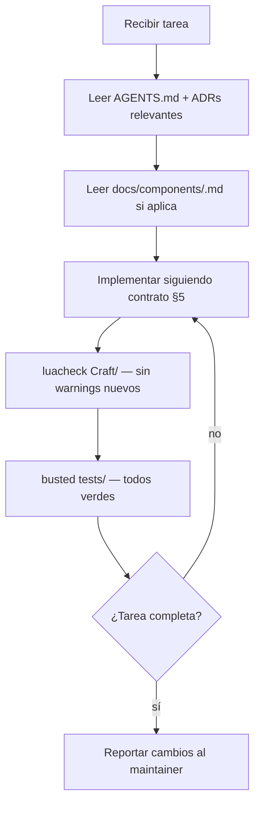

# AGENTS.md — Craft

> README para agentes de IA. Leer antes de cualquier tarea. Sincronizado con `docs/DTI_v0.1.md`.

---

## 1. Identidad del producto

- **Nombre**: Craft
- **Dominio**: WoW Addon Development — librería de componentes UI
- **Resumen**: librería open source de componentes UI para addons de World of Warcraft. Distribuida como addon instalable (LibStub) en CurseForge y Wago. Diseño basado en shadcn Lyra (Zinc + Emerald, Radius=0) con íconos Lucide y fuente Inter bundled en `Craft/media/`. **Dark mode únicamente** — WoW addon dev es dark-mode exclusivo.
- **DTI**: `docs/DTI_v0.1.md`
- **FSD**: `docs/FSD_v0.1.md`
- **BRD**: `docs/BRD_v0.1.md`
- **ADRs**: `docs/adr/` — leer todos antes de tomar decisiones arquitectónicas

---

## 2. Contexto que el agente MUST leer antes de actuar

En orden:

1. **Este archivo completo** (AGENTS.md).
2. `docs/adr/` — las 11 ADRs definen todas las decisiones no negociables.
3. `docs/FSD_v0.1.md` §4 y §5 — casos de uso y contrato de componente.
4. `docs/DTI_v0.1.md` §3 y §5 — arquitectura de módulos y patrón de componente.
5. `docs/design-reference.md` — fuente de verdad de tokens de color (CSS exacto de shadcn Lyra).
6. `docs/pixel-perfect.md` — reglas de escala WoW (ADR-0011).

Si la tarea toca un componente específico: leer también `docs/components/<nombre>.md`.

---

## 3. Estructura del repositorio

```
/
├── AGENTS.md               ← este archivo
├── CLAUDE.md               ← instrucciones para Claude Code
├── CHANGELOG.md
├── .gitignore
├── .luacheckrc             ← linter Lua con globals WoW
├── .pkgmeta                ← bigwigsmods/packager config
├── .github/workflows/
│   ├── ci.yml              ← lint + test en cada push/PR
│   └── release.yml         ← package + upload en tags v*
├── .claude/commands/
│   ├── check-traceability.md   ← /check-traceability
│   └── update-design-tokens.md ← /update-design-tokens
│
├── Craft/                  ← LA LIBRERÍA (lo que se distribuye)
│   ├── Craft.toc
│   ├── Craft.lua           ← entry point, LibStub:NewLibrary("Craft-1.0", BUILD)
│   ├── libs/LibStub.lua
│   ├── theme/
│   │   ├── Theme.lua       ← Craft.Theme (register, use, get, extend)
│   │   └── Presets.lua     ← lyra-dark (único preset built-in, dark mode solo)
│   ├── layout/Flex.lua     ← Craft.Flex (motor CSS Flexbox en Lua)
│   ├── icons/
│   │   ├── Icons.lua       ← Craft.Icons.Get/Apply/Has/List
│   │   └── Atlas.lua       ← coordenadas UV del atlas TGA
│   ├── components/         ← 13 componentes UI + 3 módulos = 16 MVP
│   │   ├── Button.lua      ├── Checkbox.lua  ├── Dialog.lua
│   │   ├── Input.lua       ├── Label.lua     ├── Panel.lua
│   │   ├── Scroll.lua      ├── Select.lua    ├── Separator.lua
│   │   ├── Sidebar.lua     ├── Slider.lua    ├── Tabs.lua
│   │   └── Tooltip.lua     (Icons, Flex, Theme son módulos en sus propias carpetas)
│   └── media/              ← assets bundled
│       ├── Inter-Regular.ttf
│       ├── Inter-Bold.ttf
│       ├── lucide-16.tga
│       └── lucide-24.tga
│
├── Craft_Browser/          ← addon showcase in-game (pendiente)
├── tests/                  ← unit tests con busted + mock WoW API (pendiente)
├── scripts/
│   ├── export-icons.py     ← genera lucide-*.tga
│   └── bump-build.sh       ← incrementa CRAFT_BUILD en Craft.lua
│
└── docs/
    ├── design-reference.md ← FUENTE DE VERDAD de tokens de color (CSS shadcn Lyra)
    ├── pixel-perfect.md    ← reglas de escala WoW (ADR-0011)
    ├── BRD_v0.1.md  ├── MRD_v0.1.md  ├── PRD_v0.1.md
    ├── FSD_v0.1.md  └── DTI_v0.1.md
    ├── components/         ← spec de cada componente
    └── adr/
        ├── 0001-arquitectura-libreria-libstub.md
        ├── 0002-sistema-diseno-shadcn-lyra.md
        ├── 0003-iconos-lucide-first-class.md
        ├── 0004-craft-browser-showcase.md
        ├── 0005-sistema-de-theming.md
        ├── 0006-craft-flex-motor-layout.md
        ├── 0007-exclusion-tstl.md
        ├── 0008-exclusion-portal-web.md
        ├── 0009-pipeline-ci-cd.md
        ├── 0010-estrategia-versioning.md
        └── 0011-pixel-perfect-estrategia.md
```

---

## 4. Stack tecnológico autoritativo

| Capa | Tecnología | Notas |
|------|------------|-------|
| Lenguaje | Lua 5.1 | WoW sandbox — sin librerías externas |
| Librería compartida | LibStub | `LibStub:NewLibrary("Craft-1.0", BUILD)` |
| Diseño | shadcn Lyra dark | Base=Zinc, Theme=Emerald, Radius=0. Ver ADR-0002 |
| Íconos | Lucide (atlas TGA bundled) | Ver ADR-0003 |
| Fuente | Inter (TTF bundled) | `Craft/media/Inter-Regular.ttf` |
| Linter | luacheck | `.luacheckrc` con globals WoW |
| Tests | busted | Headless con `tests/mock_wow.lua` |
| Packaging | bigwigsmods/packager | ADR-0009 |
| CI | GitHub Actions | `ci.yml` (push) + `release.yml` (tags v*) |
| Distribución | CurseForge + Wago | Craft como Library |

**MUST NOT** introducir dependencias fuera de este stack sin ADR aprobado.

---

## 5. Contrato de componente — regla de dominio más crítica

Todo componente Craft **MUST** implementar este contrato exacto:

```lua
local MyComponent = {}
MyComponent.__index = MyComponent

function MyComponent:Create(parent, config)
  local self = setmetatable({}, MyComponent)
  -- crear frames WoW aquí
  self._themeHandle = Craft.Theme.register(function(t) self:_applyTheme(t) end)
  self:_applyTheme(Craft.Theme.get())
  return self
end

function MyComponent:_applyTheme(t)
  -- SOLO usar t.* — NUNCA llamar Craft.Theme.get() aquí (re-entrancia)
  -- NUNCA hardcodear colores RGBA
end

function MyComponent:Destroy()
  Craft.Theme.unregister(self._themeHandle)  -- CRÍTICO: evita memory leak
  self.frame:Hide()
  self.frame = nil
end
```

**Violaciones MUST NOT:**
- Llamar `Craft.Theme.get()` dentro de `_applyTheme()` → re-entrancia.
- Omitir `unregister()` en `Destroy()` → memory leak de listeners.
- Hardcodear colores RGBA → siempre usar `t.*`.
- Usar `radius > 0` → Lyra usa Radius=0, `SetColorTexture()` es suficiente.
- Crear focus rings → WoW es mouse-only, sin navegación por teclado.

---

## 6. Reglas de dominio invariantes

- **MUST**: todo componente implementa el contrato §5 completo.
- **MUST**: los valores visuales de un componente (tamaños, paddings, colores, variantes) se derivan **exclusivamente** de `docs/components/<nombre>.md` y `docs/design-reference.md`. Nunca usar conocimiento de entrenamiento sobre shadcn, Tailwind o Lyra como fuente — ese conocimiento puede estar desactualizado o ser incorrecto. Si un valor no está en los docs, ejecutar `/update-design-tokens` o preguntar al maintainer antes de asumir.
- **MUST**: `CRAFT_BUILD` se incrementa antes de cada release (`scripts/bump-build.sh`).
- **MUST**: colores desde tokens semánticos del tema, nunca hardcodeados.
- **MUST**: usar `Craft.Icons.Apply(tex, name)` para íconos — nunca rutas TGA directas.
- **MUST**: usar `Craft.Theme.getFont()` para fuentes — nunca rutas TTF directas.
- **MUST**: elementos de 1px (bordes, separadores, underlines) usar `Craft.Theme.SetPixelHeight/Width(frame, 1)` — nunca `SetHeight(1)` directo (ADR-0011).
- **MUST**: posición del cursor en drag usar `GetCursorPosition() / frame:GetEffectiveScale()` (ADR-0011).
- **MUST NOT**: contaminar Secure Frames (anti-taint) — verificar con `Blizzard_DebugTools`.
- **MUST NOT**: globales Lua no declaradas en `.luacheckrc`.
- **MUST NOT**: soporte TypeScriptToLua — rechazar PRs con `.d.ts` (ADR-0007).
- **MUST NOT**: addon companion para assets — todo en `Craft/media/` (ADR-0003).
- **MUST NOT**: `radius > 0` — Lyra usa Radius=0 (ADR-0002).
- **MUST NOT**: modificar ADRs aceptados — crear un nuevo ADR que los superede.
- **MUST NOT**: crear `lyra-light` ni ningún preset de tema claro — WoW es dark-mode exclusivo.

---

## 7. Seguridad y restricciones del sandbox WoW

- **Sin filesystem**: `io.*` no existe en WoW.
- **Sin red**: `socket.*`, `http.*` no existen.
- **Sin `os.time()`**: usar `GetTime()` de WoW.
- **Globales**: evitar — todo en `Craft.*`. Los globales contaminan el entorno WoW.
- **Mouse-only**: WoW addon UI es exclusivamente mouse. No implementar focus rings por teclado ni navegación por Tab. Los rings de Input (EditBox) sí aplican — son activados por click (OnEditFocusGained), no por teclado.

---

## 8. Guardrails del agente

### Sin aprobación:
- Leer cualquier archivo.
- Implementar un componente siguiendo §5.
- Agregar/modificar tests.
- Corregir bugs (PATCH, sin cambio de API).
- Actualizar `CHANGELOG.md`.

### Requiere aprobación del maintainer:
- Cambiar API pública de un componente.
- Agregar componente nuevo (requiere `.toc`, tests, docs, ADR si aplica).
- Cambiar `Craft/theme/Presets.lua` (tokens de color).
- Cambiar `.github/workflows/`.
- Breaking change de API (MAJOR → `"Craft-2.0"`, `BUILD=1`).

### MUST NOT sin excepción:
- `git push` — el maintainer pushea manualmente.
- Modificar ADRs aceptados.
- `require()` de módulos externos al sandbox WoW.
- Archivos `.d.ts` o artefactos TSTL.
- Directorio `Craft_SharedMedia/`.
- Preset `lyra-light` u otro tema claro.

---

## 9. Flujo de trabajo estándar



---

## 10. Comandos de verificación y slash commands

```bash
# Lint — MUST pasar sin warnings nuevos
luacheck Craft/ --config .luacheckrc

# Tests unitarios headless
busted tests/

# Generar atlas TGA de Lucide (requiere Python + Pillow)
python3 scripts/export-icons.py

# Incrementar LibStub build antes de release
bash scripts/bump-build.sh
```

**Slash commands de Claude Code** (invocar con `/nombre`):

| Comando | Descripción |
|---------|-------------|
| `/check-traceability` | Revisa la cadena BRD→MRD→PRD→FSD e identifica gaps |
| `/update-design-tokens` | Actualiza tokens desde CSS de shadcn y revisa layouts de componentes |

---

## 11. Tokens de diseño — referencia rápida

Todos los componentes usan `t.*` en `_applyTheme(t)`. **Fuente de verdad**: `docs/design-reference.md`.

### Colores core

| Token | Tipo | Uso |
|-------|------|-----|
| `t.background` | RGBA | Fondo de Panel, Dialog, Scroll |
| `t.foreground` | RGBA | Texto principal |
| `t.card` / `t.cardForeground` | RGBA | Fondo/texto de cards anidadas |
| `t.popover` / `t.popoverForeground` | RGBA | Fondo/texto de tooltips y dropdowns |
| `t.primary` / `t.primaryForeground` | RGBA | Emerald-800 — botones default, active states |
| `t.secondary` / `t.secondaryForeground` | RGBA | Botones secundarios, tab list bg |
| `t.muted` / `t.mutedForeground` | RGBA | `muted` = fondo apagado; `mutedForeground` = texto placeholder, labels disabled |
| `t.accent` / `t.accentForeground` | RGBA | Hover de ghost/outline buttons, tab hover |
| `t.destructive` / `t.destructiveForeground` | RGBA | `destructive/20` bg + `destructive` text (Lyra — tinte, no sólido). `destructiveForeground` = blanco puro |
| `t.border` | RGBA | Bordes de componentes (blanco a=0.1 en dark) |
| `t.input` | RGBA | Fondo de Input/Select trigger (blanco a=0.15 en dark) |
| `t.ring` | RGBA | **Zinc** (gris) — NO primary. Solo Input ring en OnEditFocusGained (mouse click, no teclado) |

### Tokens Sidebar (exclusivos de `Craft.Sidebar`)

| Token | Uso |
|-------|-----|
| `t.sidebar` | Fondo del sidebar |
| `t.sidebarForeground` | Texto de items |
| `t.sidebarPrimary` / `t.sidebarPrimaryForeground` | Emerald-500 — disponible pero NO se usa en active state |
| `t.sidebarAccent` / `t.sidebarAccentForeground` | **Active y hover** de items (no sidebarPrimary) |
| `t.sidebarBorder` | Borde derecho del sidebar |

### Tipografía y spacing

| Token | Valor | Nota |
|-------|-------|------|
| `t.font` | ruta Inter-Regular | Siempre via `Craft.Theme.getFont()` |
| `t.fontBold` | ruta Inter-Bold | Idem |
| `t.fontSize` | 12 | `text-xs` Lyra — base de todos los componentes |
| `t.fontSizeLg` | 14 | `text-sm` Lyra — títulos de Card y Dialog |
| `t.fontSizeSm` | 11 | Adaptación Craft (no existe en Lyra CSS) |
| `t.spacingXs/Sm/Md/Lg/Xl` | 4/8/12/16/24 px | UI units directos |
| `t.borderWidth` | 1 | Usar con `Craft.Theme.SetPixelHeight/Width` |
| `t.radius` | 0 | **Sin border radius** — Lyra usa Radius=0 |
| `t.iconSizeSm` / `t.iconSizeMd` | 16 / 24 | Atlas lucide-16 / lucide-24 |

> **`t.ring` es zinc (gris), NO emerald/primary.** Ring en WoW solo aplica para Input EditBox (OnEditFocusGained via click), no por navegación de teclado.

---

## 12. Versioning — referencia rápida

| Tipo de cambio | Acción |
|---|---|
| Bug fix (sin cambio de API) | `PATCH` → `v1.0.1`, incrementar `CRAFT_BUILD` |
| Nuevo componente o feature | `MINOR` → `v1.1.0`, incrementar `CRAFT_BUILD` |
| Breaking change de API | `MAJOR` → `v2.0.0`, LibStub `"Craft-2.0"`, `CRAFT_BUILD = 1` |

`CRAFT_BUILD` en `Craft.lua` es un integer siempre creciente. Usar `scripts/bump-build.sh`.

---

## 13. Contacto

- **Maintainer**: Alberto Gomez
- **Repositorio**: `github.com/bettogamer/craft` (pendiente publicación)
- **Canal comunidad**: Discord addon-dev WoW

---

## 14. Registro de cambios

| Versión | Fecha | Autor | Cambio |
|---------|-------|-------|--------|
| v0.1 | 30/05/2026 | Alberto Gomez | Versión inicial |
| v0.2 | 30/05/2026 | Alberto Gomez | ADR-0011 pixel-perfect; 11 ADRs; slash commands; token ring corregido (zinc, no primary); lyra-light eliminado; tabla de tokens completa; regla pixel-perfect en §6; WoW mouse-only en §7 |
