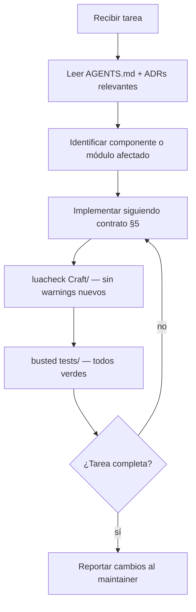

# AGENTS.md — Craft

> README para agentes de IA. Leer antes de cualquier tarea. Sincronizado con `docs/DTI_v0.1.md`.

---

## 1. Identidad del producto

- **Nombre**: Craft
- **Dominio**: WoW Addon Development — librería de componentes UI
- **Resumen**: librería open source de componentes UI para addons de World of Warcraft. Distribuida como addon instalable (LibStub) en CurseForge y Wago. Diseño basado en shadcn Lyra (Zinc + Emerald, Radius=None) con íconos Lucide y fuente Inter bundled en `Craft/media/`.
- **DTI**: `docs/DTI_v0.1.md`
- **FSD**: `docs/FSD_v0.1.md`
- **BRD**: `docs/BRD_v0.1.md`
- **ADRs**: `docs/adr/` — leer todos antes de tomar decisiones arquitectónicas

---

## 2. Contexto que el agente MUST leer antes de actuar

En orden:

1. **Este archivo completo** (AGENTS.md).
2. `docs/adr/` — las 10 ADRs definen todas las decisiones no negociables.
3. `docs/FSD_v0.1.md` §4 y §5 — casos de uso y contrato de componente.
4. `docs/DTI_v0.1.md` §3 y §5 — arquitectura de módulos y patrón de componente.

Si la tarea toca un componente específico: leer también `docs/components/<nombre>.md` cuando exista.

---

## 3. Estructura del repositorio

```
/
├── AGENTS.md               ← este archivo
├── CLAUDE.md               ← instrucciones para Claude Code
├── CHANGELOG.md            ← Keep a Changelog format
├── README.md
├── .gitignore
├── .luacheckrc             ← configuración del linter Lua
├── .pkgmeta                ← configuración de bigwigsmods/packager
├── .github/
│   └── workflows/
│       ├── ci.yml          ← lint + test en cada push/PR
│       └── release.yml     ← package + upload en tags v*
│
├── Craft/                  ← LA LIBRERÍA (lo que se distribuye)
│   ├── Craft.toc
│   ├── Craft.lua           ← entry point, LibStub registration
│   ├── libs/
│   │   └── LibStub.lua
│   ├── theme/
│   │   ├── Theme.lua       ← Craft.Theme (register, use, get, extend)
│   │   └── Presets.lua     ← lyra-dark, lyra-light tokens
│   ├── layout/
│   │   └── Flex.lua        ← Craft.Flex (motor CSS Flexbox en Lua)
│   ├── icons/
│   │   ├── Icons.lua       ← Craft.Icons.Get(name)
│   │   └── Atlas.lua       ← coordenadas UV del atlas TGA
│   ├── components/         ← 16 componentes MVP
│   │   ├── Button.lua
│   │   ├── Checkbox.lua
│   │   ├── Dialog.lua
│   │   ├── Input.lua
│   │   ├── Label.lua
│   │   ├── Panel.lua
│   │   ├── Scroll.lua
│   │   ├── Select.lua
│   │   ├── Separator.lua
│   │   ├── Sidebar.lua
│   │   ├── Slider.lua
│   │   ├── Tabs.lua
│   │   ├── Tooltip.lua
│   │   └── (Icons y Flex son módulos, no componentes de UI directos)
│   └── media/              ← assets bundled (no addon companion)
│       ├── Inter-Regular.ttf
│       ├── Inter-Bold.ttf
│       ├── lucide-16.tga
│       └── lucide-24.tga
│
├── Craft_Browser/          ← addon showcase in-game (CurseForge)
│   ├── Craft_Browser.toc
│   ├── Browser.lua
│   └── pages/              ← una página por componente
│
├── tests/                  ← unit tests con busted + mock WoW API
│   ├── mock_wow.lua        ← mock del WoW API para headless testing
│   └── test_<component>.lua
│
├── scripts/
│   ├── export-icons.py     ← genera lucide-16.tga y lucide-24.tga
│   └── bump-build.sh       ← incrementa CRAFT_BUILD en Craft.lua
│
└── docs/                   ← documentación (no se distribuye)
    ├── BRD_v0.1.md
    ├── MRD_v0.1.md
    ├── PRD_v0.1.md
    ├── FSD_v0.1.md
    ├── DTI_v0.1.md
    └── adr/
        ├── 0001-arquitectura-libreria-libstub.md
        ├── 0002-sistema-diseno-shadcn-lyra.md
        ├── 0003-iconos-lucide-first-class.md
        ├── 0004-craft-browser-showcase.md
        ├── 0005-sistema-de-theming.md
        ├── 0006-craft-flex-motor-layout.md
        ├── 0007-exclusion-tstl.md
        ├── 0008-exclusion-portal-web.md
        ├── 0009-pipeline-ci-cd.md
        └── 0010-estrategia-versioning.md
```

---

## 4. Stack tecnológico autoritativo

| Capa | Tecnología | Notas |
|------|------------|-------|
| Lenguaje principal | Lua 5.1 | WoW sandbox — sin librerías externas al entorno WoW |
| Librería compartida | LibStub | Registro: `LibStub:NewLibrary("Craft-1.0", BUILD)` |
| Diseño | shadcn Lyra | Base=Zinc, Theme=Emerald, Radius=None. Ver ADR-0002 |
| Íconos | Lucide (atlas TGA bundled) | Ver ADR-0003 |
| Fuente | Inter (TTF bundled) | `Craft/media/Inter-Regular.ttf` |
| Linter | luacheck | Configurado en `.luacheckrc` con globals WoW |
| Tests | busted | Headless con `tests/mock_wow.lua` |
| Packaging | bigwigsmods/packager | Ver ADR-0009 |
| CI | GitHub Actions | `ci.yml` (push) + `release.yml` (tags) |
| Distribución | CurseForge + Wago | Craft como Library; Craft_Browser como Addon |

El agente **MUST NOT** introducir dependencias fuera de este stack sin crear un ADR y obtener aprobación del maintainer.

---

## 5. Contrato de componente — regla de dominio más crítica

Todo componente Craft **MUST** implementar este contrato exacto:

```lua
-- 1. Definición del módulo
local MyComponent = {}
MyComponent.__index = MyComponent

-- 2. Constructor
function MyComponent:Create(parent, config)
  local self = setmetatable({}, MyComponent)
  -- crear frames WoW aquí
  self._themeHandle = Craft.Theme.register(function(t) self:_applyTheme(t) end)
  self:_applyTheme(Craft.Theme.get())
  return self
end

-- 3. Aplicar tema (MUST recibir la tabla de tokens, no llamar Theme.get() dentro)
function MyComponent:_applyTheme(t)
  -- aplicar t.background, t.primary, t.border, etc.
end

-- 4. Destructor — MUST liberar el listener para evitar memory leaks
function MyComponent:Destroy()
  Craft.Theme.unregister(self._themeHandle)
  self.frame:Hide()
  self.frame = nil
end
```

**Violaciones que el agente MUST NOT cometer:**
- Llamar `Craft.Theme.get()` dentro de `_applyTheme()` — causa re-entrancia.
- Omitir `Destroy()` o no llamar `unregister()` — causa memory leak de listeners.
- Hardcodear colores RGBA en los componentes — MUST usar tokens de `t.*`.
- Usar `radius > 0` en texturas — Lyra usa `Radius=None`; `SetColorTexture()` es suficiente.

---

## 6. Reglas de dominio invariantes

- **MUST**: todo componente implementa el contrato §5 completo (Create, _applyTheme, Destroy).
- **MUST**: `Craft.lua` incrementa `CRAFT_BUILD` antes de cada release (ver `scripts/bump-build.sh`).
- **MUST**: los colores vienen de tokens semánticos del tema, nunca hardcodeados.
- **MUST**: usar `Craft.Icons.Get(name)` para íconos — nunca rutas TGA hardcodeadas.
- **MUST**: usar `Craft.Theme.getFont()` para fuentes — nunca rutas TTF hardcodeadas.
- **MUST NOT**: ningún componente puede contaminar Secure Frames (anti-taint). Verificar con `Blizzard_DebugTools` antes de PR.
- **MUST NOT**: usar globales de Lua no declaradas en `.luacheckrc`. `luacheck` MUST pasar sin warnings nuevos.
- **MUST NOT**: introducir soporte TypeScriptToLua (ver ADR-0007). Rechazar PRs con `.d.ts`.
- **MUST NOT**: crear un addon companion separado para assets — todo va en `Craft/media/` (ver ADR-0003).
- **MUST NOT**: usar `radius > 0` en ningún componente — Lyra usa `Radius=None` (ver ADR-0002).
- **MUST NOT**: modificar ADRs aceptados. Crear un ADR nuevo que los superede.

---

## 7. Seguridad y restricciones del sandbox WoW

- **Sin acceso a filesystem**: WoW no provee APIs de lectura/escritura de archivos. `io.*` no existe.
- **Sin sockets de red**: `socket.*`, `http.*` no existen en el sandbox.
- **Sin `os.time()` no determinista**: usar `GetTime()` de WoW en su lugar.
- **Variables globales**: evitar — todo debe estar en el namespace `Craft.*`. Los globales contaminan el entorno de WoW.
- **No hay secretos**: Craft es código open source sin autenticación ni datos de usuario.

---

## 8. Guardrails del agente

### Lo que el agente puede hacer sin aprobación:
- Leer cualquier archivo del repositorio.
- Implementar un componente siguiendo el contrato §5.
- Agregar o modificar tests en `tests/`.
- Actualizar `CHANGELOG.md`.
- Corregir bugs en componentes existentes (PATCH — sin cambio de API).

### Lo que requiere aprobación del maintainer:
- Cambiar la API pública de un componente (nuevo parámetro en `Create()`, nuevo método público).
- Agregar un componente nuevo (MINOR — requiere entrada en `Craft.toc`, tests, docs).
- Cualquier cambio en `Craft/theme/Presets.lua` (tokens de diseño Lyra).
- Cambios en `.github/workflows/` (pipelines de CI/CD).
- Breaking change de API (MAJOR — requiere nuevo ADR y cambio de nombre LibStub a `"Craft-2.0"`).

### MUST NOT sin excepción:
- Hacer `git push` — el maintainer pushea manualmente.
- Modificar ADRs aceptados — crear un nuevo ADR que los superede.
- Introducir `require()` de módulos externos al sandbox WoW.
- Crear archivos `.d.ts` o cualquier artefacto TypeScript/TSTL.
- Crear un directorio `Craft_SharedMedia/` — los assets van en `Craft/media/`.

---

## 9. Flujo de trabajo estándar para una tarea



---

## 10. Comandos de verificación locales

```bash
# Lint — MUST pasar sin warnings nuevos antes de cualquier PR
luacheck Craft/ --config .luacheckrc

# Tests unitarios headless
busted tests/

# Generar atlas TGA de Lucide (requiere Python + Pillow)
python3 scripts/export-icons.py

# Incrementar LibStub build number antes de un release
bash scripts/bump-build.sh
```

---

## 11. Tokens de diseño Lyra — referencia rápida

Todos los componentes usan estos tokens vía `Craft.Theme.get()`:

| Token | Uso típico |
|-------|-----------|
| `t.background` | Fondo de Panel, Dialog, Scroll |
| `t.foreground` | Texto principal |
| `t.primary` | Color de acento (Emerald) — botones activos, focus rings |
| `t.primaryForeground` | Texto sobre fondo primary |
| `t.secondary` | Botones secundarios, badges |
| `t.muted` | Texto de ayuda, placeholders |
| `t.mutedForeground` | Texto sobre fondo muted |
| `t.border` | Bordes de inputs, separators, cards |
| `t.input` | Fondo de inputs, selects |
| `t.ring` | Focus ring — 2px, color primary |
| `t.destructive` | Estados de error, botones destructivos |
| `t.card` | Fondo de cards y paneles anidados |
| `t.font` | Ruta a `Inter-Regular.ttf` bundled |
| `t.fontBold` | Ruta a `Inter-Bold.ttf` bundled |

`radiusBase = 0` — Lyra usa `Radius=None`. **No aplicar border radius en ningún componente.**

---

## 12. Versioning — referencia rápida

| Tipo de cambio | Acción |
|---|---|
| Bug fix (sin cambio de API) | `PATCH` — e.g., `v1.0.1`; incrementar `CRAFT_BUILD` |
| Nuevo componente o feature | `MINOR` — e.g., `v1.1.0`; incrementar `CRAFT_BUILD` |
| Breaking change de API | `MAJOR` — e.g., `v2.0.0`; nuevo nombre LibStub `"Craft-2.0"`; `CRAFT_BUILD = 1` |

El `CRAFT_BUILD` en `Craft.lua` es un integer siempre creciente. Usar `scripts/bump-build.sh`.

---

## 13. Contacto y escalamiento

- **Maintainer**: Alberto Gomez
- **Repositorio**: `github.com/[org]/craft` (pendiente publicación)
- **Canal comunidad**: Discord addon-dev WoW

---

## 14. Registro de cambios

| Versión | Fecha | Autor | Cambio |
|---------|-------|-------|--------|
| v0.1 | 30/05/2026 | Alberto Gomez | Versión inicial — Craft, librería UI WoW con LibStub, Lyra, Lucide bundled |
