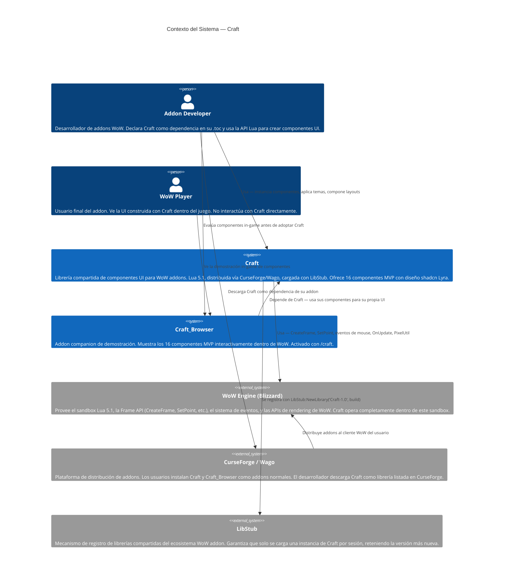
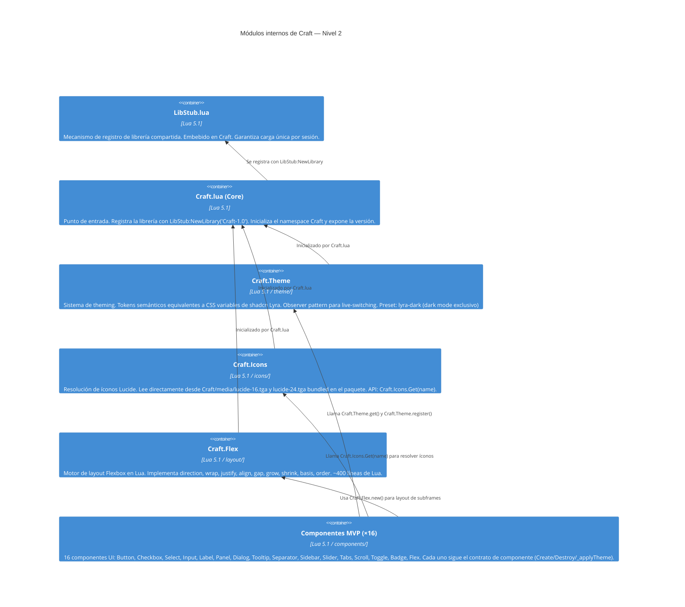
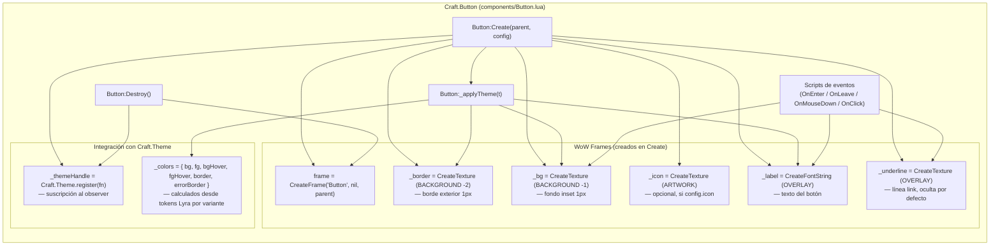
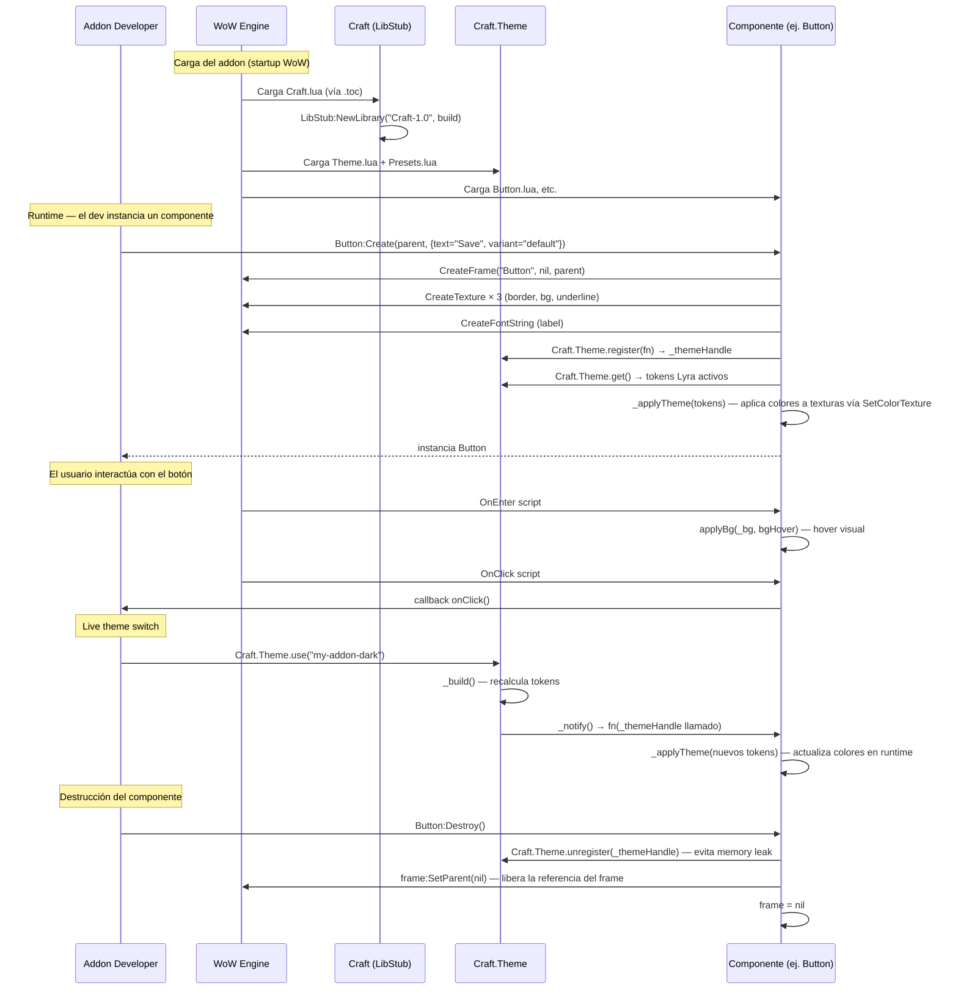
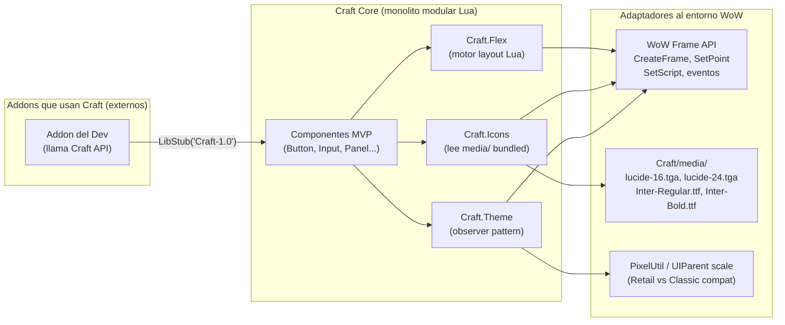
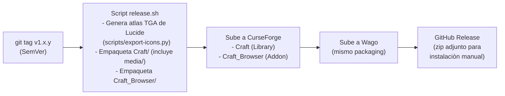

# Documento Técnico Inicial (DTI) — Craft

> **Propósito**: este documento es el contrato técnico inicial de Craft. Describe la arquitectura real de la librería — un monolito modular Lua 5.1 distribuido como WoW addon — con suficiente detalle para que tanto ingenieros humanos como agentes IA puedan entender, extender y mantener el proyecto sin contexto adicional.
>
> **Audiencia dual**:
> - **Humanos**: el maintainer principal (Alberto Gomez), co-maintainers futuros, contribuidores de la comunidad addon-dev.
> - **Agentes IA**: Claude Code y otros asistentes que asistan en el desarrollo futuro de Craft. Este documento es la fuente primaria de contexto arquitectónico.
>
> **Regla de oro**: si una decisión arquitectónica significativa no está aquí (o referenciada desde aquí), no existe.

---

## 0. Metadatos

| Campo | Valor |
|-------|-------|
| Producto | Craft — Librería compartida de componentes UI para addons de World of Warcraft |
| Versión | v0.1 |
| Fecha | 30/05/2026 |
| Arquitecto responsable | Alberto Gomez |
| Stakeholders | Desarrolladores independientes de addons WoW, autores de suites UI completas, comunidad CurseForge/Wago |
| Estado | Borrador |
| Repositorio | github.com/bettogamer/craft |
| Enlace al BRD | `docs/BRD_v0.1.md` |
| Enlace a ADRs | `docs/adr/` |
| POC de referencia | CraftUI (mayo 2026) — `../CraftUI/` |
| Prompts utilizados | PR-DTI-001 (generación inicial via Claude Code) |

---

## 1. Visión del Producto

**Problema**: El ecosistema WoW addon carece de una librería de componentes UI moderna con arquitectura de librería compartida. AceGUI-3.0, la solución dominante, tiene más de 15 años de antigüedad: estética de 2008, API inconsistente, y ningún sistema de theming. Para desarrolladores con background web (React, Tailwind, shadcn/ui), la brecha conceptual es radical.

**Usuarios objetivo**:
- *Marco* — desarrollador independiente de addons WoW, Lua nativo, familiarizado con LibStub/Ace3. Necesita UI moderna sin distribuir assets propios.
- *Arjun* — autor de suite UI completa con múltiples addons coordinados. Necesita theming personalizable compartido entre todos sus addons.

**Propuesta de valor**: Craft es una librería open source de componentes UI para addons WoW, distribuida vía CurseForge/Wago, cargada con LibStub. Ofrece 16 componentes MVP con diseño shadcn Lyra, íconos Lucide first-class, motor de layout Flex, y sistema de theming con live-switching. El desarrollador declara `Craft` como dependencia en su `.toc`; Craft se instala una vez y es compartida por todos los addons que la usan en la sesión.

**Métricas de éxito**:
- North Star: 50 addons activos en CurseForge/Wago declarando Craft como dependencia al cierre de Q1 2027.
- KPI-02: 300 GitHub Stars al cierre de Q4 2026.
- KPI-03: Tiempo de setup de UI ≤ 60 minutos (baseline AceGUI: ~8 horas).
- KPI-04: Los 16 componentes MVP entregados con cobertura anti-taint documentada antes del 30/09/2026.

**Restricciones de negocio**:
- Presupuesto USD 0/año. Sin hosting web, sin CI/CD externo en fase inicial.
- Un maintainer principal: ~4h/semana disponibles.
- Sin soporte TypeScriptToLua (ADR-0007).
- Sin portal web (ADR-0008).
- Plataforma: sandbox Lua 5.1 de WoW — sin filesystem, sin sockets de red, sin librerías externas al entorno WoW.

---

## 2. Contexto del Sistema

### 2.1 Diagrama C4 Nivel 1 — Contexto



### 2.2 Actores externos y dependencias

| Actor / Sistema | Tipo | Dirección | Criticidad | Notas |
|-----------------|------|-----------|------------|-------|
| WoW Engine (Blizzard) | Plataforma de ejecución | Craft → WoW | Crítica | Craft opera exclusivamente dentro del sandbox Lua de WoW. Cambios de API en parches de Blizzard son el riesgo técnico principal. |
| LibStub | Librería externa (embebida) | Craft → LibStub | Crítica | Mecanismo de registro y versionado. Embebido en la distribución de Craft. Sin LibStub, Craft no puede registrarse como librería compartida. |
| CurseForge / Wago | Plataforma de distribución | Craft → CurseForge | Alta | Canal único de distribución del addon. Cambios en su política de listado o ToS impactan la disponibilidad de Craft. |
| Craft_Browser | Addon companion (propio) | Browser → Craft | Media | Showcase in-game. Depende de Craft, no al revés. Distribuido en CurseForge como addon separado. |
| shadcn Lyra | Referencia de diseño (externa) | diseño → tokens Lua | Alta | Fuente de verdad visual. Los tokens CSS de Lyra están traducidos a tablas Lua en `Craft/theme/Presets.lua`. Sin cambio activo en el runtime — solo referencia para implementación. |
| Lucide | Referencia de íconos (externa) | diseño → TGA atlas | Media | Los SVGs de Lucide se convierten a atlas TGA via script de release. MIT License. |
| GitHub | Repositorio y gestión | bidireccional | Alta | Source of truth del código. Issues, PRs, Discussions. Sin CI/CD en fase inicial. |

---

## 3. Arquitectura de Alto Nivel

### 3.1 Estilo arquitectónico adoptado — Monolito Modular Lua

**Estilo elegido**: Monolito modular Lua 5.1.

**Justificación**: Craft opera dentro del sandbox Lua de World of Warcraft, que impone restricciones absolutas que eliminan todos los estilos arquitectónicos modernos basados en red:

- No hay servidor web, no hay microservicios, no hay base de datos.
- No hay sistema de archivos accesible desde Lua en tiempo de ejecución.
- No hay llamadas de red (el sandbox de WoW prohíbe sockets de red desde Lua).
- No hay async/await ni concurrencia real: WoW es single-threaded con un bucle de eventos sincrónico basado en callbacks de frames (`SetScript`).
- No hay proceso de build en runtime: los archivos `.lua` se cargan en el orden declarado en el archivo `.toc` durante la inicialización del addon.

El "monolito" no es un anti-patrón aquí: es la única arquitectura posible dentro del sandbox. La modularidad se logra mediante la organización de archivos en carpetas lógicas y la convención de namespaces Lua (`Craft.Theme`, `Craft.Icons`, `Craft.Flex`, etc.). Cada módulo es un archivo `.lua` que escribe en la tabla global `Craft`.

La alternativa considerada fue TypeScriptToLua (TSTL), que añadiría un paso de compilación TypeScript → Lua. Fue descartada por su overhead de mantenimiento desproporcionado para un proyecto con un solo maintainer (ADR-0007).

Ver ADR correspondiente: `docs/adr/0001-arquitectura-libreria-libstub.md`.

### 3.2 Diagrama C4 Nivel 2 — Contenedores (Módulos de Craft)



### 3.3 Diagrama C4 Nivel 3 — Internals de un Componente (Button)



**Variantes del Button**: `default`, `destructive`, `outline`, `secondary`, `ghost`, `link`. Cada variante mapea tokens Lyra distintos en `_applyTheme`. La variante puede cambiarse en runtime con `Button:SetVariant(v)`.

**Sin bordes redondeados**: Lyra usa `radiusBase = 0` (Radius=None). No hay 9-slice TGA ni esquinas redondeadas. `Craft.Theme.SetBg(tex, color)` aplica `SetColorTexture` directamente.

### 3.4 Data Flow — Ciclo de vida de un componente



---

## 4. Modelo de Dominio

Craft no implementa DDD clásico (no hay bounded contexts, aggregates ni repositorios — no hay persistencia). Las entidades conceptuales del dominio son:

### 4.1 Entidades conceptuales

| Entidad | Descripción | Ciclo de vida | Representación en código |
|---------|-------------|---------------|--------------------------|
| **Componente** | Frame WoW con métodos Craft. Tiene identidad propia (instancia). Posee referencias a sus subframes y a su `_themeHandle`. | `Create()` → uso → `Destroy()` | Tabla Lua con metatable: `setmetatable({}, Component)` |
| **Token de tema** | Par clave-valor semántico que mapea un rol visual (e.g. `primary`, `background`, `border`) a un color RGBA o valor de espaciado. Equivalente a una CSS variable de Lyra. | Inmutable por preset; reemplazado en live-switch | Campo de la tabla retornada por `Craft.Theme.get()` |
| **Preset de tema** | Tabla completa de tokens (22 de color + 7 de espaciado = 29 tokens) que define un tema completo. `lyra-dark` es el único preset built-in. | Registrado en startup o con `Craft.Theme.register()` | Tabla Lua en `theme/Presets.lua` o registrada por el dev |
| **Descriptor de ícono** | Par `{path, coords}` que identifica una textura en el atlas TGA de Lucide bundled en `Craft/media/`. No tiene identidad persistente — se resuelve en runtime. | Efímero — resuelto en cada llamada a `Craft.Icons.Get()` | Tabla Lua retornada por `Craft.Icons.Get(name)` |
| **Contenedor Flex** | Frame WoW que actúa como contenedor de layout. Calcula posiciones de sus hijos según atributos Flexbox (direction, justify, align, gap, grow/shrink). | `Craft.Flex.new(parent, config)` → `flex:Add(child)` → `flex:Layout()` → `flex:Destroy()` | Tabla Lua con metatable FlexContainer |
| **_themeHandle** | Número de secuencia opaco que identifica la suscripción de un componente al observer de temas. | Creado en `Component:Create()` via `Craft.Theme.register(fn)`. Liberado en `Destroy()` via `Craft.Theme.unregister(handle)`. | `number` (entero, secuencia global `_handleSeq`) |

### 4.2 Invariantes del dominio

- Un componente DEBE llamar `Craft.Theme.unregister(self._themeHandle)` en `Destroy()`. No hacerlo produce un memory leak: la tabla `_listeners` de Theme retiene una referencia al componente muerto, impidiendo que el garbage collector de Lua lo libere.
- Un componente NUNCA debe tocar Secure Frames (frames de Blizzard marcados como protected). Cualquier llamada a métodos de Secure Frames desde código no-protegido produce taint, bloqueando funcionalidades de combate del juego.
- `Craft.Theme.get()` retorna la misma tabla hasta el próximo `use()`. Los componentes NO deben mutar esta tabla — deben leerla solamente.
- `Craft.Icons.Get(name)` puede retornar `nil` si el ícono no existe. Los componentes que usan íconos DEBEN verificar `if icon then` antes de aplicarlo.

---

## 5. Patrón de Componente

### 5.1 Contrato de componente

Todo componente de Craft DEBE implementar la siguiente interfaz:

| Método | Tipo | Obligatorio | Descripción |
|--------|------|-------------|-------------|
| `ComponentName:Create(parent, config)` | Constructor | Sí | Crea los frames WoW, aplica el tema inicial, suscribe al observer de temas. Retorna `self`. |
| `ComponentName:Destroy()` | Destructor | Sí | Desregistra `_themeHandle`, oculta el frame, llama `frame:SetParent(nil)`. Previene memory leaks. |
| `ComponentName:_applyTheme(t)` | Interno | Sí | Recibe la tabla de tokens del tema activo y aplica colores/espaciados a los subframes. Llamado por el observer y al final de `Create()`. |
| `self._themeHandle` | Campo | Sí | Handle de suscripción retornado por `Craft.Theme.register()`. Almacenado en `self` para poder llamar `unregister` en `Destroy()`. |

**Patrón OOP usado**:
```lua
ComponentName = ComponentName or {}
ComponentName.__index = ComponentName

function ComponentName:Create(parent, config)
  local self = setmetatable({}, ComponentName)
  -- ... crear frames WoW ...
  self._themeHandle = Craft.Theme.register(function(t)
    self:_applyTheme(t)
  end)
  self:_applyTheme(Craft.Theme.get())
  return self
end

function ComponentName:Destroy()
  Craft.Theme.unregister(self._themeHandle)
  self.frame:SetParent(nil)
  self.frame = nil
end
```

### 5.2 Módulos Core como "adaptadores del entorno WoW"

En términos de puertos y adaptadores aplicados al sandbox Lua, los módulos core de Craft actúan como la capa de abstracción entre los componentes y las peculiaridades del entorno WoW:

| Módulo Core | Rol de adaptador | Port que abstrae |
|-------------|-----------------|------------------|
| `Craft.Theme` | Adaptador de diseño visual | Traduce tokens semánticos de Lyra a valores concretos `{r,g,b,a}` que la API de WoW entiende. Aplica colores con `SetColorTexture` (sin bordes redondeados — `radiusBase = 0`). |
| `Craft.Icons` | Adaptador de assets de íconos | Lee directamente desde `Craft/media/lucide-16.tga` y `lucide-24.tga` bundled en el paquete. Los componentes solo llaman `Craft.Icons.Get(name)`. |
| `Craft.Flex` | Adaptador de layout | Abstrae el sistema de `SetPoint` de WoW detrás de una API Flexbox familiar. Calcula coordenadas en Lua y llama `SetPoint` internamente. |
| `Craft.Theme.px()` / `PixelUtil` | Adaptador de resolución de pantalla | Abstrae la diferencia entre Retail (tiene `PixelUtil`) y Classic (sin `PixelUtil`). Garantiza que 1px en el diseño sea 1 pixel render en cualquier versión de WoW. |

### 5.3 Diagrama de puertos y adaptadores



---

## 6. Distribución y Empaquetado

### 6.1 Estructura de archivos del addon Craft

```
Craft/
├── Craft.toc                    # Manifiesto del addon WoW
│   # ## Interface: 110002 (Retail) / 11502 (Classic ERA) / ...
│   # ## Title: Craft
│   # ## Version: @project-version@
│   # ## Dependencies: (ninguna — LibStub se embebe)
│   # Archivos en orden de carga:
├── libs/
│   └── LibStub.lua              # LibStub embebido
├── Craft.lua                    # Core: LibStub:NewLibrary("Craft-1.0", build)
├── theme/
│   ├── Theme.lua                # Craft.Theme — observer, get(), use(), extend(), register()
│   └── Presets.lua              # lyra-dark (único preset built-in) (22 color + 7 spacing)
├── icons/
│   ├── Icons.lua                # Craft.Icons — Get(name), lee desde media/ bundled
│   └── Atlas.lua                # Coordenadas UV del atlas TGA de Lucide
├── layout/
│   └── Flex.lua                 # Craft.Flex — motor Flexbox en Lua (~400 líneas)
├── media/
│   ├── lucide-16.tga            # Atlas Lucide 16px (bundled)
│   ├── lucide-24.tga            # Atlas Lucide 24px (bundled)
│   ├── Inter-Regular.ttf        # Fuente Inter Regular (bundled)
│   └── Inter-Bold.ttf           # Fuente Inter Bold (bundled)
└── components/
    ├── Button.lua
    ├── Checkbox.lua
    ├── Select.lua
    ├── Input.lua
    ├── Label.lua
    ├── Panel.lua
    ├── Dialog.lua
    ├── Tooltip.lua
    ├── Separator.lua
    ├── Sidebar.lua
    ├── Slider.lua
    ├── Tabs.lua
    ├── Scroll.lua
    ├── Toggle.lua
    ├── Badge.lua
    └── [Flex ya incluido en layout/]

Craft_Browser/                   # Addon companion (showcase in-game)
├── Craft_Browser.toc            # ## Dependencies: Craft
├── Browser.lua                  # Comando /craft, frame principal
└── pages/
    ├── ButtonPage.lua
    ├── InputPage.lua
    └── [una página por componente MVP]
```

### 6.2 Proceso de release



**Versionado con LibStub + SemVer**:
- `Craft.toc`: `## Version: @project-version@` — reemplazado por CurseForge Packager al hacer deploy.
- `Craft.lua`: `LibStub:NewLibrary("Craft-1.0", build)` donde `build` es el número de build (entero creciente). LibStub carga automáticamente la versión con el `build` más alto si múltiples versiones de Craft están presentes.
- SemVer `MAJOR.MINOR.PATCH`: MAJOR = breaking change de API, MINOR = nuevos componentes/features sin breaking change, PATCH = bugfixes.
- El nombre de la librería en LibStub (`"Craft-1.0"`) solo cambia en MAJOR version bumps.

---

## 7. Compatibilidad WoW Multi-Versión (Retail vs. Classic)

_Esta sección reemplaza la sección de Capa de IA/Agentes del template genérico. Craft es una librería Lua, no un sistema de IA._

### 7.1 Versiones de WoW soportadas

| Versión WoW | Interface Number | Estado de soporte | Notas |
|-------------|-----------------|-------------------|-------|
| Retail (The War Within 11.x) | 110002+ | Soporte completo | Tiene `PixelUtil`, `AnchorSets`, APIs modernas. |
| Classic Era (1.14.x) | 11502 | Soporte completo | Sin `PixelUtil`; usa fallback manual de escala. `AnchorSets` no disponible. |
| Classic Cata (4.4.x) | 40400 | Soporte completo | Sin `PixelUtil`. Intermedio en APIs disponibles. |
| Classic WotLK / SoD | variable | Soporte best-effort | Sin APIs modernas; fallbacks activos. |
| Versiones no hosteadas por Blizzard | N/A | Fuera de alcance | No se prueban ni garantizan. |

### 7.2 Estrategia de compatibilidad multi-versión

El principio es **detección de features en runtime, no bifurcación de versiones**. Un único codebase Lua corre en todas las versiones soportadas:

| API / Feature | Retail | Classic | Estrategia de Craft |
|---------------|--------|---------|---------------------|
| `PixelUtil.SetHeight/Width/Size` | Disponible (Dragonflight+) | No disponible | `Craft.Theme.SetPixelHeight/Width/Size` detecta `if PixelUtil then` y cae a cálculo manual con `UIParent:GetEffectiveScale()`. |
| `AnchorSets` (layout nativo) | Disponible (Dragonflight+) | No disponible | `Craft.Flex` no depende de AnchorSets. Usa `SetPoint` puro — disponible en todas las versiones. |
| `CreateFrame("Button")` scripts de input | Estándar | Estándar | Sin diferencias entre versiones para la API básica de frames. |
| Interface number check | N/A | N/A | Los componentes NO verifican la versión del juego explícitamente. Usan detección de features. |

### 7.3 Proceso de validación multi-versión

Antes de cada release:
1. Prueba de componentes en Retail (última versión del PTR/Live).
2. Prueba de componentes en Classic ERA (versión de referencia para Classic).
3. Verificación de anti-taint en ambas versiones (ver §10).
4. Los resultados se documentan en el changelog del release.

---

## 8. NFRs Consolidados

| ID | Categoría | Umbral / Criterio | Mecanismo de verificación |
|----|-----------|-------------------|--------------------------|
| NFR-001 | Anti-taint | Ningún componente contamina Secure Frames en ninguna versión soportada | Prueba manual en Retail y Classic con `/taintlog`; ninguna alerta de taint en los logs de WoW |
| NFR-002 | Performance de layout | `Craft.Flex.Layout()` con 10 elementos en < 1ms; con 50 elementos en < 5ms | Medición con `GetTimePreciseSec()` en Craft_Browser |
| NFR-003 | Performance de live-switch | `Craft.Theme.use()` aplicado a 10 componentes activos en < 16ms (1 frame a 60fps) | Medición con `GetTimePreciseSec()` antes y después del `use()` |
| NFR-004 | Memory — sin leaks | Abrir y cerrar 100 veces cualquier componente en Craft_Browser sin crecimiento apreciable de memoria Lua | Inspección de `gcinfo()` antes y después; diff < 10KB |
| NFR-005 | Compatibilidad Retail | Los 16 componentes MVP funcionan sin errores en WoW Retail 11.x | Test manual en Retail antes de cada release |
| NFR-006 | Compatibilidad Classic | Los 16 componentes MVP funcionan sin errores en WoW Classic ERA | Test manual en Classic antes de cada release |
| NFR-007 | Sin globals contaminantes | Craft no escribe en el espacio de nombres global de WoW salvo la tabla `Craft` y los registros de LibStub | Auditoría de código — `grep -n "^[A-Z][a-zA-Z]* ="` en archivos de Craft |
| NFR-008 | Assets siempre disponibles | No aplica fallback — assets (TGA, fuentes Inter) siempre bundled en `Craft/media/`. No hay dependencia externa de assets | N/A — assets incluidos en el paquete de Craft |
| NFR-009 | Licencia MIT | Toda distribución de Craft mantiene el encabezado de licencia MIT | Revisión manual en cada release; header en `Craft.lua` |
| NFR-010 | Tamaño del addon | `Craft.zip` (incluye `media/`) < 500KB | Medición del archivo de release antes de subir a CurseForge |

---

## 9. POCs Críticas

### 9.1 POC-01: CraftUI (mayo 2026) — COMPLETADA ✅

| Campo | Valor |
|-------|-------|
| Nombre | CraftUI — POC de patrón de componentes, theming y Flex |
| Riesgo mitigado | ¿Es viable implementar componentes UI modernos (shadcn Lyra) en Lua 5.1 dentro del sandbox WoW? ¿El patrón OOP con setmetatable funciona correctamente para componentes reutilizables? ¿El sistema de callbacks para live-switching de temas funciona sin taint? |
| Hipótesis | Es posible implementar los conceptos de shadcn/ui (tokens de color semánticos, variantes de componentes, live-switching de temas) en Lua 5.1 usando solo la Frame API de WoW, sin XML y sin TSTL. |
| Criterio de éxito | Implementación funcional de Button, Input, Panel, Flex, Theme, e Icons en Lua puro. Live-switching sin recarga de UI. Sin errores de taint. |
| Alcance ejecutado | 7 componentes iniciales + CraftTheme + CraftFlex + CraftIcons. Modelo copy-paste (no LibStub). |
| Resultado | **✅ Validada completamente**. Todos los criterios de éxito cumplidos. Hallazgos clave: (1) el patrón OOP con setmetatable es correcto para componentes WoW; (2) el observer pattern para live-switching funciona sin taint; (3) Craft.Flex es el feature más valorado por early testers; (4) el modelo copy-paste es inviable para una librería de UI de uso general — las actualizaciones no se propagan. El modelo copy-paste fue descontinuado; la arquitectura de librería compartida (LibStub) es la correcta para Craft. |
| Ubicación del código | `../CraftUI/src/components/` |
| ADRs derivados | ADR-0001 (LibStub), ADR-0002 (Lyra), ADR-0003 (Lucide), ADR-0005 (theming), ADR-0006 (Flex), ADR-0007 (exclusión TSTL) |

### 9.2 POC-02: Packaging LibStub en instalación multi-addon — PROPUESTA

> Documento completo: `docs/poc/POC-02-libstub-multi-addon.md`

| Campo | Valor |
|-------|-------|
| Nombre | Validación de packaging LibStub en escenario real multi-addon |
| Riesgo mitigado | ¿Se carga correctamente una única instancia de Craft cuando múltiples addons declaran Craft como dependencia? ¿LibStub resuelve correctamente el conflicto si un addon embebe una versión de Craft ligeramente más nueva o más vieja que la standalone? |
| Hipótesis | `LibStub:NewLibrary("Craft-1.0", build)` retorna `nil` (no reemplaza) si ya hay una versión igual o más nueva, y retorna la nueva tabla si el build es mayor. En una instalación con 5 addons dependiendo de Craft, solo se carga una instancia y todos los addons acceden a la misma. |
| Criterio de éxito medible | `LibStub("Craft-1.0")` retorna el mismo puntero de tabla en todos los addons que la solicitan. No hay duplicación de memoria. Ningún error de Lua en el log de WoW al cargar 5 addons simultáneos. |
| Alcance | Crear 3 addons de prueba minimal que declaren Craft como dependencia, instalarlos con Craft standalone, verificar comportamiento de LibStub en el log de carga. |
| Cronograma estimado | 2 días — ejecutar antes del release de Craft v1.0 |
| Responsable | Alberto Gomez |

---

## 10. Seguridad (WoW context: Anti-Taint)

En el contexto de WoW addon development, "seguridad" no involucra autenticación, autorización ni cifrado. Las amenazas relevantes son específicas del sandbox de Blizzard:

### 10.1 Modelo de amenazas WoW

| Amenaza | Descripción | Impacto | Mitigación en Craft |
|---------|-------------|---------|---------------------|
| **Taint de Secure Frames** | Un addon que llama a métodos de frames protegidos de Blizzard (frames de combate, macros, movimiento) desde código no-protegido contamina esas funciones. El juego bloquea esas funcionalidades hasta el próximo `/reload`. | Crítico — puede bloquear el combate, movimiento o habilidades del jugador. | Craft NUNCA toca Secure Frames. Todos los frames Craft se crean como non-secure (`CreateFrame("Frame", nil, UIParent)`, no `CreateFrame("Frame", nil, UIParent, "SecureFrameTemplate")`). Verificación anti-taint es requisito de merge. |
| **Contaminación del espacio de nombres global** | Craft escribe variables globales que colisionan con nombres usados por otros addons, modificando su comportamiento silenciosamente. | Alto — puede romper addons de terceros instalados. | Craft usa un único namespace global: la tabla `Craft`. Internamente, todas las variables son locales (`local`). Módulos se escriben en `Craft.Theme`, `Craft.Icons`, etc. — no en globals independientes. |
| **Memory leaks vía listeners no liberados** | Componentes destruidos cuyo `_themeHandle` no fue desregistrado retienen una referencia en `Craft.Theme._listeners`. Lua no puede garbage-collect el componente. En sesiones largas, esto agota la memoria del addon. | Medio — degradación de performance con el tiempo. | El contrato de componente REQUIERE `Craft.Theme.unregister(self._themeHandle)` en `Destroy()`. Documentado en `docs/component-contract.md`. Auditado en code reviews. |
| **Filtración de datos del jugador** | Un componente malicioso podría capturar input (contraseñas, etc.) y enviarlo. | N/A en Craft | Craft no hace llamadas de red (el sandbox WoW no permite sockets desde Lua de addons). No hay `SendAddonMessage` con datos sensibles. No aplica para una librería de UI. |
| **Ejecución arbitraria de código** | Un addon malicioso podría modificar las funciones de Craft en runtime (monkey-patching de la tabla global `Craft`). | Bajo | El modelo de librería compartida hace que Craft sea una referencia global mutable. Los addons maliciosos pueden modificarla. Mitigación: Craft no pretende ser un sandbox de seguridad — es una librería de UI. Este riesgo es inherente al ecosistema WoW addon. |

### 10.2 Garantías anti-taint por componente

Antes del merge de cualquier componente al branch principal, se debe documentar:
- Una prueba manual confirmando que el componente no genera alertas en `/taintlog` en Retail.
- Una prueba en Classic confirming lo mismo.
- La prueba se documenta en el PR como evidencia.

---

## 11. Observabilidad (WoW context: sin CloudWatch)

En el sandbox de WoW, la observabilidad es radicalmente diferente al stack web estándar. No hay logs estructurados, no hay Prometheus, no hay OpenTelemetry.

### 11.1 Mecanismos disponibles

| Mecanismo | API WoW | Uso en Craft |
|-----------|---------|--------------|
| **Errores Lua** | `geterrorhandler()`, log de errores de WoW | Los errores de componentes de Craft aparecen en el log de errores de WoW con stack trace. Los addons dependientes pueden ver de qué archivo de Craft proviene el error. |
| **Mensajes de debug** | `print()` — escribe en el chat del juego | `Craft.Debug.log(msg)` (si está habilitado) escribe en el chat. Solo activo cuando `Craft._debug = true`. Desactivado por defecto. |
| **Comando `/craft debug`** | `SlashCmdList["CRAFT"]` | Craft_Browser registra `/craft debug` que activa logging y muestra métricas básicas (número de listeners de tema, versión de Craft cargada). |
| **`gcinfo()`** | API Lua nativa | Disponible para medir uso de memoria Lua en cualquier momento. Útil para detectar memory leaks en desarrollo. |
| **`GetTimePreciseSec()`** | API WoW | Para medir performance de operaciones específicas (layout, live-switch). |

### 11.2 Estrategia de debugging para adoptantes

El addon `Craft_Browser` actúa como primera herramienta de diagnóstico:
- `/craft` — abre el showcase de componentes. Si no abre, Craft no está cargado correctamente.
- `/craft debug` — activa logging en chat. Muestra: versión de Craft cargada, `LibStub("Craft-1.0")` status, número de theme listeners activos.
- La presencia de errores en el log de errores de WoW con archivos `Craft/` en el stack trace indica un bug en Craft vs. un bug en el addon del dev.

---

## 12. DevOps y Ciclo de Vida

### 12.1 Estrategia de branching

```
main          — código estable, releases. Protegido.
develop       — integración de features. PRs mergeados aquí primero.
feat/[nombre] — feature branches individuales.
fix/[nombre]  — bugfix branches.
```

Craft no tiene CI/CD automatizado en la fase inicial (ADR-0008, restricción de presupuesto). Las acciones son manuales:

### 12.2 Proceso de release manual

1. Merge de `develop` → `main` cuando todos los componentes del milestone están listos.
2. `git tag v1.x.y -m "..."` en `main`.
3. Ejecutar `scripts/export-icons.py` para regenerar los atlas TGA de Lucide en `Craft/media/`.
4. Ejecutar `scripts/package.sh` para generar los ZIPs de distribución.
5. Subir manualmente a CurseForge (Craft, Craft_Browser).
6. Subir manualmente a Wago.
7. Crear GitHub Release con los ZIPs adjuntos.

### 12.3 Estrategia de testing

El sandbox de Lua de WoW no puede ejecutarse fuera del cliente del juego. No hay framework de testing unitario automático para lógica de frames WoW. La estrategia es:

| Nivel | Mecanismo | Qué cubre |
|-------|-----------|-----------|
| **Manual in-game** | Craft_Browser | Todos los 16 componentes MVP — visual, interacción, estados (hover, disabled, error). |
| **Test scripts Lua** | `tests/test_flex.lua` | Lógica pura de Craft.Flex (sin frames WoW). Puede ejecutarse con lua 5.1 standalone o en WoW con `/run loadfile("tests/test_flex.lua")()`. |
| **Anti-taint check** | `/taintlog` en WoW | Componentes en Retail y Classic antes de cada release. |
| **Memory leak check** | `gcinfo()` en Craft_Browser | Abrir/cerrar componentes 100 veces, verificar delta de memoria. |
| **Multi-addon packaging** | POC-02 | Verificar que LibStub resuelve correctamente múltiples addons dependiendo de Craft (pendiente). |

### 12.4 Política de PRs y contribuciones

- Los PRs deben incluir: descripción del cambio, evidencia de test manual in-game (screenshot o descripción), verificación anti-taint.
- Ningún PR se mergea sin al menos una revisión aprobada del maintainer (RB-06 del BRD).
- Los PRs que introduzcan `.d.ts` o convenciones TSTL son rechazados (ADR-0007).
- Los PRs de nuevos componentes deben incluir su página en `Craft_Browser/pages/`.

---

## 13. Antipatrones Auditados

| Antipatrón | ¿Detectado? | Mitigación aplicada |
|------------|-------------|---------------------|
| **Contaminación del namespace global** | Riesgo existente, mitigado | Un solo namespace global (`Craft`). Toda variable interna es `local`. Auditado con grep en cada release. |
| **Taint por acceso a Secure Frames** | No detectado en POC, vigilado | Contrato de componente prohíbe tocar Secure Frames. Anti-taint check obligatorio antes de merge. |
| **Memory leak por listeners huérfanos** | Detectado en desarrollo del POC | Contrato de componente requiere `unregister` en `Destroy()`. Documentado en `docs/component-contract.md`. |
| **God Module** | No — Craft.lua es solo el loader | Responsabilidades divididas en Theme, Icons, Flex, Components. Cada módulo es un archivo independiente. |
| **Dependencia externa de assets** | No aplica — eliminado | Assets bundled directamente en `Craft/media/`. No hay addon companion de assets ni fallback necesario. |
| **OnUpdate polling** | Evitado deliberadamente | Ningún componente Craft usa `OnUpdate` para polling. Solo callbacks de eventos específicos (`OnEnter`, `OnLeave`, `OnClick`, `OnSizeChanged`). El `OnUpdate` es el mayor impacto de performance en addons WoW. |
| **Frames huérfanos** | Mitigado por `Destroy()` | `Component:Destroy()` llama `frame:SetParent(nil)`. Sin esto, los frames destruidos quedan en la jerarquía de UIParent y nunca son liberados por el garbage collector de WoW. |
| **Hardcoded colors** | Eliminado por sistema de tokens | Ningún componente hardcodea colores excepto como fallback cuando `Craft.Theme` no está cargado (tabla `D` local en cada componente del POC, que Craft reemplaza con el sistema de tokens). |
| **Versión única de LibStub** | Evitado — uso correcto de LibStub | `LibStub:NewLibrary()` retorna `nil` si la versión ya cargada es igual o más nueva. Craft verifica el retorno y sale si ya está cargado. |

---

## 14. Trade-offs Arquitectónicos

| Decisión | Opción elegida | Alternativas descartadas | Razones | Consecuencias |
|----------|----------------|--------------------------|---------|---------------|
| **Modelo de distribución** | LibStub (librería compartida) | Copy-paste (modelo CraftUI POC) | Propagación de updates, una instancia en memoria, modelo familiar del ecosistema WoW | El usuario debe instalar Craft por separado; si Craft tiene un bug crítico, afecta a todos los addons dependientes simultáneamente | ADR-0001 |
| **Sistema de diseño visual** | shadcn Lyra | shadcn zinc (POC), diseño propio, Radix UI | Identidad visual diferenciada, referencia objetiva para decisiones de diseño, familiaridad para devs web | Si Lyra hace breaking changes, Craft necesita major version; los devs que no conocen shadcn necesitan el enlace a la referencia | ADR-0002 |
| **Íconos** | Lucide bundled en `Craft/media/` | Lucide opcional, solo texturas WoW nativas | Paridad visual con Lyra, experiencia predecible, el dev no gestiona assets; assets siempre disponibles sin addon companion | Los TGA añaden tamaño al paquete de Craft; siempre presentes, sin fallback necesario | ADR-0003 |
| **Showcase/demo** | Craft_Browser (addon in-game) | Portal web estático | Rendering real de WoW (no simulación), validación anti-taint real, canal de distribución en CurseForge | Requiere WoW instalado para evaluar; mantenimiento paralelo a Craft | ADR-0004 |
| **Motor de layout** | Craft.Flex incluido en el MVP | SetPoint manual, Grid simple, AnchorSets (solo Retail) | Validado en POC, familiar para devs web, necesario para Craft_Browser y futuros Blocks | ~400 líneas adicionales; edge cases de Flexbox documentados como limitaciones conocidas | ADR-0006 |
| **Soporte TypeScript** | Sin TSTL — Lua only | TSTL con `.d.ts`, TSTL community-driven | Sostenibilidad con un solo maintainer; foco en calidad Lua-first antes de expandir | El segmento TSTL no puede usar Craft con soporte de tipos oficial; revisable en v2.0 | ADR-0007 |
| **Portal web de documentación** | Sin portal web — GitHub only | Portal estático, sitio shadcn-style | Reduce superficie de mantenimiento; CurseForge + GitHub son canales suficientes para el MVP | Toda documentación en markdown; los devs navegan GitHub | ADR-0008 |
| **Lyra vs zinc** | Lyra (con paleta cálida/ámbar) | zinc/dark (paleta del POC), neutral puro | Identidad visual propia; no ser "otro clone de zinc" | Los presets del POC CraftUI (zinc/dark, zinc/light, minimal) no son compatibles directamente — Craft arranca fresh con Lyra |

---

## 15. Riesgos Técnicos

| Riesgo | Prob. | Impacto | Mitigación | Plan de contingencia |
|--------|-------|---------|------------|----------------------|
| Cambio de API de Blizzard que rompe uno o más componentes | Alta (parches frecuentes en Retail) | Alto (addons dependientes se rompen hasta la corrección) | Arquitectura modular: cada componente es un archivo independiente — la corrección de uno no afecta a los demás. Monitoreo del PTR de Blizzard. | Hotfix release con corrección puntual. El modelo de librería compartida garantiza que el fix llega a todos los addons en la próxima actualización de CurseForge. |
| Taint no detectado en un componente que llega a producción | Media | Crítico (puede bloquear funciones de combate del jugador) | Anti-taint check obligatorio como criterio de merge. Prueba en Retail y Classic antes de cada release. | Release de hotfix inmediato. Notificación en el changelog de CurseForge marcando el problema. |
| Abandono del proyecto por falta de tiempo del maintainer | Media | Alto (sin correcciones para parches de Blizzard; addons dependientes expuestos) | Documentación exhaustiva desde el día 1 (este DTI + ADRs + component-contract.md). Proceso de contribución claro en CONTRIBUTING.md. Búsqueda activa de 2-3 co-maintainers. | La licencia MIT permite forks. La documentación existente permite a un nuevo maintainer retomar el proyecto sin contexto previo. |
| shadcn Lyra hace breaking changes en sus tokens | Baja | Medio (los presets de Craft requieren actualización; potencial breaking change para devs que usen nombres de tokens en su código) | Pin de la versión de referencia de Lyra al inicio del proyecto. Los cambios de Lyra se evalúan antes de incorporarlos. | Major version bump de Craft (Craft-2.0 en LibStub) si los cambios de Lyra son incompatibles con la API de tokens actual. |
| Performance de Craft.Flex en layouts complejos (50+ elementos) | Media | Medio (frame drops en panels con muchos componentes) | Benchmarks de Flex en Craft_Browser con layouts de 10, 20 y 50 elementos. Documentar el límite práctico. | Si el overhead es inaceptable, Craft.Flex pasa a addon opcional (Craft_Flex) y los componentes que lo usen declaran `## OptionalDeps: Craft_Flex`. |
| Baja adopción inicial (< 20 addons al cierre de Q4 2026) | Media | Medio (momentum del proyecto se pierde; la comunidad no percibe traction) | Coordinación de lanzamiento en Discord addon-dev, r/WowUI, r/wowaddons. Contacto directo con 10 desarrolladores influyentes pre-lanzamiento. Craft_Browser en CurseForge como punto de entrada orgánico. | Revisar propuesta de valor con feedback de la comunidad; considerar si la API OOP es la barrera o si el problema es discoverability. |
| Conflicto de versiones LibStub con addons que embeben versiones antiguas de Craft | Baja | Medio (un addon que embebe Craft 1.0.1 podría silenciar una corrección de Craft 1.0.5 standalone) | Documentar explícitamente cómo LibStub resuelve versiones (retiene el build más alto). POC-02 valida este escenario antes de v1.0. | Si LibStub no resuelve correctamente, evaluar incluir una verificación explícita de versión mínima en `Craft.lua`. |

---

## 16. Roadmap Técnico

### Fase 0: Fundación (en curso — mayo/junio 2026)
- Documentación arquitectónica: BRD, DTI, ADRs (completado ✅)
- POC-01: CraftUI (completado ✅)
- Setup del repositorio GitHub: licencia MIT, README inicial, estructura de carpetas
- Migración del loader: de globals CraftUI a `LibStub:NewLibrary("Craft-1.0")`

### Fase 1: MVP Core (julio–agosto 2026)
- Implementación de `Craft.Theme` con tokens Lyra dark/light
- Implementación de `Craft.Icons` leyendo desde `Craft/media/` bundled
- Implementación de `Craft.Flex` (migrado de CraftFlex del POC)
- Implementación de los 16 componentes MVP bajo el contrato de componente
- Atlas TGA de Lucide + fuentes Inter en `Craft/media/`
- Script `export-icons.py` para generación de atlas

### Fase 2: Browser y Release (septiembre 2026)
- `Craft_Browser` con páginas de los 16 componentes MVP
- POC-02: validación de packaging LibStub multi-addon
- Suite de pruebas anti-taint en Retail y Classic
- Packaging y upload a CurseForge/Wago
- README con Quick Start + CONTRIBUTING.md
- **Release v1.0** — objetivo: 30/09/2026

### Fase 3: Post-launch y comunidad (Q4 2026)
- GitHub Discussions habilitado + canal Discord de Craft
- Monitoreo de adopción (KPIs)
- Correcciones de bugs post-lanzamiento
- Búsqueda de co-maintainers

### Fase 4: v1.1 — Blocks y expansión (Q1 2027)
- `Craft.Blocks`: composiciones pre-construidas (OptionsPanel, ConfirmDialog, ProfileSelector)
- Temas adicionales más allá de Lyra dark/light
- Componentes adicionales según feedback de la comunidad
- Evaluación de TSTL según adopción del segmento (revisión del ADR-0007)

---

## 17. Glosario y Referencias

### Glosario

| Término | Definición |
|---------|------------|
| **Sandbox Lua de WoW** | El entorno de ejecución Lua 5.1 que provee Blizzard para addons WoW. No tiene acceso al filesystem, sockets de red, ni APIs del sistema operativo fuera de lo que Blizzard expone explícitamente. |
| **LibStub** | Mecanismo estándar del ecosistema WoW addon para gestión de librerías compartidas. Garantiza que solo se carga una instancia de una librería por sesión, reteniendo la versión con el número de build más alto. |
| **`.toc` (Table of Contents)** | Archivo de manifiesto de un addon WoW. Declara metadata (interface number, título, versión, dependencias) y lista los archivos `.lua` que WoW debe cargar y en qué orden. |
| **Taint (WoW)** | Contaminación del entorno seguro de WoW. Ocurre cuando código de addon (no-seguro) modifica frames o funciones marcadas como "protegidas" por Blizzard. El resultado es que WoW bloquea la ejecución de esas funciones protegidas hasta el próximo `/reload`. |
| **Secure Frame** | Frame WoW marcado como "protected" por Blizzard. Solo puede ser modificado por templates XML de Blizzard o código marcado como seguro. Los addons normales no pueden tocar Secure Frames sin producir taint. |
| **Frame (WoW)** | Unidad básica de UI en WoW. Creada con `CreateFrame(type, name, parent, template)`. Tipos comunes: `"Frame"`, `"Button"`, `"EditBox"`, `"ScrollFrame"`. |
| **SetPoint** | API de WoW para posicionar frames relativamente entre sí. `frame:SetPoint(anchor, relativeFrame, relativeAnchor, offsetX, offsetY)`. El sistema de layout nativo de WoW antes de AnchorSets (Dragonflight). |
| **9-slice** | Técnica de texturizado que divide una textura en 9 partes (4 esquinas, 4 bordes, 1 centro) para que se escale sin distorsionar las esquinas. No utilizada en Craft — Lyra usa `radiusBase = 0` (sin bordes redondeados). |
| **PixelUtil** | API de Blizzard disponible en Retail Dragonflight+ para posicionamiento pixel-perfect. No disponible en Classic. Craft usa `if PixelUtil then` para detección de feature. |
| **OnUpdate** | Script de frame WoW que se ejecuta en cada frame renderizado (~60 veces/segundo a 60fps). El uso de OnUpdate para polling es el mayor impacto de performance en addons WoW. Craft evita su uso. |
| **shadcn Lyra** | Sistema de color de shadcn/ui (2026) con paleta cálida/ámbar. Fuente de verdad visual de Craft. Los tokens CSS de Lyra se traducen a tablas Lua `{r,g,b,a}`. |
| **Lucide** | Biblioteca de íconos SVG open source (MIT License), utilizada por shadcn/ui. En Craft, los SVGs se convierten a atlas TGA (`lucide-16.tga`, `lucide-24.tga`) bundled directamente en `Craft/media/`. |
| **Token semántico** | Par clave-valor que asigna un nombre de rol (`primary`, `background`, `border`) a un valor concreto en el tema activo. Equivalente a CSS variables (`--primary`, `--background`, etc.). |
| **Live-switching** | Cambio de tema en runtime sin recargar la UI de WoW (`/reload`). Craft.Theme implementa esto mediante el observer pattern: `use()` → `_notify()` → callbacks en todos los componentes activos. |
| **_themeHandle** | Número entero opaco que identifica la suscripción de un componente al observer de temas de Craft.Theme. Debe almacenarse en el componente (`self._themeHandle`) para poder llamar `unregister` en `Destroy()`. |
| **CurseForge** | Principal plataforma de distribución de addons WoW. Provee listados, instalación automática vía cliente Overwolf, estadísticas de descarga, y sistema de dependencias de addons. |
| **Wago** | Plataforma alternativa de distribución de addons WoW, popular en la comunidad de raiders. Craft se distribuye en ambas plataformas. |

### Referencias

| Recurso | URL | Relevancia |
|---------|-----|------------|
| shadcn/ui Lyra | https://ui.shadcn.com/themes | Fuente de verdad visual — tokens de color y espaciado |
| Lucide icons | https://lucide.dev | Biblioteca de íconos — conversión SVG → TGA |
| LibStub source | https://github.com/Ace3/LibStub | Mecanismo de registro de librería compartida |
| Ace3 embedding guide | https://www.wowace.com/projects/ace3/pages/getting-started | Referencia del modelo de librería compartida |
| WoW API (Wowpedia) | https://wowpedia.fandom.com/wiki/World_of_Warcraft_API | Referencia completa de la Frame API de WoW |
| TypeScriptToLua | https://typescripttolua.github.io/ | Referencia del transpilador — excluido por ADR-0007 |
| CSS Flexbox spec | https://www.w3.org/TR/css-flexbox-1/ | Referencia para la implementación de Craft.Flex |
| POC CraftUI | `../CraftUI/` | Código de referencia del POC — implementaciones validadas de Button, Theme, Flex, Icons |

---

## 18. Registro de ADRs

| ADR | Título | Estado | Fecha | Impacto |
|-----|--------|--------|-------|---------|
| ADR-0001 | Arquitectura de librería compartida con LibStub | Aceptada | 30/05/2026 | Fundamental — define el modelo de distribución y carga de toda la librería |
| ADR-0002 | Sistema de diseño shadcn Lyra como fuente de verdad visual | Aceptada | 30/05/2026 | Fundamental — define la identidad visual y los tokens de todos los componentes |
| ADR-0003 | Íconos Lucide como ciudadanos de primera clase | Aceptada | 30/05/2026 | Alto — define el atlas TGA bundled en `Craft/media/` y la resolución directa vía `Craft.Icons` |
| ADR-0004 | Craft_Browser como addon de demostración in-game | Aceptada | 30/05/2026 | Medio — define la estrategia de showcase y el addon companion Craft_Browser |
| ADR-0005 | Sistema de theming con tokens semánticos y live-switching | Aceptada | 30/05/2026 | Fundamental — define el contrato de componente y el observer pattern de Craft.Theme |
| ADR-0006 | Craft.Flex — motor de layout programático estilo Flexbox | Aceptada | 30/05/2026 | Alto — define el motor de layout incluido en el MVP |
| ADR-0007 | Exclusión de soporte TypeScriptToLua (TSTL) | Aceptada | 30/05/2026 | Estratégico — define el scope de lenguaje: Lua-only |
| ADR-0008 | Exclusión de portal web de documentación | Aceptada | 30/05/2026 | Estratégico — define GitHub como único canal de documentación |

---

## 19. Registro de Cambios

| Versión | Fecha | Autor | Cambio |
|---------|-------|-------|--------|
| v0.1 | 30/05/2026 | Alberto Gomez | Versión inicial — DTI completo de Craft. Arquitectura monolito modular Lua, LibStub, shadcn Lyra, 16 componentes MVP, Craft.Flex, Craft.Theme, Craft.Icons, Craft_Browser. Sin TSTL, sin portal web. Basado en POC CraftUI (mayo 2026) y los 8 ADRs fundacionales. |
| v0.1.1 | 30/05/2026 | Alberto Gomez | Decisión arquitectónica: eliminación de `Craft_SharedMedia` y `LibSharedMedia-3.0`. Assets (atlas TGA Lucide, fuentes Inter) bundled directamente en `Craft/media/`. Sin addon companion de assets, sin fallback. Fuente tipográfica cambiada de Geist a Inter. `radiusBase = 0` — sin bordes redondeados, sin 9-slice TGA. |
| v0.1.2 | 30/05/2026 | Alberto Gomez | lyra-light eliminado de diagramas y modelo de dominio; solo lyra-dark como preset built-in |

---

*Documento preparado bajo la cadena BRD → DTI de Craft.*
*Repositorio: github.com/bettogamer/craft.*
*POC de referencia: `../CraftUI/src/components/` — código Lua de implementaciones validadas.*
