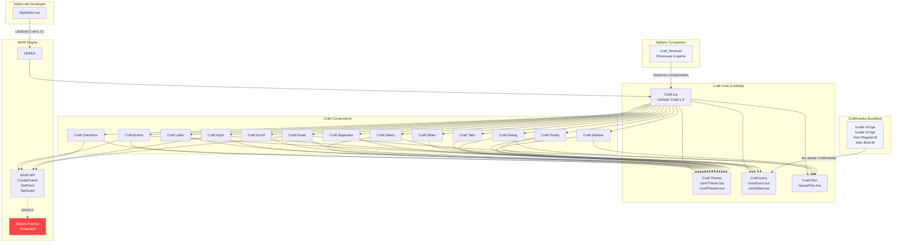

# Functional Specification Document (FSD) — Craft

> **Modo elegido: FSD clásico**
> Documento de especificación funcional completa de Craft v1.0 — librería open source de componentes UI para addons de World of Warcraft. Responde a "¿cómo se comporta exactamente el sistema y qué contratos expone a sus consumidores?".

---

## 0. Metadatos

| Campo | Valor |
|-------|-------|
| Producto | Craft — Librería compartida de componentes UI para addons de World of Warcraft |
| Versión del documento | v0.2 |
| Fecha | 30/05/2026 |
| Autores | Alberto Gomez |
| Revisores | Comunidad addon-dev WoW (Discord #addon-dev-general) |
| Estado | Borrador |
| **Modo elegido** | **FSD clásico** |
| Trazabilidad a PRD | `docs/PRD_v0.1.md` |
| Trazabilidad a BRD | `docs/BRD_v0.1.md` |
| ADRs relevantes | `docs/adr/0001` — `docs/adr/0008` |
| Repositorio | github.com/[org]/craft (pendiente publicación) |
| Prompts utilizados | PR-FSD-001 (generación inicial via Claude Code) |

---

## 1. Resumen ejecutivo

Craft es una librería open source de componentes UI para addons de World of Warcraft, escrita en Lua 5.1 y distribuida como addon instalable desde CurseForge y Wago. Los addons consumidores declaran `Craft` como dependencia en su archivo `.toc`; la librería se carga una única vez por sesión de WoW mediante LibStub y es compartida entre todos los addons que la usan.

El catálogo MVP comprende **16 componentes**: Button, Checkbox, Select, Flex, Icons, Input, Label, Scroll, Panel, Dialog, Separator, Sidebar, Slider, Tabs, Theme y Tooltip. Todos siguen el sistema de diseño **shadcn Lyra** como fuente de verdad visual y exponen una API orientada a objetos consistente: `Create(parent, config)`, `Destroy()`, `_applyTheme(t)` y métodos específicos por componente.

El valor diferencial de Craft frente a AceGUI-3.0 (la solución dominante con más de 15 años sin renovación significativa) reside en tres pilares: (1) diseño contemporáneo basado en shadcn Lyra con íconos Lucide first-class; (2) sistema de theming con tokens semánticos y live-switching sin recargar la UI; y (3) motor de layout `Craft.Flex` que implementa CSS Flexbox en Lua 5.1, eliminando el boilerplate de `SetPoint` manual.

Este FSD documenta los contratos funcionales de la API Lua de Craft — no las pantallas de usuario final, ya que Craft es una librería para desarrolladores de addons. Los "usuarios" del sistema son **addon developers** que instancian componentes Craft en sus propios addons.

---

## 2. Alcance

### 2.1 Dentro del alcance

- Implementación y contrato de API de los 16 componentes MVP: Button, Checkbox, Select, Flex, Icons, Input, Label, Scroll, Panel, Dialog, Separator, Sidebar, Slider, Tabs, Theme, Tooltip.
- Módulo `Craft.Theme`: sistema de tokens semánticos equivalentes a CSS variables de shadcn Lyra, presets `lyra-dark` y `lyra-light`, live-switching con callbacks, API `use()`, `get()`, `extend()`, `register()`.
- Módulo `Craft.Icons`: resolución de íconos Lucide directamente desde `Craft/media/lucide-16.tga` y `Craft/media/lucide-24.tga` (assets bundled).
- Módulo `Craft.Flex`: implementación de CSS Flexbox en Lua 5.1 — atributos `direction`, `wrap`, `justify`, `align`, `gap`, `grow`, `shrink`, `basis`, `order`, `align-self`.
- Registro de la librería con LibStub: `LibStub("Craft-1.0")`, carga única por sesión.
- Directorio `Craft/media/`: contiene el atlas TGA de íconos Lucide (16px, 24px) y las fuentes Inter bundled directamente en el addon.
- Addon de demostración `Craft_Browser`: showcase in-game interactivo de los 16 componentes MVP.
- Garantía anti-taint: ningún componente Craft contamina Secure Frames de WoW.
- Compatibilidad con WoW Retail 11.x y Classic (misma base de código, sin bifurcaciones).
- Documentación técnica en GitHub: README con Quick Start (≤ 5 pasos), documentación por componente, CONTRIBUTING.md.

### 2.2 Fuera del alcance

- **TypeScriptToLua (TSTL)**: sin soporte, sin `.d.ts`, sin runtime TSTL. Decisión firme documentada en ADR-0007.
- **Portal web o sitio de documentación**: toda la documentación vive en GitHub. No existe `craftui.dev` ni equivalente (ADR-0008).
- **Blocks (composiciones pre-construidas)**: OptionsPanel, ConfirmDialog, ProfileSelector — planificados para v1.1.
- **Temas adicionales** más allá de `lyra-dark` y `lyra-light`: reservados para v1.1+.
- **Componentes de unit frames**: cubiertos por oUF.
- **Visualización de datos** (charts, heatmaps, timelines): fuera del alcance de UI de addon general.
- **CLI de scaffolding** (`craft add button`): planificado para versiones futuras.
- **Soporte para versiones de WoW Classic** no hosteadas actualmente por Blizzard.

### 2.3 Supuestos y dependencias

**Supuestos técnicos:**
- La API de Lua de WoW es Lua 5.1; sin acceso a filesystem, sockets, ni librerías externas al entorno WoW sandbox.
- `CreateFrame`, `Frame:SetPoint`, `Frame:SetScript` y demás APIs de WoW permanecen compatibles con Craft durante el ciclo de vida del MVP.
- LibStub (versión estable en uso en el ecosistema Ace3) no introduce cambios de API en el horizonte del MVP.
- El rendering de texturas TGA en WoW soporta atlas con coordenadas UV para los íconos Lucide.
- Los addons que declaran Craft como dependencia se cargan **después** de que Craft se haya inicializado completamente en el addon load order de WoW.

**Dependencias externas:**
- **LibStub**: mecanismo de registro de la librería; embebido en la distribución de Craft.
- **WoW API (Blizzard)**: `CreateFrame`, `Frame:SetPoint`, `Frame:SetScript`, `hooksecurefunc`, texturas, fuentes.
- **shadcn Lyra**: fuente de verdad de diseño (tokens de color, tipografía, espaciado). Versión de referencia fijada al inicio del proyecto.
- **Lucide**: fuente de verdad de íconos (MIT License). Versión fijada en el release de Craft; atlas TGA distribuido en `Craft/media/`.
- **CurseForge / Wago**: plataformas de distribución del addon `Craft`.

### 2.4 Plan técnico

| Bloque | Contenido |
|--------|-----------|
| **Lenguaje** | Lua 5.1 (WoW sandbox). Sin transpiladores. Sin librerías externas al entorno WoW. |
| **Registro** | `LibStub:NewLibrary("Craft-1.0", <minor>)`. La instancia global es `Craft`. |
| **Arquitectura** | Modular plana: un archivo Lua por componente/módulo. Sin herencia de clases — metatables Lua para instancias. Patrón "module as namespace": `Craft.Button`, `Craft.Theme`, `Craft.Icons`, `Craft.Flex`. |
| **Project structure** | Ver §2.4.1 |
| **Decisiones técnicas** | LibStub (ADR-0001), shadcn Lyra (ADR-0002), Lucide first-class (ADR-0003), Craft_Browser (ADR-0004), tokens + live-switching (ADR-0005), Craft.Flex (ADR-0006), sin TSTL (ADR-0007), sin portal web (ADR-0008). |
| **Restricciones** | Sin filesystem, sin sockets, sin `require()` externo, sin debug library. Lua 5.1 estricto. Todos los frames deben ser `Unprotected` — nunca Secure. |

#### 2.4.1 Project structure

```
Craft/
├── Craft.toc                    -- TOC principal (Retail)
├── Craft_Classic.toc            -- TOC Classic
├── Craft.lua                    -- Entry point: LibStub registration, namespace
├── libs/
│   └── LibStub.lua              -- LibStub embebido
├── media/
│   ├── lucide-16.tga            -- Atlas Lucide 16px (bundled)
│   ├── lucide-24.tga            -- Atlas Lucide 24px (bundled)
│   ├── Inter-Regular.ttf        -- Fuente Inter Regular (bundled)
│   └── Inter-Bold.ttf           -- Fuente Inter Bold (bundled)
├── core/
│   ├── Theme.lua                -- Craft.Theme: tokens, use(), get(), extend(), register()
│   ├── Presets.lua              -- lyra-dark, lyra-light token tables
│   ├── Icons.lua                -- Craft.Icons: Get(), lee desde Craft/media/
│   └── Atlas.lua                -- Coordenadas UV del atlas Lucide TGA
├── layout/
│   └── Flex.lua                 -- Craft.Flex: motor Flexbox en Lua 5.1
├── components/
│   ├── Button.lua
│   ├── Checkbox.lua
│   ├── Select.lua
│   ├── Input.lua
│   ├── Label.lua
│   ├── Scroll.lua
│   ├── Panel.lua
│   ├── Dialog.lua
│   ├── Separator.lua
│   ├── Sidebar.lua
│   ├── Slider.lua
│   ├── Tabs.lua
│   └── Tooltip.lua
├── tests/
│   ├── test_theme.lua
│   ├── test_flex.lua
│   └── test_components.lua
└── docs/                        -- Documentación técnica (vive en GitHub)

Craft_Browser/
├── Craft_Browser.toc
├── Browser.lua                  -- Addon de showcase in-game
└── pages/                       -- Una página por componente MVP
```

### 2.5 Descomposición en Tasks

| Task ID | Descripción | Caso de uso | Dependencias | Estado |
|---------|-------------|-------------|--------------|--------|
| T-001 | Implementar Craft.lua: LibStub registration, namespace base, módulos loader | FSD-UC-001 | — | pendiente |
| T-002 | Implementar Craft.Theme: token table, use(), get(), register(), unregister(), extend() | FSD-UC-003 | T-001 | pendiente |
| T-003 | Implementar Presets.lua: lyra-dark y lyra-light con tokens semánticos completos | FSD-UC-003 | T-002 | pendiente |
| T-004 | Implementar Craft.Icons: Get(), resolución desde Craft/media/, Atlas.lua con coords UV | FSD-UC-001 | T-001 | pendiente |
| T-005 | Implementar Craft.Flex: motor Flexbox en Lua 5.1 con todos los atributos MVP | FSD-UC-002 | T-001 | pendiente |
| T-006 | Implementar Button con contrato estándar (Create, Destroy, _applyTheme) | FSD-UC-002 | T-002, T-004 | pendiente |
| T-007 | Implementar Input, Label, Checkbox con contrato estándar | FSD-UC-002 | T-002, T-004 | pendiente |
| T-008 | Implementar Panel, Scroll, Separator con contrato estándar | FSD-UC-001 | T-002 | pendiente |
| T-009 | Implementar Select, Slider, Tabs con contrato estándar | — | T-002, T-004, T-005 | pendiente |
| T-010 | Implementar Dialog, Sidebar, Tooltip con contrato estándar | — | T-002, T-004, T-005 | pendiente |
| T-011 | Generar atlas TGA de Lucide y empaquetar Inter.ttf en Craft/media/ | FSD-UC-001 | T-004 | pendiente |
| T-012 | Implementar Craft_Browser: showcase interactivo de 16 componentes | — | T-006–T-010, T-011 | pendiente |
| T-013 | Suite de pruebas anti-taint en Retail 11.x y Classic | — | T-006–T-010 | pendiente |
| T-014 | Suite de pruebas de memory leaks (100 ciclos create/destroy) | — | T-006–T-010 | pendiente |
| T-015 | Suite de pruebas de performance (render < 5ms, Flex < 1ms) | FSD-UC-002 | T-005–T-010 | pendiente |
| T-016 | Documentación: README Quick Start, docs por componente, CONTRIBUTING.md | FSD-UC-001 | T-001–T-012 | pendiente |

---

## 3. Actores y roles del sistema

| Actor | Tipo | Responsabilidad principal | Permisos / restricciones |
|-------|------|---------------------------|--------------------------|
| **Addon Developer** | Humano | Consumidor principal de la API de Craft. Crea addons que declaran Craft como dependencia, instancian componentes con `Create()`, los destruyen con `Destroy()` y opcionalmente cambian el tema con `Craft.Theme.use()`. | Acceso total a la API pública de Craft. No puede modificar el código fuente de Craft en producción (librería compartida). |
| **WoW Engine (Blizzard)** | Sistema | Proveedor del entorno Lua 5.1, la API de frames, el sistema de eventos y el addon load order. Determina qué APIs están disponibles en cada versión del juego. | Controla el sandbox: sin filesystem, sin sockets. Puede romper APIs en parches. |
| **LibStub** | Sistema | Registra y resuelve versiones de librerías compartidas. Garantiza que siempre se usa la versión más nueva de Craft cargada en la sesión. | Solo existe una instancia de LibStub por sesión. El versionado es unidireccional (la versión más nueva gana). |
| **Craft.Theme** | Módulo interno | Gestiona el tema activo, el registro de listeners de componentes y el despacho de callbacks en live-switch. | Acceso de lectura a todos los componentes registrados. Solo puede despachar callbacks — no puede acceder directamente a los frames de los componentes. |
| **Craft_Browser** | Addon companion | Addon de demostración in-game. Instancia los 16 componentes MVP interactivamente. Sirve como prueba de integración real en el entorno WoW. | Las mismas restricciones que cualquier addon consumidor. No tiene acceso especial a internals de Craft. |
| **Craft media directory** | Directorio bundled | Contiene el atlas TGA de íconos Lucide (16px, 24px) y las fuentes Inter (Regular, Bold). Los assets se distribuyen directamente con Craft; `Craft.Icons.Get()` los lee desde `Craft/media/`. | Parte integral del addon Craft — no es un addon separado. |
| **Co-maintainer / Contribuidor** | Humano | Desarrollador externo que extiende el catálogo de componentes, corrige bugs o mejora la documentación mediante PRs. | Acceso de escritura al repositorio solo con aprobación del maintainer principal. Debe seguir el contrato de componente estándar. |

---

## 4. Casos de uso funcionales

### 4.1 FSD-UC-001 — Integración de Craft en un addon nuevo

- **Trazabilidad**: PRD-REQ-001, BR-001, BR-002 (BRD)
- **Actor principal**: Addon Developer
- **Precondiciones**:
  1. Craft está instalado en la carpeta de addons WoW del usuario (`Interface/AddOns/Craft/`).
  2. El desarrollador tiene un addon WoW en desarrollo con un archivo `.toc` válido.
  3. El addon del desarrollador no usa LibStub todavía (caso base).
- **Disparador**: El desarrollador desea instanciar su primer componente Craft en su addon.
- **Flujo principal**:
  1. El desarrollador abre el archivo `.toc` de su addon y agrega `Craft` en la línea `## Dependencies:`.
  2. En el archivo Lua principal del addon, el desarrollador obtiene la referencia a Craft con `local Craft = LibStub("Craft-1.0")`.
  3. Dentro del event handler `ADDON_LOADED` del addon, el desarrollador instancia un componente: `local panel = Craft.Panel:Create(UIParent, { width = 400, height = 300 })`.
  4. WoW garantiza que Craft está completamente cargado antes del addon del desarrollador (por la declaración de dependencia en `.toc`).
  5. `Craft.Panel:Create()` crea el frame, registra su listener de tema, aplica el tema activo (`lyra-dark` por defecto) y retorna la instancia del componente.
  6. El panel aparece en la UI de WoW con el diseño Lyra dark.
- **Flujos alternativos / excepciones**:
  - A1: El usuario no tiene Craft instalado → WoW reporta error de dependencia al cargar el addon del desarrollador. El addon no carga. El desarrollador debe informar a sus usuarios que instalen Craft.
  - A2: `LibStub` no está disponible en el entorno → el desarrollador debe declarar `LibStub.lua` en su propio `.toc`, o asegurarse de que Craft (que lo embebe) esté en las dependencias.
  - A3: El desarrollador llama a `Craft.Panel:Create()` fuera de un event handler (en top-level Lua) → el frame puede crearse antes de que la UI esté lista. Resultado: comportamiento indefinido. La documentación advertirá sobre este antipatrón.
- **Postcondiciones**:
  1. La instancia del componente `panel` tiene `panel.frame` apuntando al frame WoW creado.
  2. El componente está registrado en `Craft.Theme` y recibirá callbacks de live-switch mientras exista.
  3. El frame es visible en la UI de WoW con el diseño Lyra dark aplicado.
- **Reglas de negocio aplicables**: BR-001 (declaración de dependencia), BR-002 (LibStub), RB-01 (versionado SemVer), COMP-001 (contrato de componente, §5).
- **Datos de entrada**: `parent` (frame WoW válido, generalmente `UIParent`), `config` (tabla Lua con propiedades del componente: `width`, `height`, opcionales según componente).
- **Datos de salida**: instancia del componente — tabla Lua con metatable, con `frame` (frame WoW), `_themeHandle` (handle de registro de tema), y métodos del componente.
- **Criterios de aceptación**:

```gherkin
Dado que Craft está declarado en "## Dependencies:" del .toc del addon
  Y el addon llama a LibStub("Craft-1.0") en su archivo Lua principal
  Y WoW ha completado la carga del addon Craft
Cuando el addon llama a Craft.Panel:Create(UIParent, { width=400, height=300 })
Entonces se retorna una instancia con .frame apuntando a un frame WoW válido
  Y el frame es visible en pantalla con el diseño lyra-dark aplicado
  Y la instancia está registrada en Craft.Theme para recibir callbacks de live-switch

Dado que Craft NO está instalado en la carpeta de addons del usuario
Cuando WoW intenta cargar el addon que depende de Craft
Entonces WoW reporta un error de dependencia faltante
  Y el addon dependiente no se carga
  Y no se produce ningún error de Lua no manejado
```

---

### 4.2 FSD-UC-002 — Crear un formulario compuesto con Button, Input, Label y Craft.Flex

- **Trazabilidad**: PRD-REQ-007, PRD-REQ-008, BR-011, BR-012 (BRD)
- **Actor principal**: Addon Developer
- **Precondiciones**:
  1. Craft está integrado en el addon (FSD-UC-001 completado).
  2. El addon tiene un Panel de contenedor ya creado.
  3. El desarrollador quiere componer un formulario con dos campos Input + Labels descriptivos y un Button de envío, con alineación vertical automática.
- **Disparador**: El desarrollador necesita un formulario de configuración en su addon (caso común: settings panel, search bar, filtros).
- **Flujo principal**:
  1. El desarrollador crea un contenedor Flex vertical: `local form = Craft.Flex.new(panel.frame, { direction = "column", gap = 8 })`.
  2. Para cada campo, el desarrollador crea un Label y un Input y los agrega al Flex: `form:Add(Craft.Label:Create(panel.frame, { text = "Nombre" }).frame)` y `form:Add(Craft.Input:Create(panel.frame, { placeholder = "Ingrese nombre" }).frame)`.
  3. El desarrollador crea el Button de envío: `local btn = Craft.Button:Create(panel.frame, { label = "Guardar", onClick = function() ... end })` y lo agrega al Flex: `form:Add(btn.frame)`.
  4. El desarrollador llama a `form:Layout()` para calcular y aplicar las posiciones de todos los elementos.
  5. `Craft.Flex` calcula las posiciones de cada hijo según `direction = "column"` y `gap = 8`, aplica `SetPoint` en cada frame.
  6. El formulario aparece en la UI con los elementos alineados verticalmente con 8px de separación.
  7. El usuario interactúa con los Input y al hacer clic en el Button se dispara el `onClick` del desarrollador.
- **Flujos alternativos / excepciones**:
  - A1: El desarrollador agrega un frame al Flex que ya tiene un `SetPoint` manual → Craft.Flex sobreescribe el `SetPoint` con el resultado de su cálculo. La documentación advertirá este comportamiento.
  - A2: El contenedor padre cambia de tamaño → el `OnSizeChanged` del Flex dispara `form:Layout()` automáticamente y los elementos se reposicionan.
  - A3: El desarrollador llama a `form:Layout()` con cero hijos agregados → operación no-op; no se producen errores.
  - A4: El Input recibe `onEnter` con un valor inválido → el addon del desarrollador es responsable de la validación; Craft.Input solo despacha el evento con el valor actual.
- **Postcondiciones**:
  1. Todos los frames de los componentes tienen `SetPoint` aplicado por Craft.Flex en base al algoritmo Flexbox.
  2. El formulario es visualmente correcto: elementos alineados verticalmente con el gap especificado.
  3. El Button dispara `onClick` cuando el usuario hace clic.
  4. Los Input despachan `onChange` cuando el usuario escribe y `onEnter` cuando presiona Enter.
  5. Todos los componentes comparten el tema activo y se actualizarán si se cambia el tema.
- **Reglas de negocio aplicables**: COMP-001 (contrato de componente), BR-012 (Craft.Flex), NFR-002 (performance de Flex < 1ms para 10 elementos).
- **Datos de entrada**:
  - `Craft.Flex.new(parent, config)`: `parent` = frame WoW padre; `config.direction` = `"row"` | `"column"`; `config.gap` = número en píxeles; `config.justify` = `"start"` | `"center"` | `"end"` | `"space-between"` | `"space-around"` | `"space-evenly"`; `config.align` = `"start"` | `"center"` | `"end"` | `"stretch"`.
  - `Craft.Input:Create(parent, config)`: `config.placeholder` (string), `config.onChange` (function), `config.onEnter` (function), `config.icon` (string, nombre Lucide).
  - `Craft.Button:Create(parent, config)`: `config.label` (string), `config.onClick` (function), `config.icon` (string, nombre Lucide), `config.variant` = `"default"` | `"outline"` | `"ghost"` | `"destructive"`.
  - `Craft.Label:Create(parent, config)`: `config.text` (string), `config.for` (referencia al Input asociado, opcional).
- **Datos de salida**: instancias de componentes con sus frames posicionados; formulario funcional en la UI de WoW.
- **Criterios de aceptación**:

```gherkin
Dado que un addon tiene un Panel creado con Craft
  Y crea un Flex con direction="column" y gap=8
  Y agrega un Label, un Input y un Button al Flex
Cuando el addon llama a form:Layout()
Entonces los tres componentes están posicionados verticalmente con 8px de separación
  Y el cálculo de layout se completa en menos de 1ms

Dado que un Input de Craft tiene un handler onChange registrado
Cuando el usuario escribe texto en el Input
Entonces el handler onChange se dispara con el valor actual del Input como argumento

Dado que un Button de Craft tiene un handler onClick registrado
Cuando el usuario hace clic en el Button
Entonces el handler onClick se dispara exactamente una vez
  Y el Button no contamina ningún Secure Frame del juego (no produce errores de taint)

Dado que el Panel contenedor del formulario cambia de tamaño
Cuando OnSizeChanged se dispara en el contenedor
Entonces Craft.Flex recalcula y reaplica el layout automáticamente
```

---

### 4.3 FSD-UC-003 — Live-switching de tema con Craft.Theme.use()

- **Trazabilidad**: PRD-REQ-006, BR-009, BR-010 (BRD)
- **Actor principal**: Addon Developer
- **Precondiciones**:
  1. Craft está integrado en el addon (FSD-UC-001 completado).
  2. El addon tiene al menos tres componentes Craft activos y visibles (instanciados y no destruidos).
  3. El tema activo actual es `lyra-dark` (tema por defecto).
- **Disparador**: El usuario del addon activa un toggle de tema en la UI (o el addon llama a `Craft.Theme.use()` programáticamente en respuesta a cualquier evento).
- **Flujo principal**:
  1. El addon del desarrollador llama a `Craft.Theme.use("lyra-light")`.
  2. `Craft.Theme` valida que `"lyra-light"` es un preset registrado.
  3. `Craft.Theme` actualiza la tabla de tema activo con los tokens de `lyra-light`.
  4. `Craft.Theme` itera sobre todos los listeners registrados (uno por cada componente activo) y llama a cada callback `function(t) component:_applyTheme(t) end` con la nueva tabla de tokens.
  5. Cada componente llama a su método `_applyTheme(t)` interno, que actualiza los colores y apariencia de sus frames WoW con los nuevos tokens (`SetBackdropColor`, `SetTextColor`, `SetVertexColor`, etc.).
  6. Todos los componentes activos del addon reflejan inmediatamente el diseño Lyra light sin necesidad de destruirlos o recargar la UI.
- **Flujos alternativos / excepciones**:
  - A1: El desarrollador llama a `Craft.Theme.use("nonexistent-theme")` → `Craft.Theme` registra un error en el chat de WoW con el mensaje `"[Craft] Theme 'nonexistent-theme' not found. Available: lyra-dark, lyra-light"`. El tema activo no cambia.
  - A2: El desarrollador registra un tema personalizado con `Craft.Theme.register("my-theme", tokens)` y luego llama `Craft.Theme.use("my-theme")` → el flujo principal aplica normalmente con los tokens del tema registrado.
  - A3: El desarrollador usa `Craft.Theme.extend("lyra-dark", { primary = { r=1, g=0, b=0, a=1 } })` → crea un nuevo preset derivado de `lyra-dark` con solo `primary` sobreescrito; los demás tokens heredan de `lyra-dark`. El nuevo tema se puede usar con `Craft.Theme.use()` si el desarrollador lo registra con un nombre.
  - A4: Un componente destruido (su listener fue desregistrado en `Destroy()`) no recibe el callback → comportamiento correcto por diseño.
  - A5: El live-switch ocurre con 100+ componentes activos → todos los listeners se invocan sincrónicamente. Si el tiempo total supera 16ms, puede producirse un frame drop visual momentáneo (limitación conocida documentada).
- **Postcondiciones**:
  1. `Craft.Theme.get()` retorna la tabla de tokens del nuevo tema activo.
  2. Todos los componentes activos (no destruidos) reflejan visualmente el nuevo tema.
  3. Los componentes creados después del `use()` reciben el nuevo tema como tema inicial en su `Create()`.
  4. El tema activo persiste mientras dure la sesión de WoW (no hay persistencia entre sesiones sin que el addon del desarrollador lo guarde con AceDB u otro sistema).
- **Reglas de negocio aplicables**: COMP-001 (contrato de componente — obligación de implementar `_applyTheme` y desregistrar en `Destroy`), BR-009 (live-switching), BR-010 (temas personalizados), RB-02 (fuente de verdad Lyra).
- **Datos de entrada**: `Craft.Theme.use(presetName: string)` — nombre de un preset registrado.
- **Datos de salida**: todos los frames de componentes activos actualizados visualmente. `Craft.Theme.get()` retorna la nueva tabla de tokens.
- **Criterios de aceptación**:

```gherkin
Dado que un addon tiene 10 componentes Craft activos y visibles
  Y el tema activo es "lyra-dark"
Cuando el addon llama a Craft.Theme.use("lyra-light")
Entonces todos los componentes actualizan sus colores al diseño Lyra light
  Y la operación completa se ejecuta en menos de 16ms (1 frame a 60fps)
  Y Craft.Theme.get() retorna la tabla de tokens de lyra-light

Dado que el desarrollador registra un tema personalizado con Craft.Theme.register("acme-dark", tokens)
Cuando el addon llama a Craft.Theme.use("acme-dark")
Entonces todos los componentes activos aplican los tokens del tema "acme-dark"

Dado que el addon llama a Craft.Theme.use("tema-que-no-existe")
Cuando Craft.Theme procesa la llamada
Entonces se imprime un error descriptivo en el chat de WoW
  Y el tema activo no cambia
  Y ningún componente se ve afectado

Dado que se crean y destruyen 100 componentes en ciclos sucesivos
  Y se llama a Craft.Theme.use() entre ciclos
Cuando se verifica el uso de memoria Lua al finalizar los 100 ciclos
Entonces el uso de memoria no ha crecido de forma apreciable respecto al inicio
  (sin memory leaks por listeners no desregistrados)
```

---

## 5. Reglas de negocio

| ID | Regla | Tipo | Origen | Casos de uso afectados |
|----|-------|------|--------|------------------------|
| COMP-001 | Todo componente Craft DEBE implementar: (a) `Create(parent, config)` que registra su listener de tema con `Craft.Theme.register()` y aplica el tema inicial; (b) `Destroy()` que desregistra el listener con `Craft.Theme.unregister()` y oculta / elimina sus frames; (c) `_applyTheme(t)` que actualiza los frames con los tokens del tema `t`. Este es el contrato de componente estándar. | Política de arquitectura | ADR-0005, ADR-0001 | FSD-UC-001, FSD-UC-002, FSD-UC-003 |
| COMP-002 | El campo `_themeHandle` de cada instancia de componente debe ser válido desde la creación hasta la destrucción del componente. Un `_themeHandle` inválido o `nil` es un bug. | Política de implementación | ADR-0005 | FSD-UC-003 |
| COMP-003 | Ningún componente Craft puede llamar a funciones protegidas de WoW ni crear Secure Frames. Está prohibido el uso de `SecureHandlerSetFrameRef`, `SecureActionButtonTemplate` u otras APIs de Secure Frames. | Política anti-taint | BR-005 (BRD), NFR-001 | FSD-UC-001, FSD-UC-002 |
| COMP-004 | Todo componente debe funcionar correctamente en WoW Retail 11.x y Classic sin bifurcación de código. Los puntos de variación entre versiones (si los hay) deben resolverse con detección de versión en tiempo de carga, no con archivos separados. | Política de compatibilidad | BR-006 (BRD) | FSD-UC-001, FSD-UC-002, FSD-UC-003 |
| THEME-001 | `Craft.Theme.use(name)` solo acepta nombres de presets registrados. Llamar con un nombre no registrado produce un error visible en el chat de WoW (no silencioso) y deja el tema sin cambios. | Validación | ADR-0005 | FSD-UC-003 |
| THEME-002 | Los tokens semánticos de Lyra que DEBEN estar presentes en todo preset válido son: `background`, `foreground`, `card`, `cardForeground`, `primary`, `primaryForeground`, `secondary`, `secondaryForeground`, `muted`, `mutedForeground`, `accent`, `accentForeground`, `destructive`, `destructiveForeground`, `border`, `input`, `ring`. Un preset que omita cualquiera de estos tokens es inválido. | Validación | ADR-0005, ADR-0002 | FSD-UC-003 |
| THEME-003 | `Craft.Theme.extend(base, overrides)` requiere que `base` sea un preset registrado. El resultado es una nueva tabla de tokens donde `overrides` sobreescribe valores de `base`. No modifica el preset `base`. | Política de extensión | ADR-0005 | FSD-UC-003 |
| LIB-001 | Craft se registra con LibStub usando `LibStub:NewLibrary("Craft-1.0", minor)` donde `minor` es un número entero que se incrementa en cada release. Si ya existe una versión de Craft con un `minor` mayor o igual, LibStub retorna `nil` y Craft debe salir sin reinicializar. | Política de versionado LibStub | ADR-0001, RB-01 (BRD) | FSD-UC-001 |
| LIB-002 | La versión major de la librería (`"Craft-1.0"`) solo cambia cuando hay un breaking change de API. Cambios que rompen la API de `Create()`, `Destroy()` o `_applyTheme()` de cualquier componente existente son breaking changes. | Política de SemVer | ADR-0001, RB-01 (BRD) | FSD-UC-001 |
| FLEX-001 | `Craft.Flex.new(parent, config)` requiere un `parent` frame WoW válido y no-nil. La config puede ser una tabla vacía (usa valores por defecto: `direction="row"`, `justify="start"`, `align="start"`, `gap=0`). | Validación | ADR-0006 | FSD-UC-002 |
| FLEX-002 | `flex:Layout()` sobreescribe el `SetPoint` de todos los frames hijo. El caller no debe asumir que los `SetPoint` que estableció manualmente se preservarán. | Contrato de API | ADR-0006 | FSD-UC-002 |
| ICONS-001 | `Craft.Icons.Get(name)` retorna un descriptor `{ path=string, coords={l,r,t,b} }` o `nil`. Los componentes que reciben `nil` no muestran ícono y no producen errores. La ausencia de un ícono no es un error. | Contrato de API | ADR-0003 | FSD-UC-001 |

---

## 6. Modelo de datos funcional

### 6.1 Diagrama de módulos (Mermaid)



### 6.2 Diccionario de módulos y sus APIs principales

| Módulo | Función / método | Firma | Retorno | Descripción |
|--------|-----------------|-------|---------|-------------|
| **Craft** (entry) | `LibStub("Craft-1.0")` | — | tabla `Craft` | Obtiene la instancia de la librería registrada con LibStub. |
| **Craft.Theme** | `use(name)` | `string` | `void` | Activa el preset `name` y despacha callbacks a todos los listeners. Error en chat si `name` no existe. |
| **Craft.Theme** | `get()` | — | `table` | Retorna la tabla de tokens del tema activo (lazy-built). |
| **Craft.Theme** | `register(fn)` | `function(t)` | `handle` (opaque) | Registra un listener de tema. Retorna un handle para desregistrar. |
| **Craft.Theme** | `unregister(handle)` | handle opaco | `void` | Desregistra el listener asociado al handle. Llamar con handle inválido es no-op. |
| **Craft.Theme** | `extend(base, overrides)` | `string, table` | `table` | Retorna una nueva tabla de tokens basada en `base` con `overrides` aplicados. No registra el tema — solo crea la tabla. |
| **Craft.Theme** | `register_preset(name, tokens)` | `string, table` | `void` | Registra un nuevo preset nombrado. Error si `tokens` no tiene todos los tokens semánticos requeridos (THEME-002). |
| **Craft.Icons** | `Get(name)` | `string` | `{path, coords}` o `nil` | Resuelve el ícono Lucide `name` directamente desde `Craft/media/lucide-16.tga`. Retorna `nil` si el ícono no existe en el atlas. |
| **Craft.Flex** | `new(parent, config)` | `frame, table` | instancia Flex | Crea un contenedor flex. `config`: `direction`, `wrap`, `justify`, `align`, `gap`. |
| **Craft.Flex** (inst) | `Add(frame, opts)` | `frame, table?` | `void` | Agrega un frame hijo al contenedor flex. `opts`: `grow`, `shrink`, `basis`, `order`, `alignSelf`. |
| **Craft.Flex** (inst) | `Layout()` | — | `void` | Calcula y aplica `SetPoint` a todos los hijos según el algoritmo Flexbox. |
| **Craft.Flex** (inst) | `Remove(frame)` | `frame` | `void` | Elimina un frame hijo del contenedor. Requiere `Layout()` posterior para actualizar posiciones. |
| **Craft.Button** | `Create(parent, config)` | `frame, table` | instancia Button | `config`: `label`, `onClick`, `icon`, `variant` (`default`\|`outline`\|`ghost`\|`destructive`), `disabled`. |
| **Craft.Button** (inst) | `SetLabel(text)` | `string` | `void` | Actualiza el texto del botón. |
| **Craft.Button** (inst) | `SetDisabled(bool)` | `boolean` | `void` | Habilita o deshabilita el botón. Un botón deshabilitado no dispara `onClick`. |
| **Craft.Button** (inst) | `Destroy()` | — | `void` | Desregistra listener de tema, oculta el frame. |
| **Craft.Input** | `Create(parent, config)` | `frame, table` | instancia Input | `config`: `placeholder`, `value`, `onChange`, `onEnter`, `icon`, `disabled`, `type` (`text`\|`password`). |
| **Craft.Input** (inst) | `GetValue()` | — | `string` | Retorna el valor actual del Input. |
| **Craft.Input** (inst) | `SetValue(text)` | `string` | `void` | Establece el valor del Input programáticamente. |
| **Craft.Label** | `Create(parent, config)` | `frame, table` | instancia Label | `config`: `text`, `for` (referencia a Input), `size` (`sm`\|`md`\|`lg`). |
| **Craft.Panel** | `Create(parent, config)` | `frame, table` | instancia Panel | `config`: `width`, `height`, `title`, `closeable`. Contenedor genérico con fondo Lyra. |
| **Craft.Dialog** | `Create(parent, config)` | `frame, table` | instancia Dialog | `config`: `title`, `message`, `onConfirm`, `onCancel`, `confirmLabel`, `cancelLabel`. Modal bloqueante. |
| **Craft.Dialog** (inst) | `Show()` / `Hide()` | — | `void` | Muestra u oculta el diálogo. |
| **Craft.Tabs** | `Create(parent, config)` | `frame, table` | instancia Tabs | `config`: `tabs` (array de `{id, label, content}`), `onTabChange`. |
| **Craft.Tabs** (inst) | `SetActive(id)` | `string` | `void` | Activa la pestaña con el id dado. |
| **Craft.Select** | `Create(parent, config)` | `frame, table` | instancia Select | `config`: `options` (array `{value, label}`), `value`, `onChange`, `placeholder`. |
| **Craft.Checkbox** | `Create(parent, config)` | `frame, table` | instancia Checkbox | `config`: `label`, `checked`, `onChange`. |
| **Craft.Slider** | `Create(parent, config)` | `frame, table` | instancia Slider | `config`: `min`, `max`, `step`, `value`, `onChange`, `label`. |
| **Craft.Scroll** | `Create(parent, config)` | `frame, table` | instancia Scroll | `config`: `width`, `height`, `content` (frame hijo scrolleable). |
| **Craft.Sidebar** | `Create(parent, config)` | `frame, table` | instancia Sidebar | `config`: `items` (array `{id, label, icon}`), `onSelect`, `width`. |
| **Craft.Separator** | `Create(parent, config)` | `frame, table` | instancia Separator | `config`: `orientation` (`horizontal`\|`vertical`), `width`\|`height`. |
| **Craft.Tooltip** | `Create(parent, config)` | `frame, table` | instancia Tooltip | `config`: `text`, `anchor` (`TOP`\|`BOTTOM`\|`LEFT`\|`RIGHT`). Muestra al hacer hover. |

---

## 7. Prompt como Contrato Funcional

### 7.1 Prompt-contrato para FSD-UC-001 — Integración de Craft en un addon nuevo

```markdown
# Role
Eres un generador de código Lua 5.1 para addons de World of Warcraft que implementa
la integración inicial de la librería Craft en un addon nuevo.

# Task
Dado el nombre del addon y una lista de componentes a usar, genera:
1. El fragmento .toc con la declaración de dependencia a Craft.
2. El bloque de inicialización Lua: obtención de LibStub, event handler ADDON_LOADED,
   instanciación del primer componente con Create().

# Context
- Entrada: nombre del addon (string), lista de componentes a usar (array de strings).
- Referencias de dominio: COMP-001 (contrato de componente), LIB-001 (registro LibStub),
  BR-001 (declaración .toc), BR-002 (LibStub).
- Restricciones:
  - El código DEBE usar LibStub("Craft-1.0") para obtener la referencia.
  - Los componentes DEBEN instanciarse dentro del handler ADDON_LOADED, no en top-level.
  - El addon NUNCA debe crear Secure Frames ni llamar APIs protegidas.
  - Lua 5.1 estricto: sin require() externo, sin módulos de sistema.

# Reasoning
1. Generar el bloque ## Dependencies: en el .toc con "Craft" incluido.
2. Generar la obtención de Craft con LibStub al inicio del archivo Lua.
3. Generar el registro del evento ADDON_LOADED con verificación del nombre del addon.
4. Dentro del handler, generar la instanciación de cada componente listado con config mínima.
5. Verificar que cada instanciación guarda la referencia en una variable local (no global).

# Stop condition
Detente cuando todos los componentes de la lista tengan su bloque Create() generado
con config mínima válida. Si un componente no existe en el catálogo Craft, reporta
el error en el output en lugar de generar código inválido.

# Output
Formato: bloque .toc (texto plano) + bloque Lua (texto plano con comentarios).
Ejemplo de salida:
```toc
## Dependencies: Craft
```
```lua
local Craft = LibStub("Craft-1.0")
local MyAddon = {}

local frame = CreateFrame("Frame")
frame:RegisterEvent("ADDON_LOADED")
frame:SetScript("OnEvent", function(self, event, addonName)
  if addonName ~= "MyAddon" then return end
  local panel = Craft.Panel:Create(UIParent, { width = 400, height = 300 })
end)
```

**Invariants**:
- `LibStub("Craft-1.0")` siempre presente antes de usar cualquier componente.
- Toda instanciación dentro de ADDON_LOADED o posterior.
- Sin variables globales de componentes (usar locales o tabla del addon).
- Sin Secure Frames.

**Failure modes**:
- Componente no existe en catálogo: `ERROR: componente 'X' no está en el catálogo Craft MVP`.
- LibStub no disponible: advertencia de que Craft debe estar en ## Dependencies:.
```

---

### 7.2 Prompt-contrato para FSD-UC-002 — Formulario compuesto con Craft.Flex

```markdown
# Role
Eres un generador de código Lua 5.1 para addons WoW que implementa formularios
compuestos usando componentes Craft y el motor de layout Craft.Flex.

# Task
Dado un esquema de formulario (lista de campos con tipo, label y callbacks), genera
el código Lua que: (1) crea el contenedor Flex, (2) instancia los componentes en orden,
(3) los agrega al Flex con sus opciones, (4) llama a Layout().

# Context
- Entrada: lista de campos `{type, label, placeholder?, onChange?, icon?}`,
  config del Flex `{direction, gap, justify?, align?}`,
  frame padre (variable name como string).
- Referencias de dominio: COMP-001, FLEX-001, FLEX-002, NFR-002 (< 1ms para ≤ 10 campos).
- Restricciones:
  - Cada campo Label debe crearse antes del Input correspondiente.
  - El Flex DEBE incluir todos los frames en el orden correcto antes de llamar Layout().
  - No usar SetPoint manual en ningún frame gestionado por el Flex.
  - Sin variables globales.

# Reasoning
1. Crear el contenedor Flex con la config dada.
2. Para cada campo en orden: crear Label → crear componente (Input/Checkbox/Select/Slider).
3. Agregar Label.frame al Flex, luego el frame del componente.
4. Agregar el Button de envío al final si el formulario lo requiere.
5. Llamar form:Layout() al final de la construcción.

# Stop condition
Detente cuando todos los campos y el botón de envío (si aplica) estén agregados
al Flex y Layout() haya sido llamado. Si un tipo de campo no existe en el catálogo
Craft, reporta el error.

# Output
Formato: bloque Lua comentado.
Ejemplo de salida:
```lua
local form = Craft.Flex.new(panel.frame, { direction = "column", gap = 8 })

local nameLabel = Craft.Label:Create(panel.frame, { text = "Nombre" })
local nameInput = Craft.Input:Create(panel.frame, { placeholder = "Ingrese nombre",
  onChange = function(value) ... end })
form:Add(nameLabel.frame)
form:Add(nameInput.frame)

local saveBtn = Craft.Button:Create(panel.frame, { label = "Guardar",
  onClick = function() ... end })
form:Add(saveBtn.frame)

form:Layout()
```

**Invariants**:
- Label precede a su Input en el orden de Add().
- Layout() llamado exactamente una vez al final de la construcción del formulario.
- Ningún frame del formulario tiene SetPoint manual.
- Todos los callbacks son funciones, nunca nil (usar función vacía `function() end` como default).

**Failure modes**:
- Tipo de campo desconocido: `ERROR: tipo de campo 'X' no existe en catálogo Craft MVP`.
- parent nil: `ERROR: el frame padre no puede ser nil`.
```

---

### 7.3 Prompt-contrato para FSD-UC-003 — Live-switching de tema

```markdown
# Role
Eres un generador de código Lua 5.1 para addons WoW que implementa controles
de cambio de tema usando Craft.Theme.

# Task
Dado el nombre del addon y el caso de uso (toggle dark/light, selector de temas, tema
personalizado parcial), genera el código Lua que implementa el cambio de tema con
Craft.Theme.use() o Craft.Theme.register_preset() + use().

# Context
- Entrada: tipo de caso (toggle | selector | custom), colores de override si es custom.
- Referencias de dominio: THEME-001, THEME-002, THEME-003, COMP-001.
- Restricciones:
  - Craft.Theme.use() solo con nombres de presets registrados.
  - Temas custom DEBEN incluir todos los tokens semánticos requeridos (THEME-002) o
    usar extend() para heredar los faltantes de un preset base.
  - El toggle no requiere persistencia (a menos que el addon use AceDB).

# Reasoning
1. Para toggle: generar una variable de estado local + Craft.Theme.use() condicional.
2. Para selector: generar un Select con las opciones de tema + onChange que llama use().
3. Para custom: generar Craft.Theme.extend() con los overrides, luego register_preset(),
   luego use().
4. En todos los casos, conectar al evento de UI apropiado (click de checkbox, change de select).

# Stop condition
Detente cuando el mecanismo de cambio de tema esté completo y todos los edge cases
(tema inexistente, tabla incompleta) estén manejados.

# Output
Formato: bloque Lua comentado con comentarios explicativos en cada sección.

**Invariants**:
- Craft.Theme.use() siempre recibe un string, nunca nil.
- Temas custom siempre usan extend() o definen TODOS los tokens (THEME-002).
- El handle de listener (_themeHandle) se guarda en la instancia del componente de toggle.

**Failure modes**:
- Nombre de tema no registrado: genera el guard `if not Craft.Theme.exists(name) then return end`.
- Tabla de tokens incompleta en tema custom: `ERROR: tokens incompletos, usar extend() como base`.
```

---

## 8. Integraciones externas

| Sistema | Tipo | Protocolo / Mecanismo | Operaciones relevantes | SLA / disponibilidad | Notas |
|---------|------|----------------------|------------------------|----------------------|-------|
| **LibStub** | Sistema interno (embebido) | Llamada Lua directa | `LibStub:NewLibrary()`, `LibStub(name)` | Siempre disponible (embebido en distribución de Craft) | Si LibStub ya fue cargado por otro addon, usa la instancia existente. |
| **WoW API (Blizzard)** | Sistema externo (runtime) | Llamada Lua directa a globals WoW | `CreateFrame`, `SetPoint`, `SetBackdropColor`, `SetTextColor`, `RegisterEvent`, `SetScript` | 100% disponible en el entorno WoW sandbox | Puede cambiar en parches de Blizzard. Craft debe monitorear PTR. |
| **CurseForge / Wago** | Sistema de distribución externo | HTTP / CDN (usuario, no Craft en runtime) | Publicación de releases, descarga de updates | Alta disponibilidad (plataformas de terceros) | Craft no interactúa con CurseForge/Wago en runtime. Solo en el proceso de release del maintainer. |
| **WoW Addon Load Order** | Sistema WoW | `.toc` Dependencies | Garantiza que Craft carga antes de addons dependientes | Garantizado por WoW para deps declaradas en .toc | Sin interacción en código — solo declarativo. |

---

## 9. Interfaces de desarrollador (DX — API de Craft)

Craft no expone pantallas de usuario final. Sus interfaces son la API Lua pública. Esta sección documenta los patrones de uso y las convenciones de la DX.

### 9.1 Convenciones de la API

| Convención | Descripción |
|------------|-------------|
| **Namespace plano** | Todos los módulos viven en `Craft.*`: `Craft.Button`, `Craft.Theme`, `Craft.Flex`. Sin sub-namespaces profundos. |
| **Create / Destroy simétrico** | Todo componente tiene `ComponentName:Create(parent, config)` → instancia; y `instance:Destroy()` → limpieza. El caller es responsable de llamar `Destroy()` cuando ya no necesita el componente. |
| **Config table** | Toda configuración se pasa como tabla Lua al crear el componente. Sin argumentos posicionales múltiples. Las propiedades opcionales de la tabla tienen defaults documentados. |
| **Callbacks como functions** | Los callbacks (`onClick`, `onChange`, `onEnter`) se pasan en la config table y son funciones Lua estándar. Se llaman con `self` del componente como primer argumento opcional (a documentar por componente). |
| **Tokens semánticos** | Los componentes no usan valores de color hardcoded. Siempre usan `Craft.Theme.get().tokenName`. Los tokens siguen la nomenclatura de shadcn Lyra. |
| **Errores visibles** | Los errores de Craft (preset inexistente, parent nil) se reportan en el chat de WoW con prefijo `[Craft]`. No producen errores silenciosos ni errores de Lua que bloqueen otros addons. |
| **Sin globals contaminantes** | Craft solo define `Craft` en el namespace global de WoW. Ningún otro global. Los componentes son variables locales del addon consumidor. |

### 9.2 Mapa de API pública — componentes MVP

| Componente | Create config mínima | Métodos clave de instancia | Eventos / Callbacks |
|------------|---------------------|---------------------------|---------------------|
| Button | `{ label="texto" }` | `SetLabel()`, `SetDisabled()`, `Destroy()` | `onClick` |
| Checkbox | `{ label="texto" }` | `SetChecked()`, `GetChecked()`, `Destroy()` | `onChange(checked)` |
| Select | `{ options={{value,label}} }` | `SetValue()`, `GetValue()`, `SetOptions()`, `Destroy()` | `onChange(value)` |
| Input | `{ placeholder="..." }` | `SetValue()`, `GetValue()`, `SetDisabled()`, `Destroy()` | `onChange(value)`, `onEnter(value)` |
| Label | `{ text="..." }` | `SetText()`, `Destroy()` | — |
| Scroll | `{ width=N, height=N }` | `SetContent()`, `ScrollTo()`, `Destroy()` | — |
| Panel | `{ width=N, height=N }` | `SetTitle()`, `Show()`, `Hide()`, `Destroy()` | `onClose` |
| Dialog | `{ title="...", message="..." }` | `Show()`, `Hide()`, `Destroy()` | `onConfirm`, `onCancel` |
| Separator | `{ orientation="horizontal" }` | `Destroy()` | — |
| Sidebar | `{ items={{id,label,icon}} }` | `SetActive()`, `Destroy()` | `onSelect(id)` |
| Slider | `{ min=0, max=100, value=50 }` | `SetValue()`, `GetValue()`, `Destroy()` | `onChange(value)` |
| Tabs | `{ tabs={{id,label,content}} }` | `SetActive()`, `GetActive()`, `Destroy()` | `onTabChange(id)` |
| Tooltip | `{ text="..." }` | `SetText()`, `Destroy()` | — |

---

## 10. NFRs con umbrales y verificación

| ID | Categoría | Requisito | Métrica | Umbral | Cómo se verifica en WoW/Lua |
|----|-----------|-----------|---------|--------|------------------------------|
| NFR-001 | Anti-taint | Ningún componente Craft contamina Secure Frames ni produce errores de taint | Errores de taint reportados por WoW | 0 errores | Ejecutar la suite de Craft_Browser en Retail con el addon Blizzard_DebugTools activo; verificar que no aparece el error "action blocked: interface taint from Craft" en el log de WoW. Ejecutar en Classic con el mismo procedimiento. |
| NFR-002 | Performance — Flex | Cálculo de layout Flex con 10 elementos | Tiempo de `flex:Layout()` en ms | < 1 ms | Instrumentar `flex:Layout()` con `debugprofilestop()` antes y después; loguear el delta. Ejecutar en Craft_Browser con un panel de 10 botones. Tomar el p95 de 100 llamadas consecutivas. |
| NFR-003 | Performance — render | Tiempo de render inicial de un componente (desde `Create()` hasta frame visible) | ms por `Create()` | < 5 ms | Instrumentar `Craft.Button:Create()` con `debugprofilestop()`; medir en el p95 de 50 instanciaciones en Craft_Browser. |
| NFR-004 | Memoria — sin leaks | 100 ciclos de create/destroy de componentes no producen crecimiento de memoria Lua | Delta de `collectgarbage("count")` entre inicio y fin de los 100 ciclos | < 5 KB de crecimiento neto | Ejecutar en Craft_Browser: loop Lua de 100 iteraciones de `Create()` + `Destroy()`. Medir `collectgarbage("count")` antes y después con `collectgarbage("collect")` forzado entre mediciones. |
| NFR-005 | Compatibilidad | Los 16 componentes funcionan sin errores en Retail 11.x y Classic | Errores de Lua reportados en el ErrorFrame de WoW | 0 errores en ambas versiones | Cargar Craft_Browser en una instalación limpia de Retail 11.x y en Classic. Navegar los 16 componentes y verificar ausencia de errores en el Lua Error Frame. |
| NFR-006 | Live-switch performance | `Craft.Theme.use()` con 10 componentes activos | Tiempo total del live-switch en ms | < 16 ms (1 frame a 60fps) | Instrumentar `Craft.Theme.use()` con `debugprofilestop()`; activar 10 componentes en Craft_Browser y llamar `use()` 100 veces alternando `lyra-dark`/`lyra-light`; reportar p95. |
| NFR-007 | Licencia | Craft y todos sus archivos distribuyen bajo MIT License | Presencia de header MIT en todos los archivos .lua | 100% de archivos | Script de CI: `grep -rL "MIT License" Craft/**.lua` debe retornar vacío. |
| NFR-008 | Carga de addon | Craft se inicializa correctamente con 5 addons dependientes simultáneos | Sin errores en `LibStub("Craft-1.0")` desde cualquier addon | 0 errores | Instalar Craft + 5 addons de prueba, cada uno llamando `LibStub("Craft-1.0")` en ADDON_LOADED; verificar que todos retornan la misma instancia. |

---

## 11. Trazabilidad MRD → PRD → FSD

| BRD / MRD (necesidad) | PRD (requerimiento) | FSD (caso de uso / módulo) | NFR | Prueba de aceptación |
|----------------------|---------------------|---------------------------|-----|----------------------|
| BR-001: distribución LibStub | PRD-REQ-001 | FSD-UC-001; LIB-001 | NFR-008 | Craft listado en CurseForge; `LibStub("Craft-1.0")` retorna instancia correcta con 5 addons cargados |
| BR-002: LibStub como registro | PRD-REQ-001 | FSD-UC-001; LIB-001, LIB-002 | NFR-008 | `LibStub:NewLibrary("Craft-1.0", minor)` funciona sin errores; retorna nil si ya hay versión igual o mayor |
| BR-003: shadcn Lyra | PRD-REQ-002 | Craft.Theme; THEME-002 | — | Todos los tokens semánticos de Lyra presentes en `lyra-dark` y `lyra-light` |
| BR-004: Lucide first-class | PRD-REQ-003 | Craft.Icons; ICONS-001 | — | `Craft.Icons.Get("chevron-right")` retorna descriptor válido desde `Craft/media/lucide-16.tga` |
| BR-005: anti-taint | PRD-NFR-001 | COMP-003 | NFR-001 | 0 errores de taint en Retail y Classic con Craft_Browser |
| BR-006: compatibilidad Retail + Classic | PRD-REQ-004 | COMP-004 | NFR-005 | Craft_Browser funciona sin errores en Retail 11.x y Classic |
| BR-008: Craft_Browser | PRD-REQ-005 | Craft_Browser (actor) | NFR-001, NFR-005 | Craft_Browser publicado en CurseForge con 16 componentes navegables |
| BR-009: live-switching | PRD-REQ-006 | FSD-UC-003; THEME-001 | NFR-006 | `Craft.Theme.use("lyra-light")` actualiza 10 componentes en < 16ms |
| BR-010: temas personalizados | PRD-REQ-006 | FSD-UC-003; THEME-003 | — | `extend()` y `register_preset()` funcionan correctamente en Craft_Browser |
| BR-011: 16 componentes MVP | PRD-REQ-007 | §6.2 Diccionario (todos) | NFR-003, NFR-004 | 16/16 componentes implementados, documentados y pasando anti-taint |
| BR-012: Craft.Flex | PRD-REQ-008 | FSD-UC-002; FLEX-001, FLEX-002 | NFR-002 | `Flex:Layout()` con 10 elementos < 1ms; layout visualmente correcto en Craft_Browser |

---

## 12. Plan de pruebas

### Estrategia general

Las pruebas de Craft se ejecutan en el entorno WoW real (no en un test runner externo como busted/luaunit, que no pueden simular la API de WoW). Las pruebas se implementan como funciones Lua en `tests/` que se cargan a través de `Craft_Browser` en modo debug y producen output en el chat de WoW.

### 12.1 Tipos de pruebas

| Tipo | Qué cubre | Herramienta | Archivos |
|------|-----------|-------------|---------|
| **Pruebas unitarias de módulos** | `Craft.Theme`, `Craft.Icons`, `Craft.Flex` — lógica pura, sin frames | Funciones Lua en `tests/test_theme.lua`, `tests/test_flex.lua` | `tests/test_theme.lua`, `tests/test_flex.lua` |
| **Pruebas de integración de componentes** | `Create()` + `_applyTheme()` + `Destroy()` de los 16 componentes | Funciones Lua en `tests/test_components.lua` con `debugprofilestop()` para performance | `tests/test_components.lua` |
| **Pruebas anti-taint** | Verificación de no-contaminación de Secure Frames | Manual + `Blizzard_DebugTools` en Retail y Classic | Procedimiento documentado en `docs/testing/antitaint.md` |
| **Pruebas de memoria** | 100 ciclos create/destroy, delta de `collectgarbage("count")` | Función Lua en `tests/test_memory.lua` | `tests/test_memory.lua` |
| **Pruebas de performance** | `Create()` < 5ms; `Flex:Layout()` < 1ms; live-switch < 16ms | `debugprofilestop()` en funciones de test | `tests/test_performance.lua` |
| **Pruebas de compatibilidad** | Los 16 componentes sin errores en Retail 11.x y Classic | Manual en cada versión, log de errores en ErrorFrame | Checklist en `docs/testing/compat.md` |

### 12.2 Cobertura objetivo

| Módulo | Cobertura de ramas objetivo |
|--------|----------------------------|
| `Craft.Theme` | 100% — todas las ramas de `use()`, `get()`, `register()`, `unregister()`, `extend()` |
| `Craft.Flex` | 100% de los valores de `justify` (6 valores) × `align` (4 valores) con 2 y 5 elementos |
| Cada componente MVP | `Create()` happy path, `Destroy()` con verificación de desregistro de listener, `_applyTheme()` con ambos presets |
| Anti-taint | 16/16 componentes verificados en Retail y Classic |
| Memory | 16/16 componentes verificados en 100 ciclos create/destroy |

### 12.3 Criterios de alta (Release gate)

- 0 errores de taint en Retail y Classic.
- 0 errores de Lua en Craft_Browser navegando los 16 componentes.
- NFR-002 (Flex < 1ms), NFR-003 (Create < 5ms), NFR-004 (memory < 5KB delta), NFR-006 (live-switch < 16ms) — todos verificados y documentados.
- Los 16 componentes documentados con examples funcionales en `docs/components/`.

---

## 13. Riesgos funcionales

| Riesgo | Probabilidad | Impacto | Mitigación | Responsable |
|--------|--------------|---------|------------|-------------|
| Cambio de API de Blizzard en parche que rompe componentes | Alta (parches frecuentes) | Alto (todos los addons dependientes se rompen) | Arquitectura modular — cada componente es un archivo Lua independiente que puede corregirse sin afectar a los demás. Monitorear PTR (Public Test Realm) antes de cada parche. Release de Craft correctivo < 24h de publicado el parche. | Alberto Gomez |
| Memory leak por listeners de tema no desregistrados (Destroy() no llamado) | Media | Medio (uso creciente de memoria en sesiones largas) | Documentar claramente el ciclo de vida Create/Destroy. Implementar el test NFR-004 (100 ciclos) como release gate. Considerar weak references para listeners en versiones futuras. | Alberto Gomez |
| Frame drops en live-switch con muchos componentes activos (> 50) | Baja | Bajo-medio (UX degradado momentáneamente) | NFR-006 verifica el caso de 10 componentes. Documentar la limitación para suites con muchos componentes. Plan B: deferred dispatch (via C_Timer) para casos de muchos componentes. | Alberto Gomez |
| `Craft.Flex` produce posiciones incorrectas en edge cases de wrapping | Media | Medio (layouts rotos en el addon del dev) | Priorizar los casos de uso más comunes (sin wrapping, con dirección fija). Documentar las limitaciones conocidas del motor Flex. Suite de tests con todos los valores de justify × align. | Alberto Gomez |
| Incompatibilidad con una versión de Classic no anticipada | Media | Medio (componentes con errores en esa versión) | Pruebas manuales en cada versión Classic antes de release. Usar detección de versión en tiempo de carga para variaciones de API. | Alberto Gomez |
| Conflicto de LibStub: otra librería con nombre `"Craft-1.0"` ya registrada | Muy baja | Alto (Craft no se inicializa) | El nombre `"Craft-1.0"` es suficientemente específico para evitar conflictos. LibStub gestiona el versionado por `minor`. | Alberto Gomez |
| Lucide cambia la licencia o nombre de íconos | Muy baja | Bajo (ícono ausente en el atlas bundled) | Atlas TGA fijado a la versión de Lucide del release. Actualización de íconos en releases puntuales de Craft (regenerar `Craft/media/lucide-*.tga`). | Alberto Gomez |

---

## 14. Glosario

| Término | Definición |
|---------|------------|
| **Taint** | Contaminación del estado del motor Lua de WoW producida cuando código no-seguro accede o modifica variables o funciones que pertenecen a la UI segura de Blizzard. El taint puede bloquear acciones de combate y otras funcionalidades core del juego. Es el riesgo más crítico en addon development. |
| **Secure Frame** | Frame WoW creado con atributos de seguridad (p.ej., `SecureActionButtonTemplate`) que puede ejecutar acciones protegidas como usar habilidades o moverse. El código de addon no puede acceder a sus propiedades internas sin producir taint. |
| **LibStub** | Librería micro de WoW que provee un registro centralizado de librerías compartidas con versionado. Cualquier addon puede registrar una librería con `LibStub:NewLibrary(name, minor)` y obtenerla con `LibStub(name)`. LibStub garantiza que siempre se usa la versión con mayor número `minor`. |
| **Frame** | Unidad básica de la UI de WoW. Creado con `CreateFrame(type, name, parent, template)`. Todo elemento visible en la UI de WoW es un frame o está contenido en uno. |
| **SetPoint** | Método de frame WoW para establecer su posición relativa a otro frame o a la pantalla: `frame:SetPoint(anchor, relativeTo, relativePoint, offsetX, offsetY)`. |
| **Addon load order** | El orden en que WoW carga los addons, determinado por las dependencias declaradas en los archivos `.toc`. Un addon que declara `## Dependencies: Craft` siempre se cargará después de Craft. |
| **.toc** | Archivo de tabla de contenidos de un addon WoW. Declara metadatos (nombre, versión), dependencias (`## Dependencies:`), y la lista de archivos Lua y XML a cargar. |
| **Token semántico** | Variable de diseño con nombre semántico (p.ej., `primary`, `background`) cuyo valor concreto depende del tema activo. Equivalente a las CSS Custom Properties de shadcn/ui. |
| **Live-switching** | Capacidad de cambiar el tema de todos los componentes activos en runtime sin destruirlos ni recargar la UI de WoW (sin `/reload`). |
| **shadcn Lyra** | Sistema de diseño de referencia de Craft. Define los tokens de color, tipografía y espaciado que todos los componentes implementan. Lyra es el tema de shadcn/ui con presets dark y light. |
| **Lucide** | Biblioteca de íconos open source (MIT) usada por shadcn/ui. Craft los distribuye como atlas TGA bundled en `Craft/media/` (`lucide-16.tga`, `lucide-24.tga`). |
| **Atlas TGA** | Archivo de textura TGA (Targa) que contiene múltiples íconos organizados en una cuadrícula. Cada ícono se referencia por sus coordenadas UV (texcoords) en el atlas. WoW soporta nativamente el renderizado de sub-regiones de texturas TGA. |
| **Craft_Browser** | Addon companion de demostración in-game. Muestra los 16 componentes MVP interactivamente dentro del juego, sirve como prueba de integración real y como canal de showcase en CurseForge. |
| **metatable** | Mecanismo de Lua 5.1 para implementar OOP. Craft usa metatables para crear instancias de componentes con métodos compartidos en el prototipo (tabla del módulo). |
| **`debugprofilestop()`** | Función de la API de WoW que retorna el tiempo en milisegundos desde el último `debugprofilestart()`. Usada en las pruebas de performance de Craft como sustituto de `os.clock()` (no disponible en el sandbox WoW). |
| **POC CraftUI** | Proof-of-concept de mayo 2026 que exploró el modelo copy-paste para la distribución de componentes UI. Descontinuado en favor de la arquitectura de librería compartida. Sus componentes sirven como referencia de implementación. |
| **SemVer** | Semantic Versioning. Craft sigue SemVer 2.0: `MAJOR.MINOR.PATCH`. Un cambio de `MAJOR` (del nombre en LibStub, e.g., `"Craft-2.0"`) indica breaking change de API. |

---

## 15. Registro de cambios

| Versión | Fecha | Autor | Cambio |
|---------|-------|-------|--------|
| v0.1 | 30/05/2026 | Alberto Gomez | Versión inicial — FSD completo de Craft v1.0 (modo FSD clásico). Cubre 16 componentes MVP, 3 casos de uso críticos con criterios Gherkin, módulo de theming, Craft.Flex, Craft.Icons, 8 NFRs con verificación en WoW/Lua, diagrama de módulos Mermaid, plan de pruebas en WoW sandbox, 13 riesgos funcionales y glosario de términos WoW. Trazabilidad a BRD v0.1 y ADRs 0001–0008. |
| v0.2 | 30/05/2026 | Alberto Gomez | Eliminación de SharedMedia: se elimina el addon companion `Craft_SharedMedia` y la dependencia de `LibSharedMedia-3.0`. Los assets (atlas TGA de Lucide 16/24px, fuentes Inter Regular/Bold) se distribuyen bundled en `Craft/media/`. `Craft.Icons` resuelve directamente desde `Craft/media/` sin fallback. Se actualiza §2.1 alcance, §2.3 dependencias, §2.4.1 project structure, §3 actores, §6.1 diagrama Mermaid, §6.2 API, §8 integraciones, §13 riesgos y §14 glosario. Fuente cambiada de Geist a Inter. T-011 actualizada a "Generar atlas TGA de Lucide y empaquetar Inter.ttf en Craft/media/". |

---

*Documento preparado bajo la cadena BRD → PRD → FSD de Craft. Versión inicial: 30/05/2026.*
*Trazabilidad: `docs/BRD_v0.1.md`, `docs/PRD_v0.1.md`, `docs/adr/0001–0008`.*
*POC de referencia: `../CraftUI/` (CraftUI, mayo 2026).*
