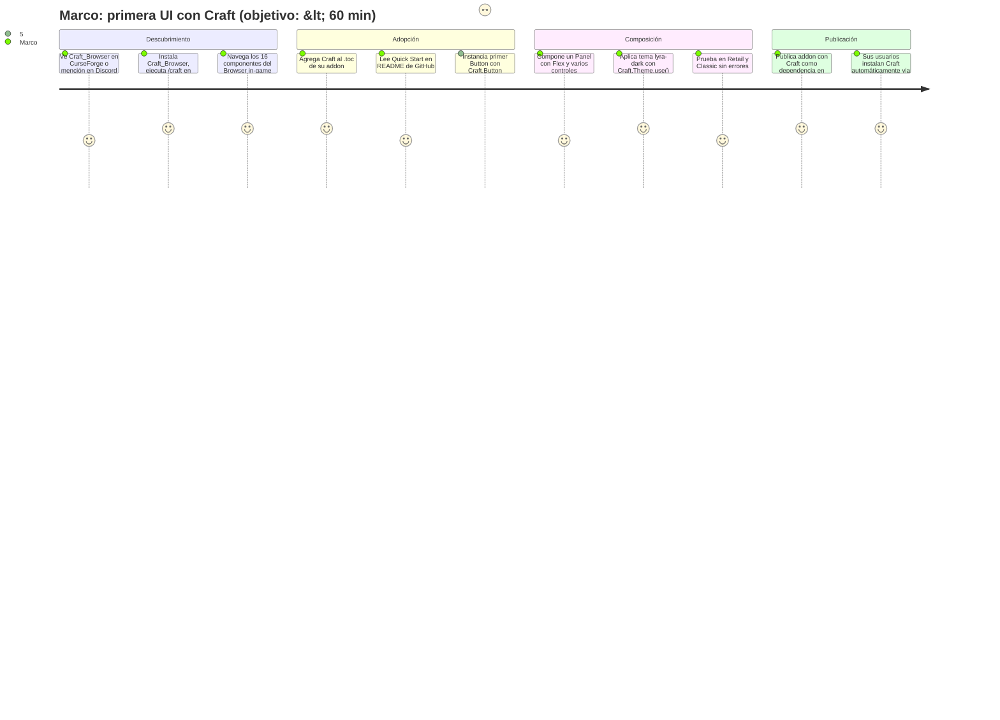
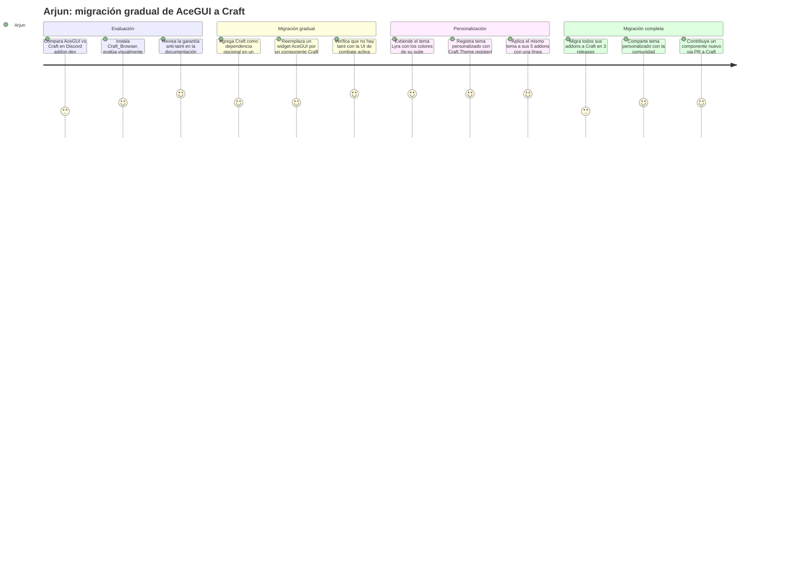

# Product Requirements Document (PRD) — Craft

> **Propósito**: describir **qué debe hacer Craft** para cumplir los requerimientos del BRD, con nivel suficiente para que ingeniería y QA puedan proceder. Responde a "¿qué hace el producto?" desde la perspectiva del desarrollador de addons (DX = UX en este contexto).
>
> Audiencia: Alberto Gomez (Product Owner / Core Dev), contribuidores externos, early-adopters, QA.

---

## 0. Metadatos

| Campo | Valor |
|-------|-------|
| Producto | Craft — Librería compartida de componentes UI para addons de World of Warcraft |
| Versión | v0.1 |
| Fecha | 30/05/2026 |
| Autor | Alberto Gomez |
| Revisores | Comunidad addon-dev (Discord #addon-dev-general), early-adopters |
| Estado | Borrador |
| BRD de referencia | `docs/BRD_v0.1.md` |
| MRD de referencia | `docs/MRD_v0.1.md` (pendiente) |
| ADRs relevantes | ADR-0001 (LibStub), ADR-0002 (Lyra), ADR-0003 (Lucide), ADR-0004 (Browser), ADR-0005 (Theming), ADR-0006 (Flex), ADR-0007 (no-TSTL), ADR-0008 (no-web) |
| POC de referencia | CraftUI (mayo 2026) — exploración copy-paste, descontinuado |
| Prompts utilizados | PR-PRD-001 (generación inicial via Claude Code) |

---

## 0.1 Constitution — Principios no negociables

Estos principios actúan como invariantes de producto. Cualquier decisión de diseño, implementación o alcance que contradiga uno de estos principios requiere una ADR aprobada.

- **C-01 — Librería compartida, nunca copy-paste**: Craft se carga una sola vez por sesión de WoW via LibStub. Ninguna funcionalidad del producto puede requerir que el desarrollador copie código de Craft en su propio addon.
- **C-02 — Anti-taint obligatorio**: ningún componente se publica sin una prueba documentada de no-contaminación de Secure Frames en Retail y Classic. El taint rompe el juego; es un riesgo reputacional no negociable.
- **C-03 — Lyra como única fuente de verdad visual**: todos los valores de color, espaciado, radio y tipografía de los componentes se derivan de los tokens de shadcn Lyra. Las desviaciones sin ADR están prohibidas.
- **C-04 — DX sobre funcionalidad**: la experiencia del desarrollador de addons es la métrica primaria de calidad. Una API que requiere más de 3 líneas para instanciar un componente común debe revisarse.
- **C-05 — Lua 5.1 puro, sin TSTL**: la API y la implementación son exclusivamente Lua 5.1 dentro del sandbox WoW. No se aceptarán contribuciones que introduzcan TypeScriptToLua.
- **C-06 — Sin portal web en v1.0**: GitHub + CurseForge/Wago son los únicos canales de distribución y documentación. No se mantiene ningún dominio web activo.

---

## 1. Resumen del producto

**Craft** es una librería open source de componentes UI para addons de World of Warcraft, distribuida como addon instalable desde CurseForge y Wago, cargada mediante LibStub. Los desarrolladores declaran `Craft` como dependencia en su `.toc` e instancian componentes modernos con una API OOP consistente.

El problema que resuelve es concreto: AceGUI-3.0 —la única alternativa estructurada del ecosistema— tiene más de 15 años de antigüedad, una estética que data de 2008, y una API inconsistente que obliga a entre 6 y 10 horas de setup para una UI funcional. Craft reduce ese tiempo a menos de 60 minutos: el desarrollador declara la dependencia, instancia componentes, compone layouts con `Craft.Flex`, y obtiene una UI con diseño shadcn Lyra e íconos Lucide lista para distribuir.

La arquitectura de librería compartida garantiza que una corrección de bug o mejora de diseño en Craft se propaga automáticamente a todos los addons dependientes en la próxima actualización, sin que cada autor intervenga. El MVP entrega 16 componentes: Button, Checkbox, Select, Flex, Icons, Input, Label, Scroll, Panel, Dialog, Separator, Sidebar, Slider, Tabs, Theme y Tooltip, más el addon `Craft_Browser` como showcase interactivo in-game. El target es septiembre de 2026 para el MVP completo.

---

## 2. Objetivos del producto

| ID | Objetivo del producto | BRD vinculado | Métrica | Meta | Horizonte |
|----|------------------------|----------------|---------|------|-----------|
| OP-01 | Ser la librería declarable como dependencia en `.toc` que los devs de addons WoW adopten como estándar de UI moderno | BO-01 | Addons activos en CurseForge/Wago declarando Craft como dependencia | 50 addons | Q1 2027 |
| OP-02 | Alcanzar visibilidad suficiente en la comunidad para atraer contribuidores | BO-02 | GitHub Stars en el repositorio principal | 300 stars | Q4 2026 |
| OP-03 | Construir una base de contribuidores que haga el proyecto autosustentable | BO-03 | Contribuidores únicos con PRs mergeados | 10 contribuidores | Q1 2027 |
| OP-04 | Reducir el tiempo de setup de UI en addon development de ~8h a ≤60 min | BO-04 | Tiempo autoreportado de setup UI completa (encuesta Discord) | ≤ 60 minutos | Q1 2027 |
| OP-05 | Entregar el catálogo MVP completo con garantía anti-taint documentada | BO-05 | Porcentaje de componentes MVP entregados con suite anti-taint | 16/16 (100%) | Septiembre 2026 |
| OP-06 | Proveer un showcase in-game que acelere la evaluación y adopción de Craft | BR-008 | Craft_Browser publicado en CurseForge con los 16 componentes navegables | Publicado pre-lanzamiento | Septiembre 2026 |

---

## 3. Alcance

### 3.1 Dentro del alcance (v1.0 — MVP)

- **Arquitectura LibStub**: registro de la librería como `"Craft-1.0"`, carga única por sesión de WoW, compartición entre múltiples addons. LibStub embebido en la distribución.
- **16 componentes MVP** (ver §5 para detalle de cada uno): Button, Checkbox, Select, Flex, Icons, Input, Label, Scroll, Panel, Dialog, Separator, Sidebar, Slider, Tabs, Theme, Tooltip.
- **Sistema de theming** (`Craft.Theme`): tokens semánticos Lyra, presets `lyra-dark` y `lyra-light`, live-switching via callbacks, `extend()` y `register()` para personalización.
- **Motor de layout** (`Craft.Flex`): implementación de CSS Flexbox en Lua 5.1 con `direction`, `wrap`, `justify`, `align`, `gap`, `grow`, `shrink`, `basis`, `order`.
- **Módulo de íconos** (`Craft.Icons`): íconos Lucide disponibles directamente desde el atlas TGA bundled en `Craft/media/`. No se requiere addon externo.
- **Addon showcase** (`Craft_Browser`): addon WoW separado con UI construida sobre Craft, navegable via `/craft`, con los 16 componentes del MVP. Distribuido en CurseForge/Wago.
- **Compatibilidad**: WoW Retail (11.x) y versiones Classic actualmente hosteadas por Blizzard, sin bifurcación de código.
- **Documentación técnica**: README con Quick Start (≤5 pasos), documentación por componente con ejemplos funcionales en Lua, CONTRIBUTING.md.
- **Suite anti-taint**: pruebas documentadas por componente en Retail y Classic antes de cada release.
- **Licencia MIT**: declarada en el repositorio y en el archivo principal de la librería.
- **Canal de soporte**: GitHub Discussions + Discord addon-dev.
- **Listings en CurseForge y Wago**: categoría Library para Craft, addon estándar para Craft_Browser.

### 3.2 Fuera del alcance

| Excluido | Justificación | Horizonte alternativo |
|----------|---------------|-----------------------|
| TypeScriptToLua (TSTL) y archivos `.d.ts` | Complejidad desproporcionada para el segmento actual; ADR-0007 | Evaluación en v2.x si el segmento crece |
| Portal web / sitio de documentación (craftui.dev) | CurseForge + GitHub suficientes para MVP; ADR-0008; BR-015 | No planificado |
| Bloques pre-construidos (OptionsPanel, ConfirmDialog, ProfileSelector) | Composiciones de nivel superior, dependen de que los 16 componentes base sean estables | v1.1 |
| Temas adicionales más allá de Lyra dark/light | El preset Lyra cubre el MVP; temas adicionales son personalizaciones del desarrollador | v1.1 |
| CLI de instalación (`craft add button`) | Complejidad de tooling fuera del alcance MVP | v2.0 |
| Componentes de unit frames | Cubiertos por oUF; nicho especializado | Fuera del roadmap |
| Componentes de visualización de datos (charts, heatmaps) | Fuera del caso de uso de UI general de addons | Evaluación futura |
| Soporte WoW Classic no hosteado por Blizzard | Versiones no mantenidas por Blizzard; costo de soporte sin base de usuarios activa | No planificado |
| Monetización directa o licencias comerciales diferenciadas | Licencia MIT; modelo open source | No planificado |

### 3.3 Roadmap de versiones

| Versión | Contenido | Fecha objetivo |
|---------|-----------|----------------|
| **v1.0 (MVP)** | 16 componentes, LibStub, Theme (Lyra dark/light), Flex, Icons (Lucide, atlas bundled en `Craft/media/`), Craft_Browser, documentación completa, suite anti-taint | Septiembre 2026 |
| **v1.1** | Bloques pre-construidos (OptionsPanel, ConfirmDialog, ProfileSelector, SettingsPanel), temas adicionales (3–5 presets de la comunidad), mejoras de DX basadas en feedback v1.0 | Q1 2027 |
| **v2.0** | Evaluación de soporte TSTL (`.d.ts` opt-in), CLI de scaffolding (`craft init`, `craft add`), sistema de plugins de componentes, posible portal de documentación si el volumen de adopción lo justifica | Q3 2027 |

---

## 4. Personas y user journeys

### 4.1 Personas (resumen)

- **Marco — Desarrollador independiente de addons WoW**: trabaja solo o en equipos pequeños, publica en CurseForge/Wago. Tiene experiencia con Lua y el modelo Ace3/LibStub. Su dolor principal es el tiempo de setup de UI y la estética anticuada de AceGUI. Quiere una librería que pueda declarar como dependencia y que le dé una UI moderna sin gestionar assets ni tomar decisiones de diseño.

- **Arjun — Autor de suite UI completa**: mantiene uno o varios addons con decenas de miles de descargas. Usa AceGUI-3.0 o tiene implementación UI propia. Quiere migrar gradualmente a un stack moderno, personalizar el tema al estilo de su suite, y garantizar performance óptimo con compatibilidad Retail + Classic.

### 4.2 User journeys principales

#### Journey 1 — Marco crea su primera UI con Craft



#### Journey 2 — Arjun migra de AceGUI a Craft



---

## 5. User stories y criterios de aceptación

> **Nota de contexto**: en Craft, la "pantalla" es la API Lua y la documentación. UX = DX (Developer Experience). Los criterios Gherkin son verificables en WoW (in-game o en el entorno de addon development).

### Épica E1 — Integración de la librería

| ID | Historia | Prioridad | Criterios |
|----|----------|-----------|-----------|
| PRD-US-001 | Como desarrollador de addons, quiero declarar `Craft` en el `.toc` de mi addon para tener acceso a todos los componentes sin copiar código | Must | ver §5.1.1 |
| PRD-US-002 | Como desarrollador, quiero que `LibStub("Craft-1.0")` retorne la instancia correcta de la librería para usar la API Craft desde cualquier punto de mi addon | Must | ver §5.1.2 |
| PRD-US-003 | Como desarrollador, quiero que la librería se cargue una sola vez por sesión de WoW aunque múltiples addons la declaren como dependencia, para no duplicar memoria | Must | ver §5.1.3 |

#### 5.1.1 Criterios PRD-US-001

```gherkin
Escenario: Addon declara Craft como dependencia y accede a la API
  Dado que Craft está instalado como addon en la carpeta Interface/AddOns/
  Y el archivo MiAddon.toc contiene "## Dependencies: Craft"
  Cuando WoW carga MiAddon durante el inicio de sesión
  Entonces Craft está disponible como variable global antes de que MiAddon ejecute su código
  Y `Craft.Button` no es nil
  Y no hay errores de Lua en el log de eventos

Escenario: Addon usa OptionalDeps con verificación
  Dado que MiAddon.toc declara "## OptionalDeps: Craft"
  Cuando WoW carga MiAddon y Craft no está instalado
  Entonces MiAddon carga sin errores
  Y el desarrollador puede verificar `if Craft then ... end` para activar la integración
```

#### 5.1.2 Criterios PRD-US-002

```gherkin
Escenario: LibStub retorna instancia de Craft
  Dado que Craft está instalado y cargado
  Cuando cualquier addon ejecuta local Craft = LibStub("Craft-1.0")
  Entonces la variable local Craft referencia la misma instancia global
  Y Craft.VERSION contiene la versión semántica actual (e.g., "1.0.0")
```

#### 5.1.3 Criterios PRD-US-003

```gherkin
Escenario: Múltiples addons comparten la misma instancia de Craft
  Dado que tres addons distintos (AddonA, AddonB, AddonC) declaran Craft como dependencia
  Cuando WoW carga los tres addons en la misma sesión
  Entonces LibStub("Craft-1.0") retorna el mismo objeto para los tres addons
  Y el uso de memoria de Craft se contabiliza una sola vez en el profiler de addons
```

---

### Épica E2 — Componentes de control

| ID | Historia | Prioridad | Criterios |
|----|----------|-----------|-----------|
| PRD-US-004 | Como desarrollador, quiero instanciar un `Button` con texto e ícono opcional para que los jugadores interactúen con las acciones de mi addon | Must | ver §5.2.1 |
| PRD-US-005 | Como desarrollador, quiero usar un `Input` de texto con placeholder y validación para capturar datos del jugador | Must | ver §5.2.2 |
| PRD-US-006 | Como desarrollador, quiero usar un `Checkbox` para que el jugador active o desactive opciones de configuración | Must | ver §5.2.3 |
| PRD-US-007 | Como desarrollador, quiero usar un `Select` (dropdown) para presentar opciones mutuamente excluyentes al jugador | Must | ver §5.2.4 |
| PRD-US-008 | Como desarrollador, quiero usar un `Slider` para que el jugador ajuste valores numéricos continuos (e.g., opacidad, escala) | Must | ver §5.2.5 |

#### 5.2.1 Criterios PRD-US-004

```gherkin
Escenario: Crear un Button básico con texto
  Dado que Craft está disponible en el entorno del addon
  Cuando el desarrollador ejecuta:
    local btn = Craft.Button:Create(parent, { text = "Aceptar" })
  Entonces se crea un frame de tipo Button con texto "Aceptar" en estilo Lyra
  Y el frame está visible en la posición del parent
  Y hacer click en el frame ejecuta la función OnClick si fue declarada en la config

Escenario: Button con ícono Lucide
  Cuando el desarrollador crea un Button con { icon = "check", text = "Confirmar" }
  Entonces el ícono Lucide "check" aparece a la izquierda del texto
  Y el ícono usa el color del token theme.primaryForeground

Escenario: Button en estado disabled
  Dado un Button creado con Craft
  Cuando el desarrollador llama a btn:SetEnabled(false)
  Entonces el Button muestra el color de token theme.mutedForeground
  Y el cursor no cambia al pasar sobre el frame
  Y el evento OnClick no se dispara al hacer click
```

#### 5.2.2 Criterios PRD-US-005

```gherkin
Escenario: Input con placeholder
  Cuando el desarrollador crea un Input con { placeholder = "Escribe aquí..." }
  Entonces el frame muestra el placeholder en color theme.mutedForeground cuando está vacío
  Y el placeholder desaparece al recibir foco y el usuario comienza a tipear

Escenario: Input con callback OnChange
  Dado un Input creado con { onChange = function(value) ... end }
  Cuando el jugador modifica el texto del Input
  Entonces la función onChange se llama con el valor actual del Input como argumento
```

#### 5.2.3 Criterios PRD-US-006

```gherkin
Escenario: Checkbox checked/unchecked
  Cuando el desarrollador crea un Checkbox con { label = "Activar notificaciones", checked = false }
  Entonces el Checkbox muestra el label a su derecha en color theme.foreground
  Y el cuadro usa el estilo de borde theme.border cuando está sin marcar
  Y al hacer click, el estado cambia a checked y ejecuta onChange(true)
```

#### 5.2.4 Criterios PRD-US-007

```gherkin
Escenario: Select despliega opciones
  Dado un Select creado con { options = {"Opción A", "Opción B", "Opción C"}, value = "Opción A" }
  Cuando el jugador hace click en el Select
  Entonces se despliega un panel con las tres opciones en estilo Lyra
  Y la opción actualmente seleccionada muestra un indicador visual (checkmark)
  Y al seleccionar una opción, el dropdown se cierra y onChange(value) es llamado
```

#### 5.2.5 Criterios PRD-US-008

```gherkin
Escenario: Slider con rango y step
  Cuando el desarrollador crea un Slider con { min=0, max=100, step=5, value=50 }
  Entonces el slider muestra el thumb en la posición correspondiente a 50
  Y arrastrar el thumb en incrementos cambia el valor en múltiplos de 5
  Y onValueChange es llamado con cada nuevo valor durante el drag
```

---

### Épica E3 — Layout y estructura

| ID | Historia | Prioridad | Criterios |
|----|----------|-----------|-----------|
| PRD-US-009 | Como desarrollador, quiero usar `Panel` como contenedor base con borde y fondo Lyra para organizar el contenido de mi addon | Must | ver §5.3.1 |
| PRD-US-010 | Como desarrollador, quiero usar `Dialog` para mostrar confirmaciones o formularios modales que bloqueen interacción con el resto de la UI | Must | ver §5.3.2 |
| PRD-US-011 | Como desarrollador, quiero usar `Craft.Flex` para componer múltiples frames en layouts de fila o columna sin `SetPoint` manual | Must | ver §5.3.3 |
| PRD-US-012 | Como desarrollador, quiero usar `Scroll` para renderizar contenido que excede el tamaño del contenedor sin implementar scrollbar manualmente | Must | ver §5.3.4 |

#### 5.3.1 Criterios PRD-US-009

```gherkin
Escenario: Panel básico como contenedor
  Cuando el desarrollador crea un Panel con { width=400, height=300, title="Mi Panel" }
  Entonces se crea un frame con fondo theme.card, borde theme.border y título en theme.cardForeground
  Y el Panel es movible por defecto (draggable)
  Y child frames agregados al Panel son clipeados por sus dimensiones

Escenario: Panel sin título
  Cuando el Panel se crea con { title = nil }
  Entonces no se renderiza el área de título y el contenido usa el espacio completo
```

#### 5.3.2 Criterios PRD-US-010

```gherkin
Escenario: Dialog de confirmación modal
  Cuando el desarrollador llama a Craft.Dialog:Show({ title="¿Confirmar?", message="Esta acción no puede deshacerse.", onConfirm=fn, onCancel=fn })
  Entonces se muestra un frame modal centrado en pantalla
  Y el fondo detrás del Dialog se oscurece (overlay)
  Y los frames fuera del Dialog no reciben clicks mientras el Dialog está visible
  Y al hacer click en Confirmar, onConfirm() es llamado y el Dialog se cierra
  Y pressing Escape dispara onCancel() y cierra el Dialog
```

#### 5.3.3 Criterios PRD-US-011

```gherkin
Escenario: Flex layout en fila con gap
  Dado un contenedor parent con ancho 400px
  Cuando el desarrollador crea un Flex con { direction="row", gap=8, justify="space-between" }
  Y agrega 3 Buttons al Flex con flex:Add(btn1) / flex:Add(btn2) / flex:Add(btn3)
  Y llama a flex:Layout()
  Entonces los 3 Buttons están distribuidos horizontalmente con gap de 8px entre ellos
  Y el espacio restante se distribuye equitativamente según space-between

Escenario: Flex recalcula al cambiar tamaño del contenedor
  Dado un Flex activo con 4 hijos
  Cuando el parent cambia de tamaño (OnSizeChanged)
  Entonces flex:Layout() se llama automáticamente
  Y las posiciones de los hijos se recalculan sin intervención del desarrollador
```

#### 5.3.4 Criterios PRD-US-012

```gherkin
Escenario: Scroll con contenido que excede el contenedor
  Dado un Scroll con { height=200 } y contenido interno de 500px de altura
  Cuando el jugador usa la rueda del mouse sobre el Scroll
  Entonces el contenido se desplaza verticalmente
  Y la scrollbar lateral indica la posición actual
  Y el contenido no se renderiza fuera de los límites del Scroll (clipping)
```

---

### Épica E4 — Navegación y feedback

| ID | Historia | Prioridad | Criterios |
|----|----------|-----------|-----------|
| PRD-US-013 | Como desarrollador, quiero usar `Tabs` para organizar el contenido de mi addon en secciones navegables sin cambiar de ventana | Must | ver §5.4.1 |
| PRD-US-014 | Como desarrollador, quiero usar `Tooltip` para mostrar información contextual al pasar el cursor sobre un elemento de la UI | Must | ver §5.4.2 |
| PRD-US-015 | Como desarrollador, quiero usar `Label` para mostrar textos estáticos con variantes de tamaño y peso tipográfico consistentes con Lyra | Must | ver §5.4.3 |
| PRD-US-016 | Como desarrollador, quiero usar `Sidebar` como panel de navegación lateral para addons con múltiples secciones | Should | ver §5.4.4 |
| PRD-US-017 | Como desarrollador, quiero usar `Separator` para dividir visualmente secciones de contenido con una línea horizontal o vertical en estilo Lyra | Should | ver §5.4.5 |

#### 5.4.1 Criterios PRD-US-013

```gherkin
Escenario: Tabs con navegación
  Dado un Tabs creado con { tabs = { {id="general", label="General"}, {id="avanzado", label="Avanzado"} } }
  Cuando el jugador hace click en la tab "Avanzado"
  Entonces el contenido asociado a "avanzado" se hace visible
  Y el contenido de "general" se oculta
  Y la tab activa muestra el indicador visual de selección (underline o fondo) en color theme.primary
  Y onTabChange("avanzado") es llamado
```

#### 5.4.2 Criterios PRD-US-014

```gherkin
Escenario: Tooltip aparece al hover
  Dado un elemento UI con un Tooltip configurado con { content = "Descripción del elemento" }
  Cuando el jugador mueve el cursor sobre el elemento durante > 300ms
  Entonces el Tooltip aparece cerca del cursor con el texto en color theme.popoverForeground sobre fondo theme.popover
  Y el Tooltip desaparece al mover el cursor fuera del elemento

Escenario: Tooltip con contenido personalizado
  Cuando el Tooltip se configura con { content = frame }
  Entonces el frame personalizado se renderiza dentro del Tooltip
```

#### 5.4.3 Criterios PRD-US-015

```gherkin
Escenario: Label con variantes tipográficas
  Cuando el desarrollador crea un Label con { text="Título", variant="heading" }
  Entonces el texto se renderiza en el tamaño y peso del token tipográfico "heading" de Lyra
  Y el color por defecto es theme.foreground
  Y los valores de { variant="muted" } usan theme.mutedForeground
```

#### 5.4.4 Criterios PRD-US-016

```gherkin
Escenario: Sidebar con items de navegación
  Dado un Sidebar creado con una lista de items { id, label, icon }
  Cuando el jugador hace click en un item de la Sidebar
  Entonces el item se marca como activo con fondo theme.accent
  Y onSelect(id) es llamado con el id del item seleccionado
```

#### 5.4.5 Criterios PRD-US-017

```gherkin
Escenario: Separator horizontal
  Cuando el desarrollador crea un Separator con { orientation = "horizontal" }
  Entonces se renderiza una línea horizontal de 1px en color theme.border
  Y la línea ocupa el ancho completo del parent
```

---

### Épica E5 — Sistema de diseño

| ID | Historia | Prioridad | Criterios |
|----|----------|-----------|-----------|
| PRD-US-018 | Como desarrollador, quiero cambiar el tema activo con una línea de código para que todos los componentes activos actualicen su apariencia simultáneamente | Must | ver §5.5.1 |
| PRD-US-019 | Como desarrollador de suite, quiero extender el tema Lyra con mis propios tokens de color para personalizar la apariencia de Craft al estilo de mi suite | Should | ver §5.5.2 |
| PRD-US-020 | Como desarrollador, quiero usar `Craft.Icons.Get("nombre")` para obtener una textura Lucide o su fallback WoW nativo sin gestionar archivos TGA | Must | ver §5.5.3 |

#### 5.5.1 Criterios PRD-US-018

```gherkin
Escenario: Live-switching de tema
  Dado que un addon tiene 10 componentes Craft activos con el tema "lyra-dark"
  Cuando el desarrollador (o el jugador vía toggle de UI) ejecuta Craft.Theme.use("lyra-light")
  Entonces los 10 componentes actualizan sus colores al preset lyra-light
  Y la actualización ocurre en menos de 16ms (dentro de un frame a 60fps)
  Y no se destruyen ni recrean los frames — solo se actualizan los valores de color

Escenario: Tema inexistente
  Cuando se ejecuta Craft.Theme.use("tema-que-no-existe")
  Entonces Craft registra un warning en el log de Lua
  Y el tema activo no cambia
```

#### 5.5.2 Criterios PRD-US-019

```gherkin
Escenario: Extender tema Lyra con overrides parciales
  Cuando el desarrollador ejecuta:
    Craft.Theme.extend("lyra-dark", { primary = {r=0.2, g=0.6, b=1, a=1} })
  Entonces se crea un tema derivado que hereda todos los tokens de lyra-dark
  Excepto primary, que usa el valor override
  Y Craft.Theme.use() puede activar este tema derivado

Escenario: Registrar tema personalizado completo
  Cuando el desarrollador ejecuta Craft.Theme.register("mi-suite", { ... tokens completos ... })
  Entonces "mi-suite" está disponible como preset para Craft.Theme.use("mi-suite")
```

#### 5.5.3 Criterios PRD-US-020

```gherkin
Escenario: Resolución de ícono desde atlas bundled
  Cuando el desarrollador ejecuta local icon = Craft.Icons.Get("chevron-right")
  Entonces icon es una tabla con { path, left, right, top, bottom } del atlas TGA de Lucide bundled en Craft/media/
  Y la textura se renderiza correctamente en WoW a 16px y 24px

Escenario: Ícono inexistente
  Cuando el desarrollador ejecuta Craft.Icons.Get("nombre-inexistente")
  Entonces icon retorna nil
  Y el componente que usa el ícono sigue renderizando correctamente (sin error de Lua)
```

---

## 6. Priorización

### MoSCoW

| Prioridad | Elementos |
|-----------|-----------|
| **Must** | LibStub (US-001, 002, 003), Button (US-004), Input (US-005), Checkbox (US-006), Select (US-007), Slider (US-008), Panel (US-009), Dialog (US-010), Flex (US-011), Scroll (US-012), Tabs (US-013), Tooltip (US-014), Label (US-015), Theme live-switching (US-018), Icons (US-020) |
| **Should** | Sidebar (US-016), Separator (US-017), Theme extend/register (US-019), Craft_Browser navegable con los 16 componentes |
| **Could** | Bloques pre-construidos, temas adicionales, CLI scaffold |
| **Won't (v1.0)** | TSTL, portal web, unit frames, componentes de visualización de datos |

### RICE — Top 10 historias

| ID | Descripción | Reach (devs/Q) | Impact (0.25–3) | Confidence (%) | Effort (semanas) | RICE |
|----|-------------|----------------|-----------------|----------------|------------------|------|
| PRD-US-001 | Declarar Craft en `.toc` | 500 | 3 | 95 | 1 | 1425 |
| PRD-US-011 | Craft.Flex layout | 400 | 3 | 90 | 3 | 360 |
| PRD-US-018 | Theme live-switching | 300 | 3 | 85 | 2 | 382 |
| PRD-US-004 | Button con ícono | 500 | 2 | 95 | 1 | 950 |
| PRD-US-009 | Panel contenedor | 450 | 2 | 95 | 1 | 855 |
| PRD-US-020 | Icons.Get() Lucide | 400 | 2 | 80 | 2 | 320 |
| PRD-US-010 | Dialog modal | 350 | 2 | 90 | 2 | 315 |
| PRD-US-005 | Input con placeholder | 400 | 2 | 90 | 1 | 720 |
| PRD-US-013 | Tabs navegables | 300 | 2 | 85 | 2 | 255 |
| PRD-US-014 | Tooltip hover | 400 | 1.5 | 90 | 1 | 540 |

> RICE = (Reach × Impact × Confidence) ÷ Effort. Reach en devs estimados por trimestre. Confidence como fracción decimal para el cálculo.

---

## 7. Requerimientos funcionales

| ID | Requisito | Historia(s) | Prioridad | BRD |
|----|-----------|-------------|-----------|-----|
| PRD-REQ-001 | Craft debe registrarse con LibStub como `"Craft-1.0"`. `LibStub("Craft-1.0")` debe retornar la instancia correcta de la librería en cualquier addon que la declare como dependencia en su `.toc` | US-001, 002, 003 | Must | BR-001, BR-002 |
| PRD-REQ-002 | Todos los componentes MVP deben leer sus valores de color, espaciado y tipografía exclusivamente desde `Craft.Theme.get()`. Ningún valor visual debe estar hardcodeado | US-004–020 | Must | BR-003, BR-009 |
| PRD-REQ-003 | `Craft.Icons.Get(name)` debe resolver íconos Lucide desde el atlas TGA bundled en `Craft/media/`. Nunca debe retornar un error de Lua; nil es un retorno válido cuando el nombre del ícono no existe en el atlas | US-020 | Must | BR-004 |
| PRD-REQ-004 | Craft debe ser compatible con WoW Retail (11.x) y las versiones Classic actualmente hosteadas por Blizzard sin bifurcación de código fuente | US-001–020 | Must | BR-006 |
| PRD-REQ-005 | `Craft_Browser` debe ser un addon WoW instalable, publicado en CurseForge, con los 16 componentes MVP navegables via `/craft`. La UI del Browser debe estar construida con los propios componentes de Craft | — | Must | BR-008 |
| PRD-REQ-006 | `Craft.Theme` debe implementar: `get()` (retorna tokens activos), `use(name)` (live-switch), `extend(base, overrides)` (tema derivado), `register(name, tokens)` (preset personalizado). El live-switch debe actualizar todos los componentes activos sin destruir frames | US-018, 019 | Must | BR-009, BR-010 |
| PRD-REQ-007 | Los 16 componentes MVP deben estar implementados, documentados con ejemplos en Lua funcionales, y con suite anti-taint ejecutada antes del release v1.0 | US-004–020 | Must | BR-011 |
| PRD-REQ-008 | `Craft.Flex` debe implementar: `direction`, `wrap`, `justify` (start/end/center/space-between/space-around/space-evenly), `align` (start/end/center/stretch), `gap`, `grow`, `shrink`, `basis`, `order`. El layout debe recalcularse automáticamente en `OnSizeChanged` del contenedor | US-011 | Must | BR-012 |
| PRD-REQ-009 | Craft no debe contener, referenciar ni distribuir archivos TypeScriptToLua (`.d.ts`, runtime TSTL, configuración de compilación TSTL) | — | Must | BR-014 |
| PRD-REQ-010 | Toda la documentación de Craft debe residir en el repositorio GitHub (README, `docs/`, wiki). No se debe mantener ningún dominio web ni sitio de documentación externo | — | Must | BR-015 |
| PRD-REQ-011 | Cada componente debe implementar el contrato de theming: registro de listener en `Create()`, llamada a `_applyTheme()` en `Create()` y `unregister` en `Destroy()` para evitar memory leaks | US-004–020 | Must | BR-009 |
| PRD-REQ-012 | La librería debe declarar su licencia MIT en el repositorio GitHub y en el encabezado del archivo principal `Craft.lua` | — | Must | BR-007 |
| PRD-REQ-013 | El README debe incluir un Quick Start completable en ≤5 pasos desde cero hasta tener un componente renderizando in-game | — | Should | BR-013 |
| PRD-REQ-014 | El directorio `Craft/media/` debe incluir el atlas TGA de íconos Lucide (16px y 24px) y la fuente Inter-Regular.ttf, bundled directamente en la distribución de Craft | US-020 | Must | BR-004 |
| PRD-REQ-015 | Todo componente que exponga un estado `disabled` debe usar el token `theme.mutedForeground` y suprimir interacción del usuario (clicks, teclado) cuando esté deshabilitado | US-004–008 | Must | BR-011 |

---

## 8. Requerimientos no funcionales

| ID | Categoría | Requerimiento | Métrica | Umbral | BRD |
|----|-----------|---------------|---------|--------|-----|
| PRD-NFR-001 | Anti-taint | Ningún componente Craft debe contaminar Secure Frames de WoW (funciones protegidas: CastSpell, UseAction, etc.) en Retail ni Classic | Suite de pruebas anti-taint documentada por componente; cero errores de taint reportados en el log de WoW durante el uso normal de Craft_Browser | 0 errores de taint en suite completa | BR-005 |
| PRD-NFR-002 | Compatibilidad | Todos los componentes MVP deben funcionar en WoW Retail (11.x) y en las versiones Classic activas sin cambios de código ni flags de versión en la implementación del componente | Tests de compatibilidad documentados en Retail y Classic por componente; sin bifurcaciones `#if retail / #if classic` en los componentes | 100% componentes compatibles en ambas versiones | BR-006 |
| PRD-NFR-003 | Performance — layout | `Craft.Flex.Layout()` sobre un contenedor con 10 hijos debe completarse en menos de 1ms | Profiling en WoW con `/script` en hardware de referencia (PC 2022) | < 1ms para layout de 10 elementos | BR-012 |
| PRD-NFR-004 | Performance — theme switch | `Craft.Theme.use()` sobre un addon con 10 componentes activos debe completarse dentro de un frame (16ms a 60fps) | Profiling con timer Lua antes y después de `use()` | < 16ms para 10 componentes activos | BR-009 |
| PRD-NFR-005 | Memoria | Abrir y cerrar 100 veces el mismo componente en Craft_Browser no debe producir crecimiento apreciable de memoria Lua | Comparación de `collectgarbage("count")` antes y después de 100 ciclos open/close | < 5% de crecimiento residual por ciclo | BR-011 |
| PRD-NFR-006 | DX — tiempo de setup | Un desarrollador nuevo (familiarizado con Lua y Ace3) debe poder completar el Quick Start de Craft (componente renderizando in-game) en ≤60 minutos siguiendo solo el README | Medición cronometrada con 3 testers | ≤ 60 minutos | BR-013, BO-04 |
| PRD-NFR-007 | API consistency | Todos los componentes MVP deben seguir el mismo patrón de instanciación: `Craft.ComponentName:Create(parent, config)` retorna una tabla con métodos `:Destroy()`, `:SetEnabled()`, `_applyTheme()` y acceso al frame via `:GetFrame()` | Revisión de código en cada PR; checklist de contrato de componente en CONTRIBUTING.md | 0 componentes que violen el patrón de instanciación | BR-011 |
| PRD-NFR-008 | Seguridad / sandboxing | Craft no debe usar APIs de WoW fuera del sandbox addon (sin acceso a filesystem, sin sockets de red, sin APIs de sistema operativo) | Revisión de código; ninguna llamada a funciones fuera de la API pública de WoW addon | 0 llamadas fuera del sandbox WoW | BR-006 |
| PRD-NFR-009 | Distribución | Craft debe estar listado en CurseForge y Wago como addon de tipo Library. `Craft_Browser` debe tener listing separado antes del lanzamiento de v1.0 | Listados verificables en CurseForge/Wago antes del release | 2 listings activos pre-lanzamiento | BR-001, BR-008 |
| PRD-NFR-010 | Lua 5.1 puro | La implementación de Craft debe ser compatible con Lua 5.1 (la versión del sandbox de WoW). No se usarán features de Lua 5.2+ ni TSTL | Revisión estática de código; ninguna llamada a funciones específicas de Lua 5.2+ | 0 incompatibilidades Lua 5.1 | BR-014 |

---

## 9. Dependencias e integraciones

| Sistema / Dependencia | Tipo | Propósito | Riesgo | Mitigación |
|-----------------------|------|-----------|--------|------------|
| **LibStub** | Embebida (distribución propia) | Mecanismo de registro y versionado de la librería compartida | Bajo — librería madura, sin desarrollo activo (estable) | LibStub.lua embebido en la distribución de Craft; no depende de que el usuario lo instale por separado |
| **WoW API (Blizzard)** | Consumo obligatorio | `CreateFrame`, `SetPoint`, `SetTexture`, font strings, events — base de todos los componentes | Alto — parches de Blizzard pueden cambiar APIs | Monitoreo de PTR; arquitectura modular permite corrección por componente sin afectar a los demás |
| **shadcn Lyra (referencia)** | Referencia de diseño (sin código externo) | Fuente de verdad de tokens visuales (color, tipografía, spacing). Los tokens se traducen a tablas Lua en `Presets.lua` | Bajo-Medio — cambios en Lyra pueden requerir revisión de tokens | Versión de referencia de Lyra fijada al inicio del proyecto; ADR requerida para actualizar |
| **Lucide icon set** | Assets (TGA generados, bundled en `Craft/media/`) | Íconos para componentes; atlas TGA incluido directamente en la distribución de Craft | Bajo — Lucide MIT, activo; cambios de nombres de íconos son infrecuentes | Scripts de generación de atlas documentados; `Craft.Icons` usa nombres estables de Lucide |
| **CurseForge / Wago** | Canal de distribución | Distribución de Craft y Craft_Browser como addons instalables | Bajo-Medio — cambios en ToS o en el sistema de listing | No hay dependencias técnicas de las plataformas; el código de Craft funciona sin ellas |
| **GitHub** | Repositorio + gestión de issues/PRs | Hosting del código fuente, issues, wiki, Discussions | Bajo | Sin CI/CD en fase inicial; dependencia única aceptable para el alcance del proyecto |
| **Discord addon-dev** | Canal de soporte y comunidad | Soporte entre pares, anuncios, feedback de la comunidad | Muy bajo | No es una dependencia técnica |

---

## 10. Supuestos y restricciones

### Supuestos

- **AS-01**: La API de Lua de WoW (Blizzard) continuará siendo compatible con el código de Craft de manera suficiente para que las actualizaciones ante parches sean puntuales y acotadas.
- **AS-02**: LibStub continuará siendo el mecanismo de facto para librerías compartidas; Blizzard no romperá su funcionamiento en parches futuros.
- **AS-03**: Los desarrolladores de addons que adopten Craft tienen una instalación activa de WoW (Retail o Classic) para probar sus addons y evaluar Craft_Browser.
- **AS-04**: CurseForge y Wago mantendrán su categoría de "Library" addon y sus sistemas de listing durante el horizonte 2026–2027.
- **AS-05**: La versión de referencia de shadcn Lyra fijada al inicio del proyecto permanece estable en sus tokens semánticos clave; cambios breaking requerirán una ADR y major version bump.
- **AS-06**: El tiempo disponible del maintainer principal es de ~4 horas/semana de manera constante hasta el lanzamiento de v1.0.

### Restricciones

- **RS-01**: Lua 5.1 exclusivamente — el sandbox de WoW no soporta Lua 5.2+. Sin librería Lua externa al entorno WoW.
- **RS-02**: Sin acceso a filesystem, sockets de red ni APIs de sistema operativo — el sandbox Blizzard lo prohíbe.
- **RS-03**: Sin TypeScriptToLua — decisión firme de foco, documentada en ADR-0007 y BR-014.
- **RS-04**: Sin portal web — toda la documentación en GitHub. ADR-0008, BR-015.
- **RS-05**: Presupuesto USD 0 para hosting o infraestructura; GitHub y CurseForge/Wago son gratuitos para proyectos open source.
- **RS-06**: El maintainer principal es una sola persona durante el MVP. Las decisiones de arquitectura y merge son responsabilidad de Alberto Gomez.

---

## 11. Experiencia de desarrollador (DX)

> En Craft, no hay usuario final del producto — el "usuario" es el desarrollador de addons. La "pantalla" es la API Lua, el README y los ejemplos de código. Esta sección describe los lineamientos de DX que equivalen al rol de UX en productos tradicionales.

### 11.1 Principios de DX

| Principio | Descripción | Criterio verificable |
|-----------|-------------|----------------------|
| **Mínima fricción de adopción** | Declarar Craft como dependencia y renderizar el primer componente debe ser posible en ≤5 pasos sin leer más que el Quick Start del README | Quick Start completable en ≤60 min por un dev nuevo con Lua y Ace3 |
| **API predecible y consistente** | Todos los componentes siguen el mismo patrón: `Craft.ComponentName:Create(parent, config)`. Sin excepciones de naming, sin patrones mixtos OOP/funcional | 0 componentes que violen el patrón en code review |
| **Documentación ejecutable** | Cada ejemplo de código en la documentación debe funcionar sin modificaciones si se copia en un addon real | Code examples validados en Craft_Browser |
| **Errores informativos** | Cuando un desarrollador usa Craft incorrectamente (argumento faltante, tipo incorrecto), el error de Lua debe indicar qué falló y cómo corregirlo | Mensajes de error con contexto en todos los puntos de entrada de la API |
| **Craft_Browser como documentación viva** | El desarrollador puede ver cada componente en su estado real (hover, disabled, focus) dentro del juego antes de usarlo en su addon | Los 16 componentes MVP navegables con estados visuales en Craft_Browser |

### 11.2 Convenciones de API

- **Instanciación**: `local c = Craft.Button:Create(parent, { text="OK", onClick=fn })` — siempre `Create(parent, config)`.
- **Configuración**: la tabla `config` siempre tiene defaults razonables; ningún campo es obligatorio salvo `parent`.
- **Acceso al frame nativo**: `c:GetFrame()` retorna el frame WoW subyacente para integraciones avanzadas.
- **Ciclo de vida**: `c:Destroy()` limpia todos los listeners, unregistra el theme callback, y libera referencias.
- **Habilitación**: `c:SetEnabled(bool)` en todos los componentes de control.
- **Theming imperativo**: `c:SetTheme(name)` para override de tema por instancia (si se necesita mezcla de temas en un mismo addon).

### 11.3 Documentación por componente

Cada uno de los 16 componentes tendrá un archivo `docs/components/<nombre>.md` con:
1. Descripción de una línea.
2. Quick example (el código mínimo para renderizar el componente).
3. Tabla de props de la config con tipo, default y descripción.
4. Ejemplos de variantes (estados: default, hover, disabled, etc.).
5. Nota de anti-taint (confirmación de que el componente es seguro con Secure Frames).
6. Referencia a los tokens Lyra que usa.

### 11.4 CONTRIBUTING.md

El archivo `CONTRIBUTING.md` en la raíz del repositorio cubrirá:
- Setup del entorno de desarrollo (estructura de carpetas, cómo probar en WoW).
- Checklist de contrato de componente (patrón `Create`, theming, Destroy, anti-taint, documentación).
- Proceso de PR: rama de feature, descripción, tests anti-taint, revisión del maintainer.
- Convenciones de naming y estilo de código Lua.

---

## 12. Métricas de éxito del producto

| Métrica | North Star? | Línea base | Meta | Horizonte | Fuente |
|---------|-------------|------------|------|-----------|--------|
| Addons activos en CurseForge/Wago declarando Craft como dependencia | Sí | 0 | 50 | Q1 2027 | CurseForge API + encuesta Discord |
| GitHub Stars | No | 0 | 300 | Q4 2026 | GitHub API |
| Tiempo autoreportado de setup UI completa | No | ~8h (AceGUI) | ≤ 60 min | Q1 2027 | Encuesta bianual Discord |
| Contribuidores únicos con PRs mergeados | No | 0 | 10 | Q1 2027 | GitHub Contributors |
| Descargas de Craft en CurseForge/Wago | No | 0 | 5,000 únicas | Q4 2026 | CurseForge/Wago stats |
| Satisfacción de la comunidad (encuesta Discord) | No | — | ≥ 4.0/5.0 en facilidad de adopción, estética y documentación | Q1 2027 | Encuesta en Discord |
| Componentes MVP entregados con suite anti-taint | No | 0/16 | 16/16 (100%) | Septiembre 2026 | Repositorio GitHub |
| Menciones positivas orgánicas en r/WowUI, Discord | No | Por medir | 30 menciones | Q4 2026 | Búsqueda manual |

---

## 13. Riesgos del producto

| ID | Riesgo | Prob. | Impacto | Mitigación |
|----|--------|-------|---------|------------|
| RP-01 | Cambio de API de Blizzard en parche que rompe uno o más componentes | Alta | Alto | Arquitectura modular: cada componente es un módulo independiente; monitoreo de PTR de Blizzard; pipeline de alerta en patch notes; la corrección de un componente no afecta a los demás |
| RP-02 | Resistencia cultural de la comunidad Ace3 a adoptar una nueva librería | Media | Medio | Publicar benchmarks AceGUI vs Craft (tiempo de setup, líneas de código, output visual); conseguir 3–5 addons conocidos como early-adopters antes del lanzamiento público |
| RP-03 | Memory leak en el sistema de callbacks de theming por `Destroy()` no llamado | Media | Medio | Contrato de componente documentado en CONTRIBUTING.md; ejemplo de ciclo de vida en Quick Start; herramienta de diagnóstico `Craft.Theme.debugListeners()` en modo debug |
| RP-04 | Overhead de `Craft.Flex.Layout()` en panels con 50+ elementos | Baja | Medio | Benchmark documentado en ADR-0006; límite de elementos documentado; lazy-layout: recalcular solo en cambio de tamaño, no en cada frame |
| RP-05 | Abandono del proyecto por falta de tiempo del maintainer | Media | Alto | Documentación exhaustiva de arquitectura desde el día 1; CONTRIBUTING.md completo; búsqueda activa de co-maintainers en la comunidad; candidatos identificados en Discord addon-dev |
| RP-06 | Baja adopción inicial (< 10 addons en Q4 2026) | Media | Medio | Lanzamiento coordinado en múltiples canales (Reddit, Discord, CurseForge changelog); contacto directo con 10 desarrolladores influyentes pre-lanzamiento; Craft_Browser como punto de entrada de descubrimiento |
| RP-07 | Contaminación de Secure Frames (taint) no detectada antes del release | Baja | Muy alto | Suite anti-taint obligatoria por componente antes de merge; Craft_Browser como prueba de integración real; todas las PRs revisadas por el maintainer con checklist de taint |
| RP-08 | Proyecto competidor con arquitectura similar entra al mercado | Baja | Alto | Acelerar time-to-market del MVP; construir comunidad leal antes del competidor; licencia MIT garantiza que cualquier fork beneficia al ecosistema |

---

## 14. Trazabilidad

| PRD ID | Historia | BRD | ADR relevante | FSD (próximo) |
|--------|----------|-----|---------------|---------------|
| PRD-REQ-001 | US-001, 002, 003 | BR-001, BR-002 | ADR-0001 | FSD-UC-001 (loader LibStub) |
| PRD-REQ-002 | US-004–020 | BR-003 | ADR-0002, ADR-0005 | FSD-UC-002 (contrato de componente) |
| PRD-REQ-003 | US-020 | BR-004 | ADR-0003 | FSD-UC-003 (Icons module) |
| PRD-REQ-004 | US-001–020 | BR-006 | — | FSD-UC-004 (compat layer) |
| PRD-REQ-005 | — | BR-008 | ADR-0004 | FSD-UC-005 (Craft_Browser) |
| PRD-REQ-006 | US-018, 019 | BR-009, BR-010 | ADR-0005 | FSD-UC-006 (Theme module) |
| PRD-REQ-007 | US-004–020 | BR-011 | — | FSD-UC-007–022 (componentes) |
| PRD-REQ-008 | US-011 | BR-012 | ADR-0006 | FSD-UC-023 (Flex module) |
| PRD-REQ-009 | — | BR-014 | ADR-0007 | — |
| PRD-REQ-010 | — | BR-015 | ADR-0008 | — |
| PRD-NFR-001 | US-004–020 | BR-005 | — | FSD-NFR-001 (anti-taint spec) |
| PRD-NFR-002 | US-001–020 | BR-006 | — | FSD-NFR-002 (compat testing) |
| PRD-NFR-003 | US-011 | BR-012 | ADR-0006 | FSD-NFR-003 (flex perf) |
| PRD-NFR-004 | US-018 | BR-009 | ADR-0005 | FSD-NFR-004 (theme perf) |
| PRD-NFR-007 | US-004–020 | BR-011 | — | FSD-NFR-007 (API contract) |

### Cobertura de BRD → PRD

| BR | Descripción resumida | PRD cubre |
|----|----------------------|-----------|
| BR-001 | Distribución como addon LibStub instalable | PRD-REQ-001, PRD-NFR-009 |
| BR-002 | LibStub como mecanismo de registro | PRD-REQ-001 |
| BR-003 | shadcn Lyra como fuente visual | PRD-REQ-002, PRD-NFR-007 |
| BR-004 | Lucide first-class | PRD-REQ-003, PRD-REQ-014 |
| BR-005 | Anti-taint obligatorio | PRD-NFR-001, RP-07 |
| BR-006 | Retail + Classic sin bifurcación | PRD-REQ-004, PRD-NFR-002 |
| BR-007 | Licencia MIT | PRD-REQ-012 |
| BR-008 | Craft_Browser showcase | PRD-REQ-005 |
| BR-009 | Theming tokens + live-switch | PRD-REQ-006, PRD-NFR-004 |
| BR-010 | Temas personalizados | PRD-REQ-006 (extend/register) |
| BR-011 | 16 componentes MVP | PRD-REQ-007, PRD-REQ-011, PRD-REQ-015 |
| BR-012 | Craft.Flex layout | PRD-REQ-008, PRD-NFR-003 |
| BR-013 | Documentación + soporte | PRD-REQ-013, PRD-NFR-006 |
| BR-014 | Exclusión TSTL | PRD-REQ-009 |
| BR-015 | Exclusión portal web | PRD-REQ-010 |

---

## 15. Registro de cambios

| Versión | Fecha | Autor | Cambio |
|---------|-------|-------|--------|
| v0.1 | 30/05/2026 | Alberto Gomez | Versión inicial — PRD completo de Craft. 20 user stories, 15 requerimientos funcionales, 10 NFRs, trazabilidad completa a BR-001..BR-015 del BRD. Constitution (6 principios), journeys de Marco y Arjun, DX guidelines, MoSCoW + RICE top-10. |
| v0.1.1 | 30/05/2026 | Alberto Gomez | Decisión de assets bundled: eliminado `Craft_SharedMedia` como addon companion separado. El atlas TGA de Lucide y la fuente Inter-Regular.ttf se distribuyen directamente en `Craft/media/`. `Craft.Icons` ya no implementa resolución en dos niveles; los íconos siempre están disponibles. PRD-REQ-003 y PRD-REQ-014 actualizados; PRD-NFR-009 reducido a 2 listings (Craft + Craft_Browser); `Geist` reemplazado por `Inter`. |

---

*Documento parte de la cadena BRD → MRD → PRD → FSD → DTI de Craft.*
*BRD de referencia: `docs/BRD_v0.1.md`.*
*ADRs de referencia: `docs/adr/`.*
*POC de referencia: CraftUI (mayo 2026) — `../CraftUI/`.*
